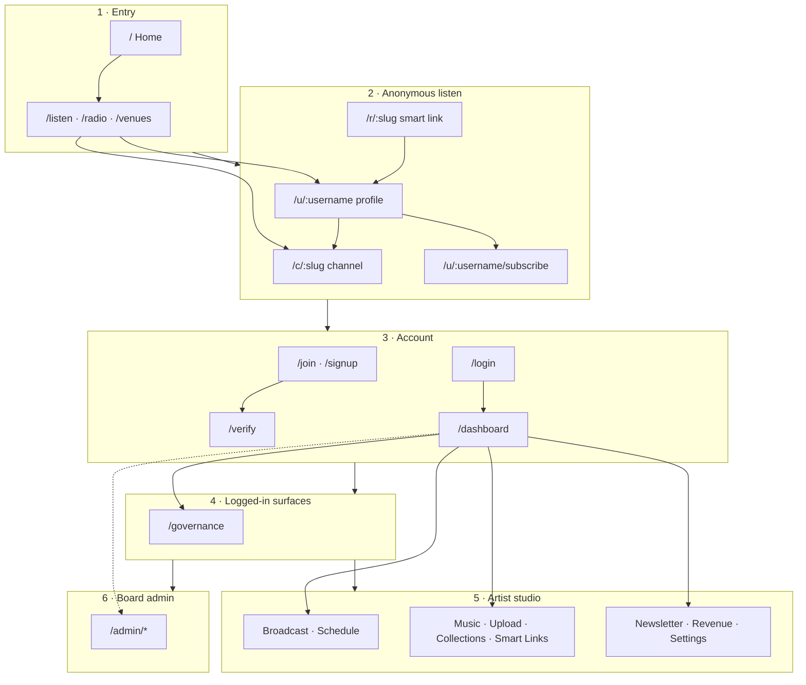

# User flows — screen map & personas

Mermaid charts + screenshot maps for **every primary surface**, grouped by who is using the product. Modelled after Giggi’s `docs/journeys/` + `docs/ui/navigation-flows-design-review.md` pack: one spine diagram, then per-persona pages that list **route → functionality → tab/nav → screenshot**.

**Nuclear × Tahti workbench copy** (current + **planned Nuclear-shell** journeys):  
[`nuclear/tahti-fit/flows/`](../../../nuclear/tahti-fit/flows/README.md) — planned pack uses Nuclear player screenshots as UI reference.

**Screenshots:** Playwright captures under [`../e2e-screenshots/`](../e2e-screenshots/). Naming: `<role>/<slug>.png`. Full route map: [`manifest.json`](../e2e-screenshots/manifest.json).

**Plain-language guides:** [`../guides/`](../guides/README.md). **Technical journey notes:** [`../technical/journey-*.md`](../technical/). **Legacy short map:** [`../user-flows.md`](../user-flows.md) (points here for the redesign pack).

---

## Master spine (all personas)

---

## Four parts (this pack)

| Part | Who | Doc | Screenshot folder |
| ---: | --- | --- | --- |
| **1** | **Anonymous listener** — no account; listen, chat, browse | [anonymous-listener.md](anonymous-listener.md) | `e2e-screenshots/public/` |
| **2** | **Logged-in listener / member** — free account, fan sub, €40 coop member | [logged-in-listener.md](logged-in-listener.md) | `free/`, `member/`, auth in `public/` |
| **3** | **Artist** — channel owner studio (sidebar groups + settings tabs) | [artist.md](artist.md) | `e2e-screenshots/artist/` |
| **4** | **Board member** — `isBoard` admin console | [board-member.md](board-member.md) | `e2e-screenshots/admin/` |

Also:

| Doc | Role |
| --- | --- |
| [site-map.md](site-map.md) | Every implemented route, colour-coded by auth gate |
| [navigation-flows-design-review.md](navigation-flows-design-review.md) | Design-review pack: spine + **embedded screenshots** per part |

---

## How to read a persona file

Each part has:

1. **Purpose** — what this person can do.
2. **Navigation chart** — Mermaid of routes and gates.
3. **Nav / tabs** — which sidebar group, settings subnav, or admin nav item owns the surface.
4. **Screen inventory** — table of route → functions → screenshot (with image embeds for primary screens).

Regenerate PNGs: `./scripts/e2e-screenshots.sh` (see [`../e2e-screenshots/README.md`](../e2e-screenshots/README.md)).
