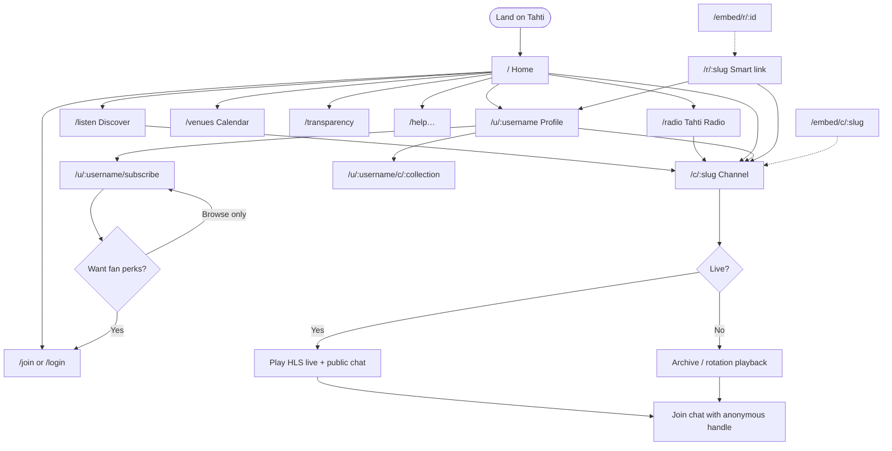
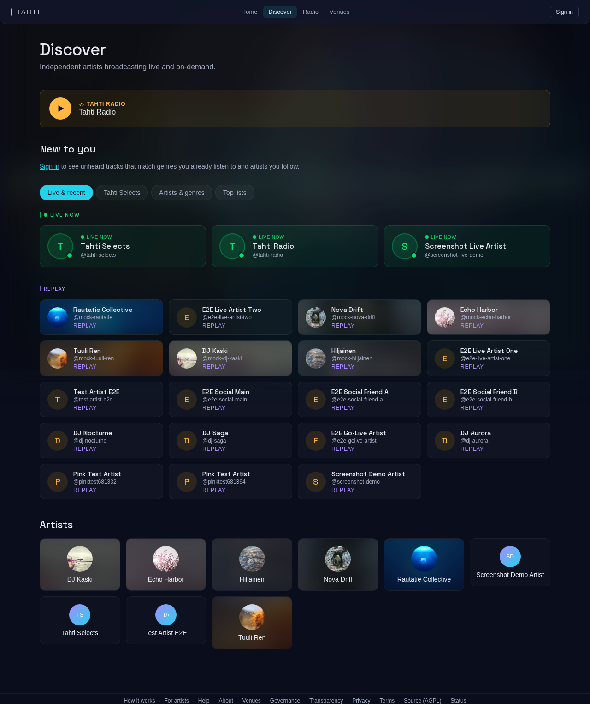
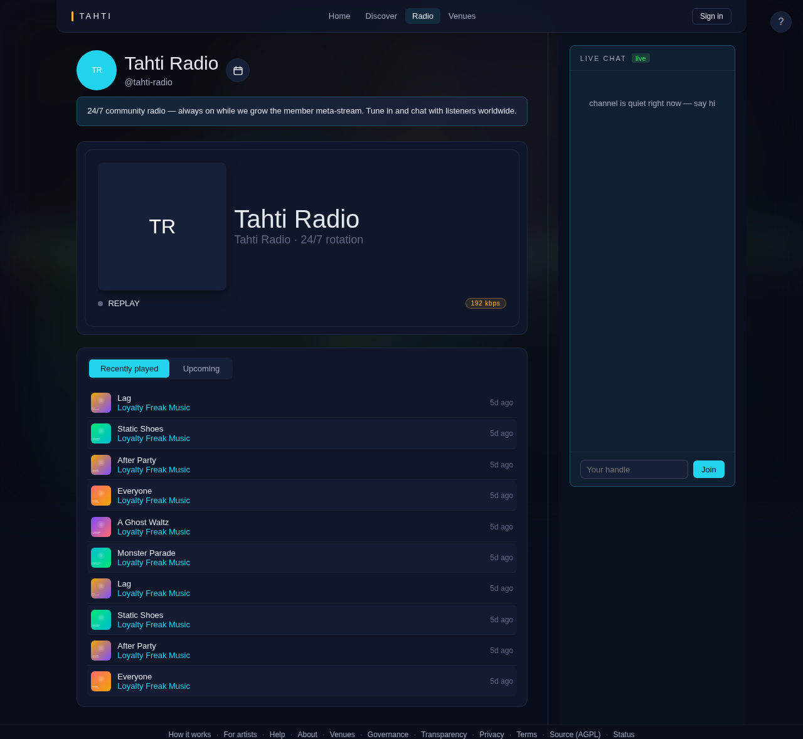
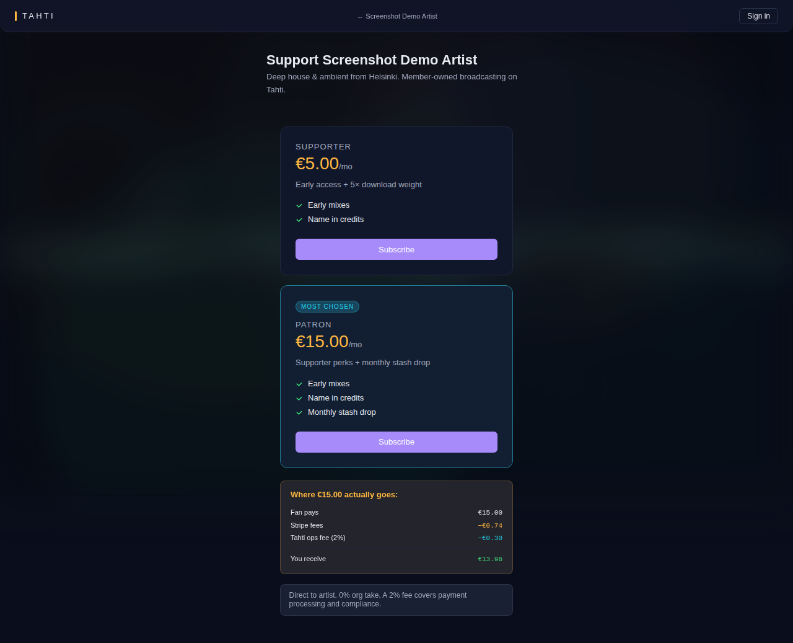
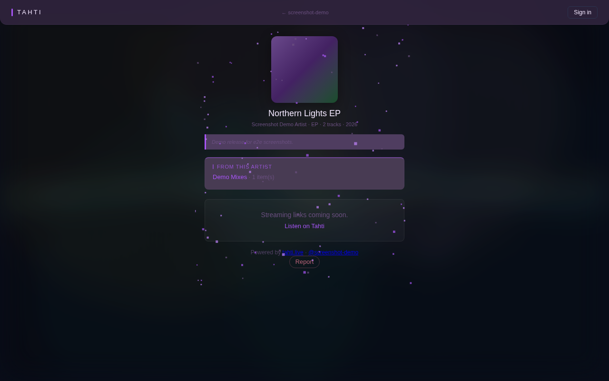
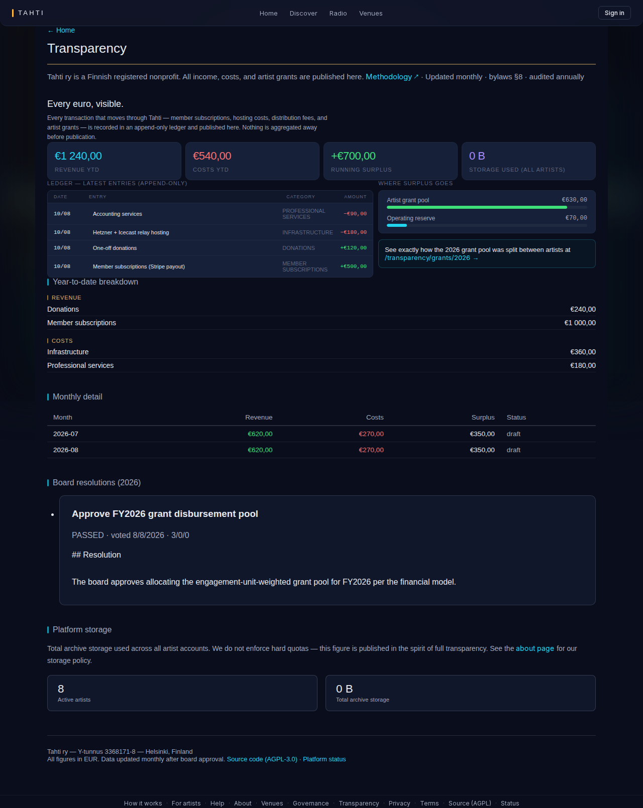

# Part 1 — Anonymous listener

**Who:** Anyone with a browser. No account. Matches constitution: *anonymous listening by default*.

**Guide:** [For viewers](../guides/for-viewers.md) · **Technical:** [journey-listener.md](../technical/journey-listener.md)

**Screenshot folder:** [`../e2e-screenshots/public/`](../e2e-screenshots/public/)

---

## Purpose

Discover shows, play live or archive audio, use public chat with a per-browser handle, open profiles / smart links / embeds, read transparency and help. **Cannot** vote, manage subscriptions, or open studio tools without signing up.

---

## Navigation chart

---

## Where things live (no signed-in chrome)

Anonymous users see **marketing / brand** chrome (site header), not the artist studio sidebar.

| Surface | Route | What you can do here |
| --- | --- | --- |
| Home | `/` | Brand entry, CTAs to listen / join / transparency |
| Listen hub | `/listen` | Browse channels / shows |
| Tahti Radio | `/radio` | Org meta-stream of live channels |
| Venues | `/venues` | Public venue calendar |
| Venue register | `/venues/register` | Submit a venue (public form) |
| Channel | `/c/:slug` | Player, live/archive, **public chat**, schedule strip |
| Profile | `/u/:username` | Bio, releases, link to channel & subscribe |
| Subscribe (browse) | `/u/:username/subscribe` | Read fan tiers (checkout needs login) |
| Collection | `/u/:username/c/:slug` | Public playlist / collection page |
| Smart link | `/r/:slug` | Release landing → DSP / Tahti |
| Embeds | `/embed/c/:slug`, `/embed/r/:id` | Minimal iframe players |
| Transparency | `/transparency`, `/transparency/methodology` | Public ledger & grant methodology |
| Help / legal | `/help…`, `/about`, `/terms`, `/privacy`, `/agpl` | Docs & policies |
| Status | `/status` | Platform health |
| Apply / auth entry | `/apply`, `/join`, `/signup`, `/login`, `/verify` | Onto Part 2 |

### Channel page layout (primary listen surface)

| Region | Functionality |
| --- | --- |
| Hero / player | Play/pause, live badge, now-playing |
| Main column | Archive / programme list, about |
| Sidebar | **Public chat** (handle + join), optional fan chat locked until sub |
| Header | Wordmark, listen/radio links, Log in / Join |

---

## Screen inventory + screenshots

### Discovery & marketing

| Screen | Route | Screenshot |
| --- | --- | --- |
| Home | `/` | [`public/home.png`](../e2e-screenshots/public/home.png) |
| Listen | `/listen` | [`public/listen.png`](../e2e-screenshots/public/listen.png) |
| Radio | `/radio` | [`public/radio.png`](../e2e-screenshots/public/radio.png) |
| Venues | `/venues` | [`public/venues.png`](../e2e-screenshots/public/venues.png) |
| How it works | `/how-it-works` | [`public/how-it-works.png`](../e2e-screenshots/public/how-it-works.png) |
| About | `/about` | [`public/about.png`](../e2e-screenshots/public/about.png) |
| Apply (beta) | `/apply` | [`public/apply.png`](../e2e-screenshots/public/apply.png) |
| Status | `/status` | [`public/status.png`](../e2e-screenshots/public/status.png) |

### Channel, profile, promo

| Screen | Route | Screenshot |
| --- | --- | --- |
| Channel | `/c/screenshot-demo` | [`public/channel.png`](../e2e-screenshots/public/channel.png) |
| Channel (live fixture) | `/c/…` live | [`public/channel-live.png`](../e2e-screenshots/public/channel-live.png) |
| Profile | `/u/screenshot-demo` | [`public/profile.png`](../e2e-screenshots/public/profile.png) |
| Fan tiers | `/u/screenshot-demo/subscribe` | [`public/subscribe.png`](../e2e-screenshots/public/subscribe.png) |
| Collection | `/u/screenshot-demo/c/demo-mixes` | [`public/collection.png`](../e2e-screenshots/public/collection.png) |
| Smart link | `/r/northern-lights-ep` | [`public/smart-link.png`](../e2e-screenshots/public/smart-link.png) |
| Embed channel | `/embed/c/screenshot-demo` | [`public/embed-channel.png`](../e2e-screenshots/public/embed-channel.png) |
| Embed release | `/embed/r/…` | [`public/embed-release.png`](../e2e-screenshots/public/embed-release.png) |

### Transparency, help, legal

| Screen | Route | Screenshot |
| --- | --- | --- |
| Transparency | `/transparency` | [`public/transparency.png`](../e2e-screenshots/public/transparency.png) |
| Methodology | `/transparency/methodology` | [`public/transparency-methodology.png`](../e2e-screenshots/public/transparency-methodology.png) |
| Help index | `/help` | [`public/help-index.png`](../e2e-screenshots/public/help-index.png) |
| For listeners | `/help/for-listeners` | [`public/help-for-listeners.png`](../e2e-screenshots/public/help-for-listeners.png) |
| Privacy / terms / AGPL | `/privacy`, `/terms`, `/agpl` | matching `public/*.png` |

---

## Happy path (short)

1. Open shared `/c/:slug` or `/` → Listen.
2. Play live or archive; join public chat with a handle.
3. Open profile → browse releases / collection / smart link.
4. Optional: open subscribe page → **Part 2** to pay or join the coop.
