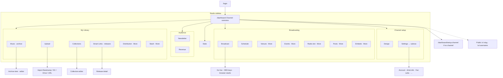
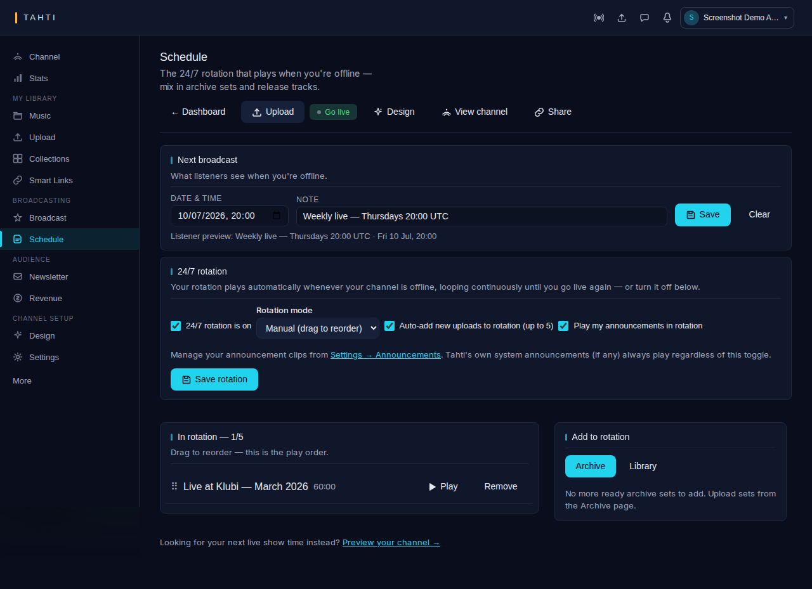
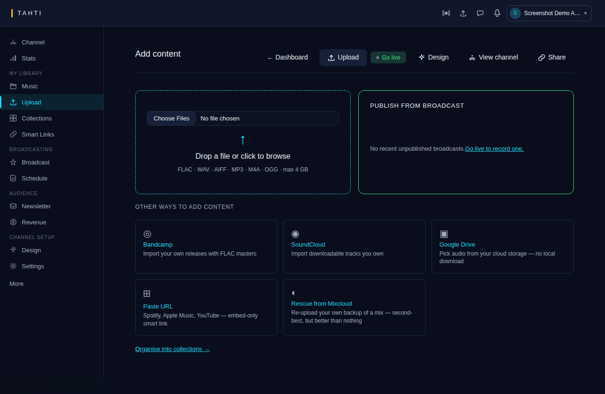
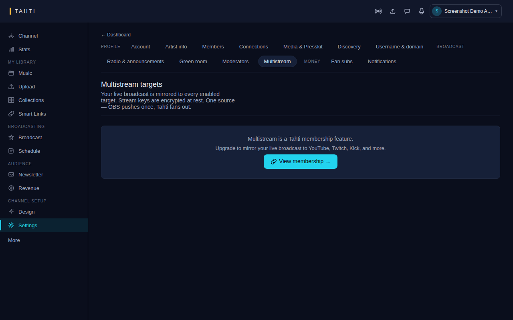

# Part 3 — Artist (studio)

**Who:** Account with a **channel** — runs 24/7 broadcast, catalog, fan tiers, and promo tools. Live broadcasting is the same persona (see [For streamers](../guides/for-streamers.md)).

**Guides:** [For artists](../guides/for-artists.md) · [For streamers](../guides/for-streamers.md) · **Technical:** [journey-artist.md](../technical/journey-artist.md)

**Screenshot folder:** [`../e2e-screenshots/artist/`](../e2e-screenshots/artist/) (+ public channel/profile for outward surfaces)

**Nav source of truth:** `packages/ui/src/brand/dashboard-nav.ts` (`DASHBOARD_NAV`) · Settings groups: `apps/web/src/app/dashboard/settings/_settings-subnav.tsx`

---

## Purpose

Provision and design the channel, upload and organise music, go live (OBS / Icecast / browser), schedule programme, collect fans, send newsletter, see revenue/stats, and configure settings (fan-subs, multistream, moderators, domain).

---

## Navigation chart

---

## Sidebar — which functionality on which item

Groups match the live studio sidebar. Items marked **More** sit under the desktop “More” disclosure / mobile overflow.

| Group | Sidebar label | Route | Functionality |
| --- | --- | --- | --- |
| — | **Channel** | `/dashboard` | Studio home: next show, quick status, channel snapshot |
| — | **Stats** | `/dashboard/stats` | Audience & engagement overview |
| — | *(detail)* | `/dashboard/stats/detail` | Deep stats |
| **My Library** | **Music** | `/dashboard/archive` | Archive / rotation catalog |
| | **Upload** | `/dashboard/upload` | Upload audio; import subflows |
| | **Collections** | `/dashboard/collections` | Playlists / collections |
| | **Smart Links** | `/dashboard/releases` | Release catalog & smart links |
| | Distribution *(More)* | `/dashboard/distribution` | DSP / Revelator distribution |
| | Stash *(More)* | `/dashboard/stash` | File manager for raw assets |
| **Broadcasting** | **Broadcast** | `/dashboard/broadcast` | Stream keys, OBS, go-live studio |
| | **Schedule** | `/dashboard/schedule` | Programme / rotation editor |
| | Venues *(More)* | `/dashboard/venues` | Venue bookings |
| | Events *(More)* | `/dashboard/events` | Events list |
| | Radio slot *(More)* | `/dashboard/tahti-radio-slots` | Tahti Radio slot requests |
| | Posts *(More)* | `/dashboard/posts` | Social / channel posts |
| | Embeds *(More)* | `/dashboard/embeds` | Embed snippets |
| **Audience** | **Newsletter** | `/dashboard/newsletter/compose` | Compose & send |
| | **Revenue** | `/dashboard/revenue` | Fan-sub & payout overview |
| **Channel setup** | **Design** | `/dashboard/channel/edit` | Channel appearance |
| | **Settings** | `/dashboard/settings` → account | Settings hub (see tabs below) |
| Board only | Admin | `/admin` | Jump to Part 4 |

### Other studio routes (not always in primary sidebar)

| Route | Functionality |
| --- | --- |
| `/dashboard/editor`, `/dashboard/editor/:id` | Pro audio editor |
| `/dashboard/archive/:id` | Archive item preview |
| `/dashboard/archive/:id/editor` | Edit that item in audio editor |
| `/dashboard/releases/:id` | Release detail / smart-link edit |
| `/dashboard/collections/new` | Create collection |
| `/dashboard/collections/:slug` | Collection editor |
| `/dashboard/messages` | Artist messages |
| `/dashboard/setup-channel` | First-time channel provision |
| `/dashboard/moderate/:slug` | Moderation tools (capture gap) |

---

## Settings subnav — tabs / pages

Settings is **not** one page with tabs over shared state: each row is its own route. Groups from `_settings-subnav.tsx`:

### Profile

| Tab label | Route | Functionality |
| --- | --- | --- |
| Account | `/dashboard/settings/account` | Login email, password, membership |
| Artist info | `/dashboard/settings/artist-info` | Display name, bio, members block |
| Members | `/dashboard/settings/artist-info#members` | Channel co-members |
| Connections | `/dashboard/settings/connections` | Social / external links |
| Media & Presskit | `/dashboard/settings/media` | Press assets |
| Discovery | `/dashboard/settings/discovery` | Discovery listing prefs |
| Username & domain | `/dashboard/settings/domain` | Slug + custom domain |

### Broadcast

| Tab label | Route | Functionality |
| --- | --- | --- |
| Radio & announcements | `/dashboard/settings/distribution` | Radio prefs / announcement clips |
| Green room | `/dashboard/settings/green-room` | Pre-live green room |
| Moderators | `/dashboard/settings/moderators` | Chat mods |
| Multistream | `/dashboard/settings/multistream` | Twitch/YT/Kick RTMP targets |

### Money

| Tab label | Route | Functionality |
| --- | --- | --- |
| Fan subs | `/dashboard/settings/fan-subs` | Tier prices & perks |
| Notifications | `/dashboard/settings/notifications` | Mentions, comments, announcements prefs |

Redirect aliases: `mentions`, `comments`, `announcements`, `presskit`, `members` → canonical pages above.

---

## Screen inventory + screenshots

### Core studio

| Screen | Route | Screenshot |
| --- | --- | --- |
| Dashboard | `/dashboard` | [`artist/dashboard.png`](../e2e-screenshots/artist/dashboard.png) |
| Stats | `/dashboard/stats` | [`artist/stats.png`](../e2e-screenshots/artist/stats.png) |
| Stats detail | `/dashboard/stats/detail` | [`artist/stats-detail.png`](../e2e-screenshots/artist/stats-detail.png) |
| Channel design | `/dashboard/channel/edit` | [`artist/channel-appearance.png`](../e2e-screenshots/artist/channel-appearance.png) |
| Broadcast | `/dashboard/broadcast` | [`artist/broadcast-studio.png`](../e2e-screenshots/artist/broadcast-studio.png) |
| Schedule | `/dashboard/schedule` | [`artist/schedule-programme.png`](../e2e-screenshots/artist/schedule-programme.png) |

### Library & catalog

| Screen | Route | Screenshot |
| --- | --- | --- |
| Music (archive) | `/dashboard/archive` | [`artist/archive.png`](../e2e-screenshots/artist/archive.png) |
| Archive item | `/dashboard/archive/:id` | [`artist/archive-item.png`](../e2e-screenshots/artist/archive-item.png) |
| Archive editor | `…/editor` | [`artist/archive-item-editor.png`](../e2e-screenshots/artist/archive-item-editor.png) |
| Upload | `/dashboard/upload` | [`artist/upload.png`](../e2e-screenshots/artist/upload.png) |
| Collections | `/dashboard/collections` | [`artist/collections.png`](../e2e-screenshots/artist/collections.png) |
| New collection | `/dashboard/collections/new` | [`artist/collections-new.png`](../e2e-screenshots/artist/collections-new.png) |
| Collection editor | `/dashboard/collections/demo-mixes` | [`artist/collection-editor.png`](../e2e-screenshots/artist/collection-editor.png) |
| Smart Links | `/dashboard/releases` | [`artist/releases.png`](../e2e-screenshots/artist/releases.png) |
| Release detail | `/dashboard/releases/:id` | [`artist/release-detail.png`](../e2e-screenshots/artist/release-detail.png) |
| Stash | `/dashboard/stash` | [`artist/stash.png`](../e2e-screenshots/artist/stash.png) |
| Audio editor | `/dashboard/editor` | [`artist/editor.png`](../e2e-screenshots/artist/editor.png) |
| Editor project | `/dashboard/editor/:id` | [`artist/editor-project.png`](../e2e-screenshots/artist/editor-project.png) |

### Audience & money

| Screen | Route | Screenshot |
| --- | --- | --- |
| Newsletter | `/dashboard/newsletter/compose` | [`artist/newsletter-compose.png`](../e2e-screenshots/artist/newsletter-compose.png) |
| Revenue | `/dashboard/revenue` | [`artist/revenue.png`](../e2e-screenshots/artist/revenue.png) |
| Venues | `/dashboard/venues` | [`artist/venues.png`](../e2e-screenshots/artist/venues.png) |

### Settings pages

| Screen | Route | Screenshot |
| --- | --- | --- |
| Account | `/dashboard/settings/account` | [`artist/settings-account.png`](../e2e-screenshots/artist/settings-account.png) |
| Artist info | `/dashboard/settings/artist-info` | [`artist/settings-artist-info.png`](../e2e-screenshots/artist/settings-artist-info.png) |
| Connections | `/dashboard/settings/connections` | [`artist/settings-connections.png`](../e2e-screenshots/artist/settings-connections.png) |
| Distribution | `/dashboard/settings/distribution` | [`artist/settings-distribution.png`](../e2e-screenshots/artist/settings-distribution.png) |
| Domain | `/dashboard/settings/domain` | [`artist/settings-domain.png`](../e2e-screenshots/artist/settings-domain.png) |
| Fan subs | `/dashboard/settings/fan-subs` | [`artist/settings-fan-subs.png`](../e2e-screenshots/artist/settings-fan-subs.png) |
| Mentions (alias) | `/dashboard/settings/mentions` | [`artist/settings-mentions.png`](../e2e-screenshots/artist/settings-mentions.png) |
| Moderators | `/dashboard/settings/moderators` | [`artist/settings-moderators.png`](../e2e-screenshots/artist/settings-moderators.png) |
| Multistream | `/dashboard/settings/multistream` | [`artist/settings-multistream.png`](../e2e-screenshots/artist/settings-multistream.png) |
| Notifications | `/dashboard/settings/notifications` | [`artist/settings-notifications.png`](../e2e-screenshots/artist/settings-notifications.png) |

### Public surfaces the artist publishes into

| Screen | Route | Screenshot |
| --- | --- | --- |
| Live channel | `/c/screenshot-demo` | [`public/channel.png`](../e2e-screenshots/public/channel.png) |
| Profile | `/u/screenshot-demo` | [`public/profile.png`](../e2e-screenshots/public/profile.png) |
| Subscribe page | `/u/…/subscribe` | [`public/subscribe.png`](../e2e-screenshots/public/subscribe.png) |

### Fresh-artist journey shots

Empty account → channel → releases: [`../e2e-screenshots/journey/`](../e2e-screenshots/journey/) (`01-artist-dashboard-empty` … `05-public-channel`).

---

## Happy path (short)

1. `/login` → `/dashboard` (or `/dashboard/setup-channel`).
2. **Design** channel → **Upload** / **Music** → **Schedule** rotation.
3. **Broadcast** → copy OBS/Icecast keys → go live → public `/c/:slug`.
4. **Fan subs** settings → share `/u/:username/subscribe`.
5. **Stats** / **Revenue** / **Newsletter** for ongoing ops.
