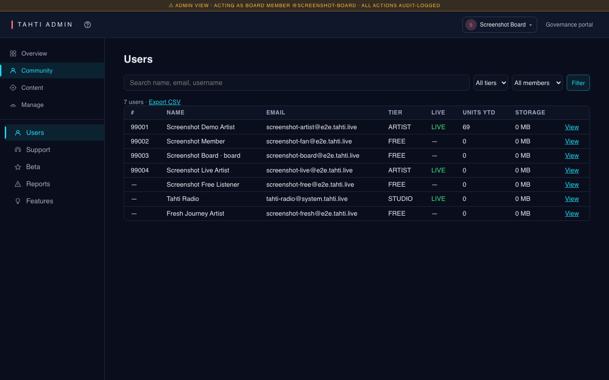

# Part 4 — Board member (admin)

**Who:** Users with `isBoard` (Tahti ry board / directors). Operates the cooperative: users, streams, money, grants, governance paperwork, radio, vendors.

**Technical:** [journey-director.md](../technical/journey-director.md)

**Screenshot folder:** [`../e2e-screenshots/admin/`](../e2e-screenshots/admin/) — the 20
available captures are annotated with the admin navigation, main workspace, page heading,
role, and exact route. Routes without dedicated seeded captures are listed below.

**Nav source of truth:** `apps/web/src/app/admin/admin-nav.tsx` (`ADMIN_NAV`)

---

## Purpose

Run the org console: approve beta applicants, manage users, monitor live streams, triage support, bookkeep financials & grants, prepare AGM / resolutions / audit exports, curate Tahti Radio and Selects, configure vendors.

---

## Navigation chart

```mermaid
flowchart TD
  Login["/login as board"] --> Studio["/dashboard"]
  Studio --> Admin["/admin → /admin/dashboard"]

  subgraph nav["Admin sidebar"]
    Dash["Dashboard"]
    Beta["Beta"]
    Users["Users"]
    Radio["Radio"]
    RadioSub["Radio submissions"]
    News["News"]
    Selects["Selects"]
    Streams["Streams"]
    Support["Support"]
    Missed["Missed shows"]
    Top["Top lists"]
    Ann["Announcements"]
    Widgets["Disco widgets"]
    Themes["Themes"]
    Internet["Internet radio"]
    Storage["Storage"]
    Files["Files"]
    Reports["Reports"]
    Fin["Financial"]
    Gov["Governance"]
    Feat["Features"]
    Grants["Grants"]
    AGM["AGM"]
    Vendors["Vendors"]
    Status["Status"]
  end

  Admin --> Dash
  Admin --> Beta
  Admin --> Users
  Admin --> Radio
  Admin --> RadioSub
  Admin --> News
  Admin --> Selects
  Admin --> Streams
  Admin --> Support
  Admin --> Missed
  Admin --> Top
  Admin --> Ann
  Admin --> Widgets
  Admin --> Themes
  Admin --> Internet
  Admin --> Storage
  Admin --> Files
  Admin --> Reports
  Admin --> Fin
  Admin --> Gov
  Admin --> Feat
  Admin --> Grants
  Admin --> AGM
  Admin --> Vendors
  Admin --> Status
  Fin --> Ledger["/admin/financial/ledger"]
  Fin --> FanSubs["/admin/financial/fansubs"]
  Fin --> Legacy["/admin/financial/legacy-members"]
  Gov --> Audit["/admin/logs"]
  Gov --> Res["/admin/governance · board resolutions"]
  Gov --> Report["/admin/reports · annual reports"]
  Gov --> Venues["/governance/venues verification"]
  Grants --> GrantYear["/admin/grants/:year"]
```

---

## Admin sidebar — functionality per item

| Sidebar label | Route | Functionality |
| --- | --- | --- |
| **Dashboard** | `/admin/dashboard` | Ops overview / KPIs |
| **Beta** | `/admin/beta` | Beta applications queue (filter by status) |
| **Users** | `/admin/users` | User directory; detail `/admin/users/:id` |
| **Radio** | `/admin/radio` | Tahti Radio admin |
| **Radio submissions** | `/admin/radio-submissions` | Incoming radio slot / track submissions |
| **News** | `/admin/news` | Site news posts |
| **Selects** | `/admin/tahti-selects` | Tahti Selects curation |
| **Streams** | `/admin/streams` | Live stream manager (force offline / restart controls) |
| **Support** | `/admin/support` | Ticket list; detail `/admin/support/:id` |
| **Missed shows** | `/admin/missed-shows` | Shows that need operational follow-up |
| **Top lists** | `/admin/top-lists` | Charts / rankings admin |
| **Announcements** | `/admin/announcements` | Org announcement clips + editor |
| **Disco widgets** | `/admin/disco-widgets` | Manage admin, artist, and listener widget installs |
| **Themes** | `/admin/themes` | Review and manage interface themes |
| **Internet radio** | `/admin/internet-radio` | Internet-radio operations and configuration |
| **Storage** | `/admin/storage` | Storage usage; per-user `/admin/storage/:userId` |
| **Files** | `/admin/files` | File browser |
| **Reports** | `/admin/content-reports` | Content report queue |
| **Financial** | `/admin/financial` | Financial hub |
| └ Ledger | `/admin/financial/ledger` | Ledger entries |
| └ Fan subs & payouts | `/admin/financial/fansubs` | Fan-sub money movement |
| └ Legacy members | `/admin/financial/legacy-members` | Legacy membership queue |
| **Governance** | `/admin/governance` | Hub: resolutions, AGM, audit, CSV exports |
| └ Audit | `/admin/logs` | Audit log |
| └ Resolutions | `/admin/governance` | Board resolutions |
| └ Report | `/admin/reports` | Annual report generator |
| **Features** | `/admin/feature-requests` | Feature request board |
| **Grants** | `/admin/grants` | Grants overview; year drill-down |
| **AGM** | `/admin/agm` | Agenda builder + persisted meeting/attendance/quorum + document archive — see [how governance works](../guides/governance-explained.md) |
| **Vendors** | `/admin/settings/vendors` | Third-party vendor credentials |
| **Status** | `/admin/status` | Admin-facing platform status |

### Related board surfaces outside `/admin`

| Route | Functionality |
| --- | --- |
| `/governance/venues` | Venue verification queue (shared governance URL) |
| `/transparency` | Public ledger the board also uses for checks |
| `/api/admin/members/export.csv` | Members CSV (from governance hub) |
| `/api/admin/audit/export.csv` | Audit CSV |

---

## Screen inventory + screenshots

| Screen | Route | Screenshot |
| --- | --- | --- |
| Admin dashboard | `/admin/dashboard` | [`admin/dashboard.png`](../e2e-screenshots/admin/dashboard.png) |
| Beta | `/admin/beta` | [`admin/beta.png`](../e2e-screenshots/admin/beta.png) |
| Users | `/admin/users` | [`admin/users.png`](../e2e-screenshots/admin/users.png) |
| Streams | `/admin/streams` | [`admin/streams.png`](../e2e-screenshots/admin/streams.png) |
| Support | `/admin/support` | [`admin/support.png`](../e2e-screenshots/admin/support.png) |
| Financial hub | `/admin/financial` | [`admin/financial.png`](../e2e-screenshots/admin/financial.png) |
| Ledger | `/admin/financial/ledger` | [`admin/financial-ledger.png`](../e2e-screenshots/admin/financial-ledger.png) |
| Fan subs | `/admin/financial/fansubs` | [`admin/financial-fansubs.png`](../e2e-screenshots/admin/financial-fansubs.png) |
| Legacy members | `/admin/financial/legacy-members` | [`admin/financial-legacy.png`](../e2e-screenshots/admin/financial-legacy.png) |
| Governance hub | `/admin/governance` | [`admin/governance.png`](../e2e-screenshots/admin/governance.png) |
| Audit | `/admin/logs` | [`admin/logs.png`](../e2e-screenshots/admin/logs.png) |
| Resolutions | `/admin/governance` | [`admin/governance.png`](../e2e-screenshots/admin/governance.png) |
| Annual report | `/admin/reports` | [`admin/reports.png`](../e2e-screenshots/admin/reports.png) |
| Grants | `/admin/grants` | [`admin/grants.png`](../e2e-screenshots/admin/grants.png) |
| AGM | `/admin/agm` | [`admin/agm.png`](../e2e-screenshots/admin/agm.png) |
| Radio | `/admin/radio` | [`admin/radio.png`](../e2e-screenshots/admin/radio.png) |
| Selects | `/admin/tahti-selects` | [`admin/tahti-selects.png`](../e2e-screenshots/admin/tahti-selects.png) |
| Vendors | `/admin/settings/vendors` | [`admin/settings-vendors.png`](../e2e-screenshots/admin/settings-vendors.png) |
| Status | `/admin/status` | [`admin/status.png`](../e2e-screenshots/admin/status.png) |
| Venue verification | `/governance/venues` | [`admin/venues.png`](../e2e-screenshots/admin/venues.png) |

### Capture gaps (routes exist; no dedicated PNG in manifest yet)

`/admin/users/:id`, `/admin/support/:id`, `/admin/storage`, `/admin/files`, `/admin/content-reports`, `/admin/feature-requests`, `/admin/news`, `/admin/announcements`, `/admin/radio-submissions`, `/admin/missed-shows`, `/admin/top-lists`, `/admin/disco-widgets`, `/admin/themes`, `/admin/internet-radio`, `/admin/grants/:year`.

---

## Happy path (short)

1. Log in as board → **Admin** from studio sidebar (or `/admin/dashboard`).
2. **Beta** / **Users** for access control · **Streams** for live ops.
3. **Financial** + **Grants** for money · **Governance** / **AGM** for org process.
4. **Radio** / **Selects** for programming · **Vendors** for integrations.
