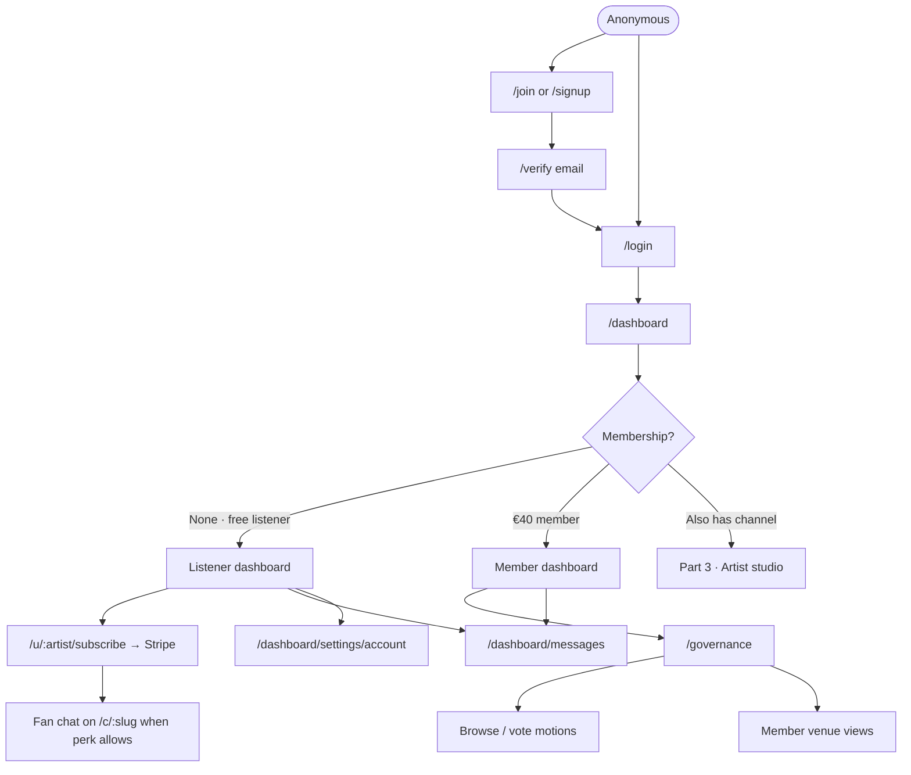
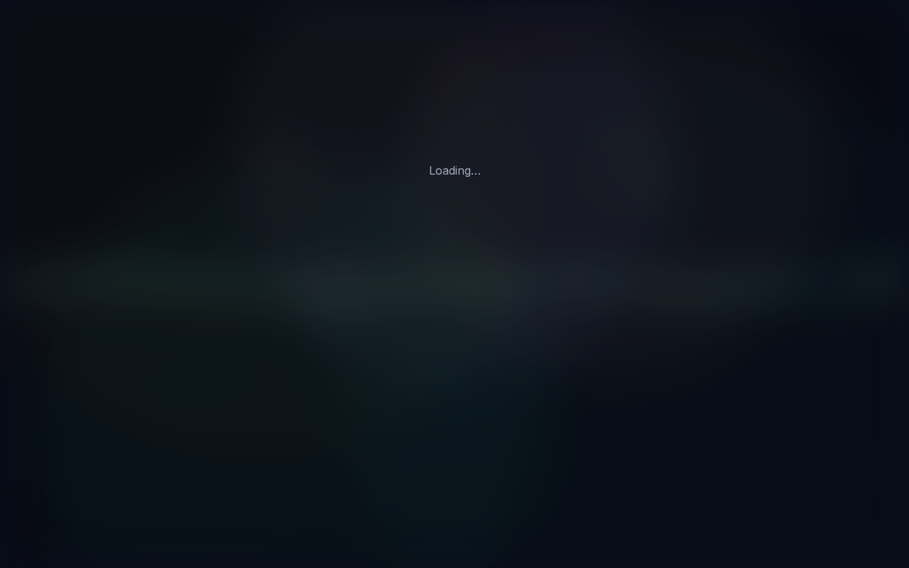
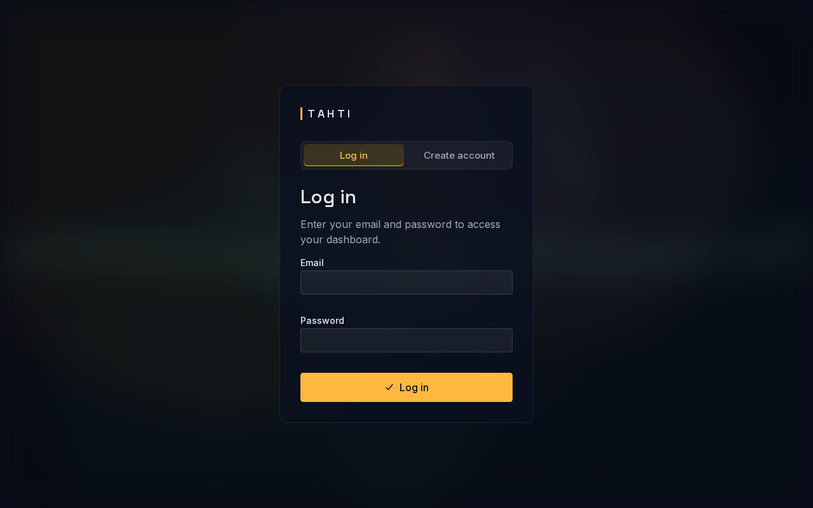
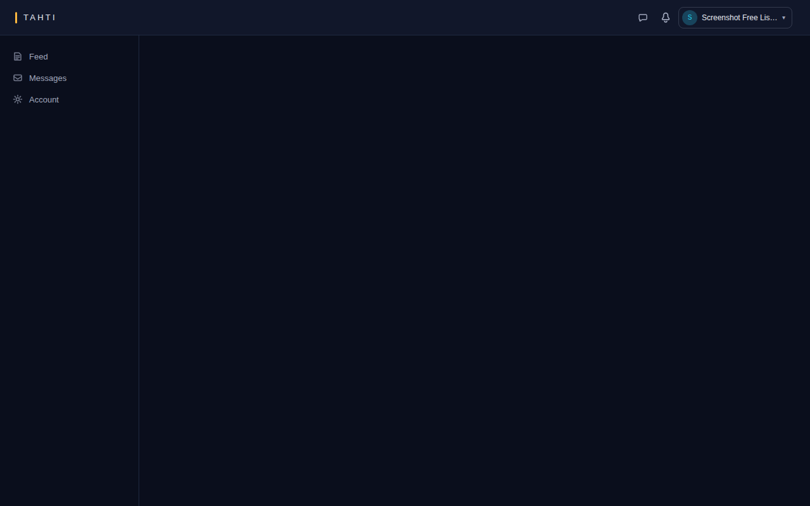
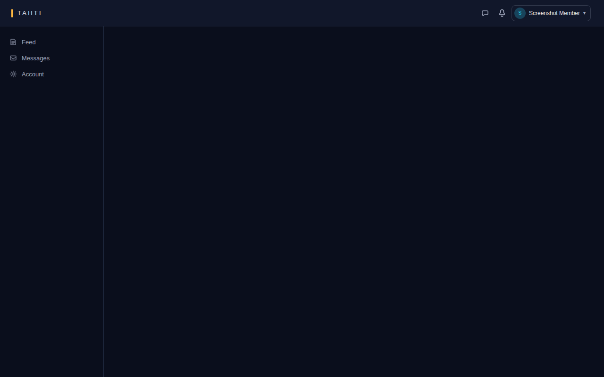

# Part 2 — Logged-in listener / member

**Who:** Anyone with an account who is **not** primarily running a channel studio. Includes:

| Sub-role | Meaning | Fixture / shots |
| --- | --- | --- |
| **Free listener** | Verified account, no €40 membership | `e2e-screenshots/free/` |
| **Fan supporter** | Pays an artist via Stripe fan-sub | Uses public subscribe + dashboard subs |
| **Coop member** | €40/year Tahti ry membership | `e2e-screenshots/member/` |

**Guides:** [For viewers](../guides/for-viewers.md) · [For members](../guides/for-members.md) · **Technical:** [journey-member.md](../technical/journey-member.md)

---

## Purpose

Keep listening with identity (supporter badge, fan chat when entitled), manage fan subscriptions, optionally join the cooperative and vote on `/governance`. Free accounts may also open a thin `/dashboard` (listener home) before becoming artists.

---

## Navigation chart

---

## Where things live

### Auth funnel (public chrome)

| Tab / page | Route | Functionality |
| --- | --- | --- |
| Join | `/join` | Register for an account |
| Signup alias | `/signup` | Same funnel (legacy/alias) |
| Verify | `/verify`, `/verify?token=…` | Email verification |
| Login | `/login` | Session; `?next=` resume |

### After login — listener / member surfaces

| Surface | Route | Nav location | Functionality |
| --- | --- | --- | --- |
| Dashboard | `/dashboard` | Primary post-login | Overview; free vs member chrome differs by seed |
| Messages | `/dashboard/messages` | Header bell / mobile nav | DMs / threads |
| Account settings | `/dashboard/settings/account` | Settings → Profile → Account | Email, password, membership status |
| Governance hub | `/governance` | Linked from member dashboard / nav | Motions, voting (**member**) |
| Venue queue (board share) | `/governance/venues` | Governance / admin | Verification — board-heavy; members may see related UI |
| Fan subscribe checkout | `/u/:username/subscribe` | From profile | Stripe Checkout for tiers |
| Channel (authed) | `/c/:slug` | Public URL | Same player; **supporter badge** + **fan chat** if entitled |

Free listeners do **not** get the full artist sidebar (Music, Broadcast, …) until they provision a channel — see [Part 3](artist.md).

---

## Screen inventory + screenshots

### Auth

| Screen | Route | Screenshot |
| --- | --- | --- |
| Join | `/join` | [`public/join.png`](../e2e-screenshots/public/join.png) |
| Signup | `/signup` | [`public/signup.png`](../e2e-screenshots/public/signup.png) |
| Login | `/login` | [`public/login.png`](../e2e-screenshots/public/login.png) |
| Verify landing | `/verify` | [`public/verify.png`](../e2e-screenshots/public/verify.png) |
| Verify with token | `/verify?token=…` | [`public/verify-token.png`](../e2e-screenshots/public/verify-token.png) |

### Free listener

| Screen | Route | Screenshot |
| --- | --- | --- |
| Free dashboard | `/dashboard` | [`free/dashboard.png`](../e2e-screenshots/free/dashboard.png) |
| Free listen (authed) | `/listen` | [`free/listen.png`](../e2e-screenshots/free/listen.png) |

### Coop member

| Screen | Route | Screenshot |
| --- | --- | --- |
| Member dashboard | `/dashboard` | [`member/dashboard.png`](../e2e-screenshots/member/dashboard.png) |
| Governance | `/governance` | [`member/governance.png`](../e2e-screenshots/member/governance.png) |

### Fan support (still Part 2)

| Screen | Route | Screenshot |
| --- | --- | --- |
| Tier picker | `/u/screenshot-demo/subscribe` | [`public/subscribe.png`](../e2e-screenshots/public/subscribe.png) |
| Channel after support | `/c/screenshot-demo` | [`public/channel.png`](../e2e-screenshots/public/channel.png) |

---

## Happy paths

**Free → fan**

1. `/login` → open `/u/:artist/subscribe` → Stripe → return to channel with perks.

**Free → coop member**

1. Join / pay membership from dashboard account area → `/governance` for motions.

**Member who starts a channel** → continues in [Part 3 · Artist](artist.md).
