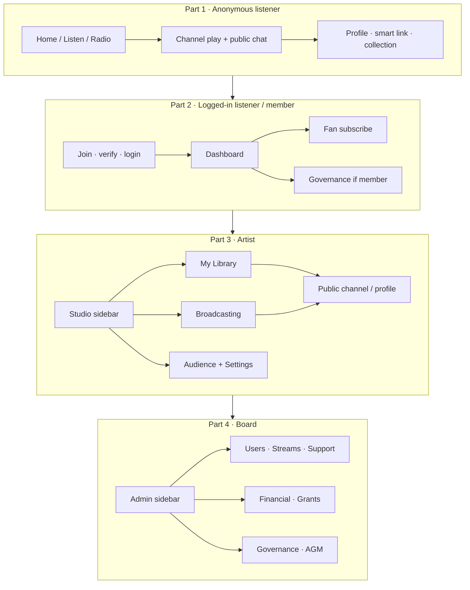
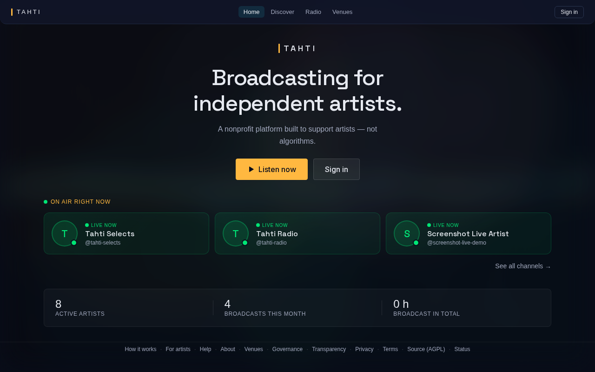
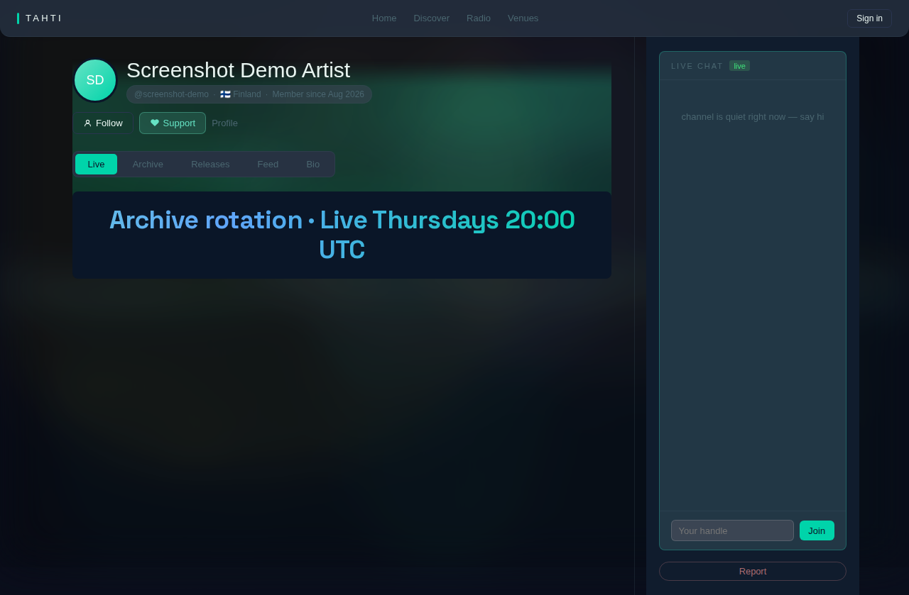
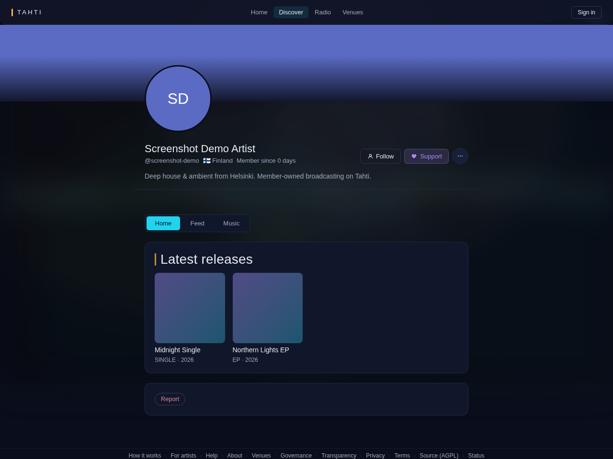
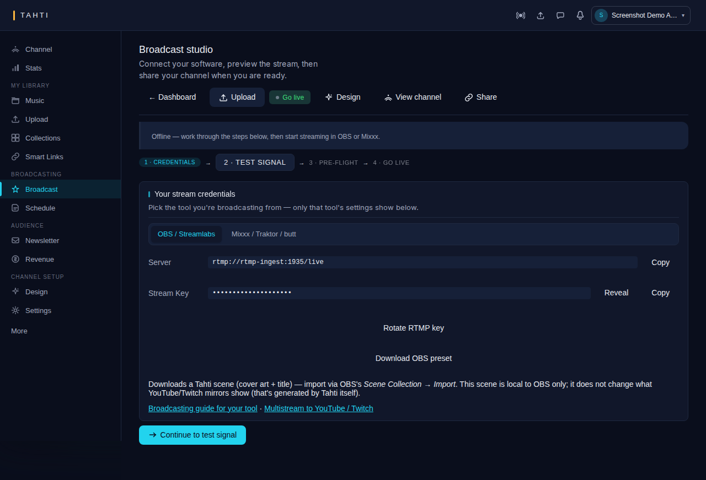
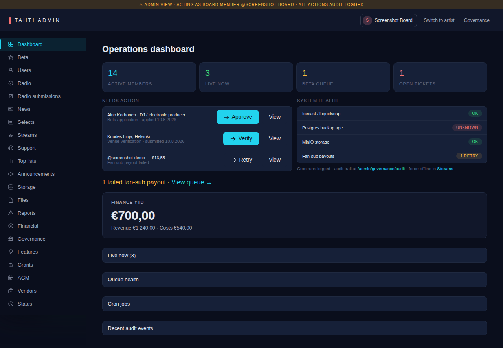
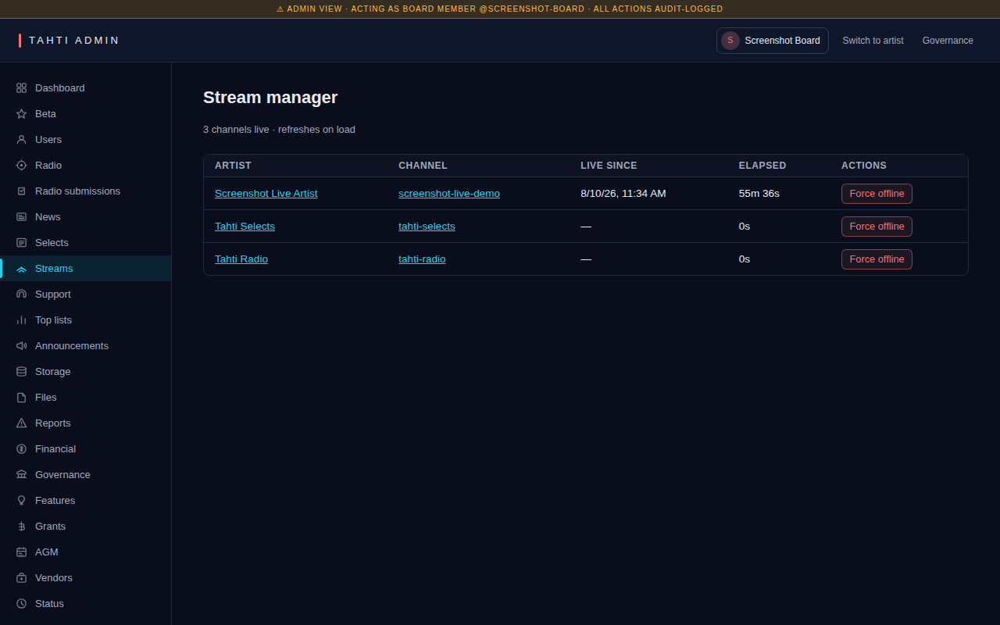
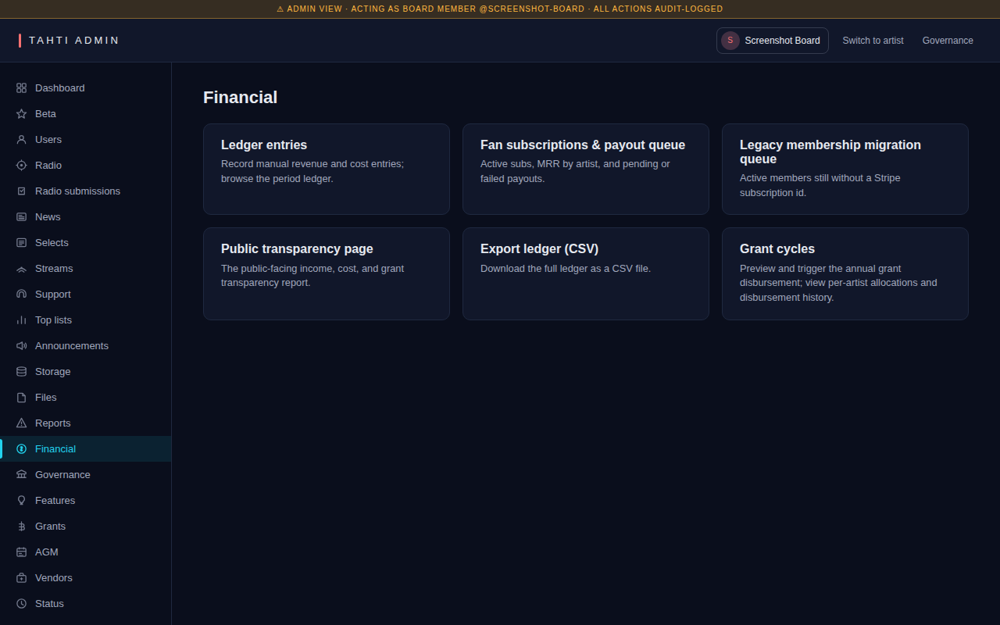
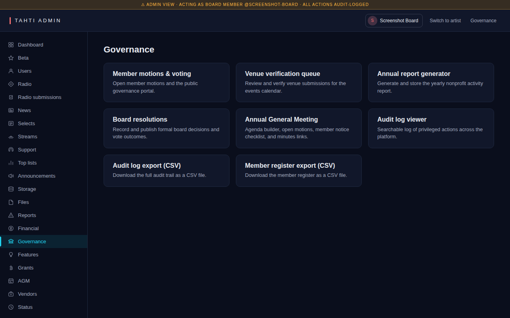

# Navigation flows — design review pack

**Audience:** UI / product design — verify layout, hierarchy, and continuity across personas without reading implementation code.

**Companion docs:** per-persona Mermaid + full screen inventories live in [`README.md`](README.md). Product constitution: [`../CONSTITUTION.md`](../CONSTITUTION.md).

**Screenshots:** Playwright captures under [`../e2e-screenshots/`](../e2e-screenshots/). Below, **reference shots** are the desktop captures from the Docker stack seed. Open sibling files in `e2e-screenshots-mobile/` when checking narrow viewports.

---

## 1. Master spine (all four parts)



Full route colour map: [site-map.md](site-map.md).

---

## 2. Screenshots by persona

### Part 1 — [Anonymous listener](anonymous-listener.md)

| Screen | Reference screenshot |
| --- | --- |
| Home | [`public/home.png`](../e2e-screenshots/public/home.png) |
| Listen | [`public/listen.png`](../e2e-screenshots/public/listen.png) |
| Channel | [`public/channel.png`](../e2e-screenshots/public/channel.png) |
| Profile | [`public/profile.png`](../e2e-screenshots/public/profile.png) |
| Subscribe (browse) | [`public/subscribe.png`](../e2e-screenshots/public/subscribe.png) |
| Smart link | [`public/smart-link.png`](../e2e-screenshots/public/smart-link.png) |
| Transparency | [`public/transparency.png`](../e2e-screenshots/public/transparency.png) |







---

### Part 2 — [Logged-in listener / member](logged-in-listener.md)

| Screen | Reference screenshot |
| --- | --- |
| Join | [`public/join.png`](../e2e-screenshots/public/join.png) |
| Login | [`public/login.png`](../e2e-screenshots/public/login.png) |
| Free dashboard | [`free/dashboard.png`](../e2e-screenshots/free/dashboard.png) |
| Member dashboard | [`member/dashboard.png`](../e2e-screenshots/member/dashboard.png) |
| Governance | [`member/governance.png`](../e2e-screenshots/member/governance.png) |


---

### Part 3 — [Artist](artist.md)

| Screen | Reference screenshot |
| --- | --- |
| Studio home | [`artist/dashboard.png`](../e2e-screenshots/artist/dashboard.png) |
| Broadcast | [`artist/broadcast-studio.png`](../e2e-screenshots/artist/broadcast-studio.png) |
| Schedule | [`artist/schedule-programme.png`](../e2e-screenshots/artist/schedule-programme.png) |
| Music / archive | [`artist/archive.png`](../e2e-screenshots/artist/archive.png) |
| Upload | [`artist/upload.png`](../e2e-screenshots/artist/upload.png) |
| Smart Links | [`artist/releases.png`](../e2e-screenshots/artist/releases.png) |
| Fan subs settings | [`artist/settings-fan-subs.png`](../e2e-screenshots/artist/settings-fan-subs.png) |
| Multistream | [`artist/settings-multistream.png`](../e2e-screenshots/artist/settings-multistream.png) |
| Revenue | [`artist/revenue.png`](../e2e-screenshots/artist/revenue.png) |





**Sidebar groups to verify visually:** Channel · Stats · My Library · Broadcasting · Audience · Channel setup — labels and order in `DASHBOARD_NAV`.

---

### Part 4 — [Board member](board-member.md)

| Screen | Reference screenshot |
| --- | --- |
| Admin dashboard | [`admin/dashboard.png`](../e2e-screenshots/admin/dashboard.png) |
| Users | [`admin/users.png`](../e2e-screenshots/admin/users.png) |
| Streams | [`admin/streams.png`](../e2e-screenshots/admin/streams.png) |
| Financial | [`admin/financial.png`](../e2e-screenshots/admin/financial.png) |
| Governance | [`admin/governance.png`](../e2e-screenshots/admin/governance.png) |
| Grants | [`admin/grants.png`](../e2e-screenshots/admin/grants.png) |
| Radio | [`admin/radio.png`](../e2e-screenshots/admin/radio.png) |









**Sidebar to verify:** full `ADMIN_NAV` list (Dashboard → … → Status) in [board-member.md](board-member.md).

---

## 3. Regenerating screenshots

From repo root:

```bash
./scripts/e2e-screenshots.sh
```

Writes to `docs/e2e-screenshots/<role>/…` and updates `manifest.json`. See [`../e2e-screenshots/README.md`](../e2e-screenshots/README.md).
