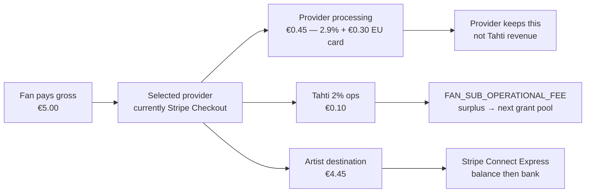
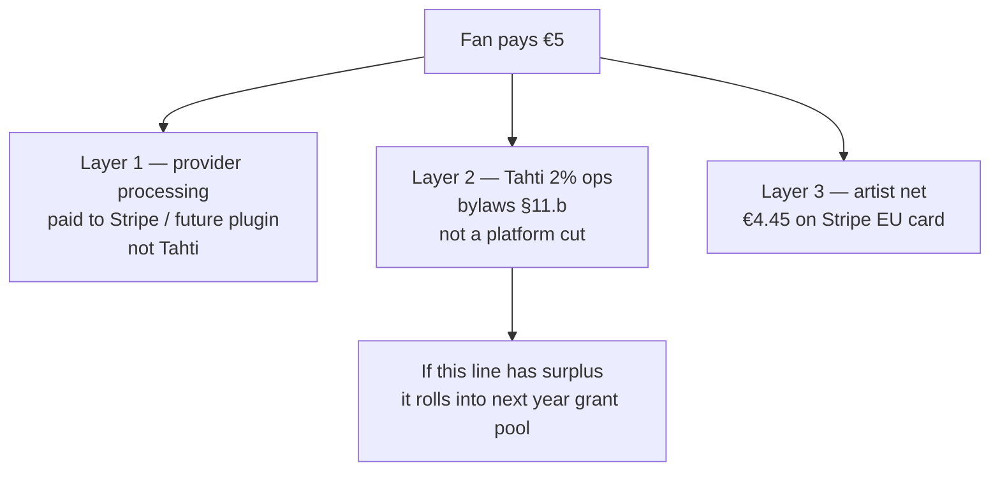
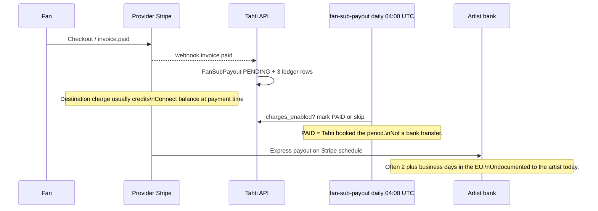
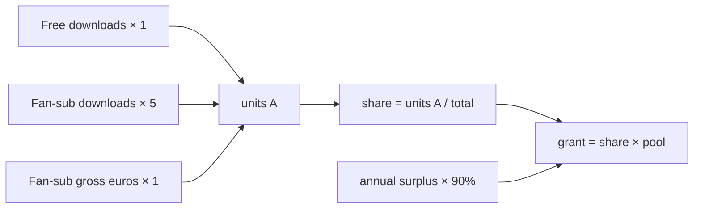
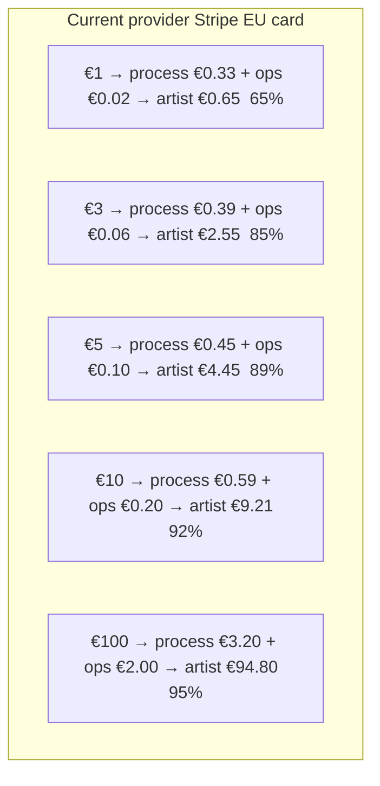
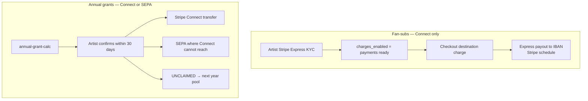

# Money flows — eight payout diagrams

Canonical money-movement spec for fan-subs, grants, royalties, and membership.
Product split and worked euro amounts live in
[`engagement-and-fansubs.md`](../engagement-and-fansubs.md). This page is the
**flow** source of truth. Older phase docs (`technical/phase-11.md`,
`AGENT.md` M19) that still say “97.9%”, “monthly payout cron”, “2% covers
processing”, or “€1 fan-sub = 10 grant units” are superseded here.

**Split (always):**

```
artist_net = gross − provider_processing − (gross × 2%)
```

- **Provider processing** is the selected payment provider’s fee. It is not
  Tahti’s money. Today the only provider is Stripe (EU card modeled as
  2.9% + €0.30 in `packages/ledger/src/fansub.ts`).
- **2% ops** is Tahti’s capped operational fee (bylaws §11.b). It does not
  cover processing. Surplus on this line rolls into the next grant pool.
- A later plugin (roadmap **PLAT-084**) lets the artist pick another
  processor; the 2% stays, the processing line changes.

On a **€5 Stripe EU-card** charge the artist keeps **€4.45 (89%)**, not 98%.

---

## The eight flows

| # | Flow | What it answers |
|---|---|---|
| 1 | [Charge split](#1-charge-split--who-pays-what) | Who pays processing vs the 2% ops fee |
| 2 | [Fee layers](#2-fee-layers--0-cut-vs-2-ops-vs-processing) | How “0% cut” coexists with a 2% fee |
| 3 | [Settlement clocks](#3-settlement-clocks--paid-is-not-the-bank) | Charge vs `PAID` row vs bank credit |
| 4 | [Four money streams](#4-four-money-streams--do-not-call-them-all-payouts) | Fan-sub ≠ grant ≠ royalty ≠ membership |
| 5 | [Grant units](#5-grant-units--one-per-gross-euro) | Fan-sub euros in the grant formula |
| 6 | [Price sensitivity](#6-price-sensitivity--the-fixed-processing-fee) | Why €1 and €5 are not the same take-home % |
| 7 | [Payout rails](#7-payout-rails--connect-vs-sepa) | Fan-subs are Connect-only; SEPA is grants |
| 8 | [Exceptions](#8-exceptions--refund-dispute-failed-card) | Refunds, disputes, unpaid renewals |

Refactor work to make code match these diagrams:
[Refactor plan](#refactor-plan).

---

## 1. Charge split — who pays what

Listener pays gross. The selected provider takes its processing fee. Tahti
takes 2% of gross as ops. The rest is the artist’s destination credit.



Ledger on each successful period (`recordFanSubPayment`):

| Category | Amount on €5 |
|---|---|
| `FAN_SUB_GROSS_RECEIVED` | +€5.00 |
| `FAN_SUB_NET_TO_ARTIST` | +€4.45 |
| `FAN_SUB_OPERATIONAL_FEE` | +€0.10 |

`stripeFeeCents` on `FanSubPayout` is the **modeled** provider processing line
(€0.45). It is not a fourth ledger category because it never hits Tahti’s
books.

**Open structural gap:** Checkout uses a destination charge
(`transfer_data.destination` + `application_fee_percent: 2`) and does **not**
set `on_behalf_of`. Stripe’s default for that pattern is that the *platform*
pays processing. The ledger still subtracts processing from the artist. Until
refactor R1/R2, treat €4.45 as the **documented intended split**, not a proven
Connect balance.

---

## 2. Fee layers — 0% cut vs 2% ops vs processing

“0% org cut” means Tahti takes no *platform profit* from fan support. It does
not mean the fan’s €5 arrives intact, and it does not mean the 2% pays Stripe.



| Phrase to retire | Phrase to use |
|---|---|
| “2% covers processing” | “2% ops; processing is extra and belongs to the provider” |
| “98% / 97.9% to the artist” | “89% on a €5 Stripe EU-card charge; higher % on larger tiers” |
| “0% take” without the 2% | “0% platform *cut*; 2% ops + provider processing” |
| “minus 2% (~~€0.45 to org)” | “2% of €5 is €0.10; €0.45 is Stripe processing” |

---

## 3. Settlement clocks — `PAID` is not the bank

Three clocks. Do not collapse them in UI copy.



Admin: job `fan-sub-payout`, pattern `0 4 * * *`, declared in
`packages/shared/src/worker-cron-jobs.ts`. Last run is on `/admin/dashboard`
(cron list) and `/admin/financial/fansubs` (payout cron card). The worker
re-registers the pattern at process start; changing it in admin without
refactor R5 does not move the scheduler.

`payouts_enabled` is not checked. “Payments ready” is `charges_enabled` only
(refactor R9).

---

## 4. Four money streams — do not call them all “payouts”

```mermaid
flowchart TB
  subgraph fanSub ["1 Fan-sub order"]
    FS["Listener monthly charge"]
    FS --> Split["provider processing + 2% ops"]
    Split --> Dest["Artist Connect destination"]
  end
  subgraph grant ["2 Annual grant"]
    Pool["Org surplus × 90%"]
    Pool --> Units["engagement units"]
    Units --> GPay["Connect or SEPA after artist confirms"]
  end
  subgraph roy ["3 DSP royalties"]
    Rev["Revelator monthly report"]
    Rev --> Mix["Production /dashboard/revenue\nmixes these into the dated list as PAID"]
  end
  subgraph mem ["4 Membership"]
    Art["Artist pays Tahti €40/year"]
    Art --> Org["REVENUE_SUBSCRIPTION\norg income, not an artist payout"]
  end
```



| Stream | Artist API / screen | Cron |
|---|---|---|
| Fan-sub orders | `GET /api/me/fan-sub-payouts`, Studio → Audience / `/dashboard/revenue` | `fan-sub-payout` daily 04:00 UTC |
| Annual grants | `GET /api/me/grants` | `annual-grant-calc` 1 March 03:00 UTC |
| DSP royalties | `GET /api/me/revelator/royalties` | `revelator-royalty-sync` 5th 04:00 UTC |
| Membership | `POST /api/me/membership/checkout` | artist **pays** the org |

Production Revenue concatenates fan-sub rows and Revelator rows (12-row cap)
and stamps royalties `PAID`. That is a display mix, not one money pipe
(refactor R6).

One fan holds **one** subscription per artist
(`@@unique([artistUserId, subscriberUserId])`). A tier change overwrites that
row.

---

## 5. Grant units — one per gross euro

Authoritative (`planning-decisions.md` Topic 8, `packages/ledger`):

```
units(A) = free_downloads×1 + paid_downloads×5 + fan_sub_euros_received×1
```

`fan_sub_euros_received` is **gross** (what fans paid), not artist net.



Worked (same Long Doe numbers as the spec):

- 800 free downloads → 800
- 120 paid downloads → 600
- €2,400 fan-sub **gross** → 2,400
- Total 3,800 units → 0.38% of 1,000,000 → **€656** grant on a €172,649 pool

Direct fan-sub net that year (Stripe EU card): 480 × €4.45 = **€2,136**.
Grant is extra: **€2,792** combined.

Phase 11’s `fan_sub_euros × 10` and “even 1 download counts” (no 5-unit floor)
are **wrong**. Eligibility floor is **5 units**.

---

## 6. Price sensitivity — the fixed processing fee

Provider processing is a **percentage plus a fixed per-charge amount**. The
2% ops fee is percentage-only. Small tiers keep a much smaller share.



Formula in cents (Stripe model):

```
processing = round(gross × 0.029) + 30
ops        = round(gross × 0.02)
net        = gross − processing − ops
```

AMEX / non-EU cards are not modeled. A future provider plugin replaces the
`0.029` / `30` constants, not the 2% ops line.

Year illustrations (Stripe €5, tests in `artist-year-economics.ts`):

| Story | Gross | Processing | 2% ops | Fan-sub net | Membership | Grant | Year net |
|---|---|---|---|---|---|---|---|
| A — 2 fans × 10 months | €100 | €9.00 | €2.00 | €89.00 | −€40 | +€1 | **+€50** |
| B — no fans | €0 | €0 | €0 | €0 | −€50 | €0 | **−€50** |
| C — 1 fan × 9 months | €45 | €4.05 | €0.90 | €40.05 | −€40 | €0 | **+€0.05** |

---

## 7. Payout rails — Connect vs SEPA



Fan-sub docs that promised “Express or SEPA in unsupported regions” were
wrong. There is **no** fan-sub SEPA path in code. If Connect is unavailable,
the artist cannot receive fan-sub orders until a second provider plugin
exists (PLAT-084).

---

## 8. Exceptions — refund, dispute, failed card

```mermaid
flowchart TB
  subgraph refund ["Refund — 7-day first month"]
    R1["Fan asks for money back"] --> R2["Artist decides — may refuse"]
    R2 --> R3["Provider refund on the connected account"]
    R3 --> R4["Intended: FanSubPayout REFUNDED\n+ reversing ledger rows"]
  end
  subgraph dispute ["Dispute"]
    D1["Fan files chargeback"] --> D2["Provider dispute flow"]
    D2 --> D3["Org steps in only if artist asks"]
  end
  subgraph fail ["Failed renewal"]
    F1["invoice.payment_failed"] --> F2["Provider smart retry"]
    F2 --> F3["PAST_DUE"]
    F3 --> F4["Auto-cancel after 14 days"]
  end
  subgraph cancel ["Voluntary cancel"]
    C1["Fan cancels"] --> C2["CANCELED — perks until period end"]
    C2 --> C3["Plus 7-day grace"]
    C3 --> C4["EXPIRED — badge and FLAC off"]
  end
```



| Event | Access | Money (specified) | Code today |
|---|---|---|---|
| First-month refund | Artist-handled | Provider reverses the charge; who eats processing + 2% is **unspecified** | `REFUNDED` exists on the enum; no writer found |
| Dispute | Provider | Stripe standard | No org auto-ledger |
| Failed card | Smart retry, cancel at 14 days | No new `FanSubPayout` | Webhook + expire cron |
| Cancel | Period end + 7 days grace | Already-paid period stays | `markFanSubCanceledAtPeriodEnd` + `fan-sub-expire` |

---

## Surfaces (routes that must agree)

| Who | Route | Job |
|---|---|---|
| Fan | `/u/:username/subscribe` | Pay; see 2% ops + provider processing, not “0% covers processing” |
| Artist | `/dashboard/revenue`, Player `/studio/revenue` | Latest **orders**, stats, €5 Stripe example |
| Artist | Settings → Audience → Fan subs | Connect onboarding, tiers |
| Board | `/admin/financial/fansubs` | Queue, retry, payout cron card |
| Board | `/admin/dashboard` | Cron last-run list |
| Public | `/transparency` | Ops fee aggregate only; never per-artist fan-sub totals without consent |

Stale names: `/v1/me/fansubs/*`, `tahti.fi`, `/dashboard/settings/payments`,
`FANSUB_PASSTHROUGH`, monthly 1st-of-month payout cron.

---

## Refactor plan

Docs now describe the intended product. These code changes are required
before artist-facing copy can say the numbers are *actual* Connect money.

### R1 — Confirm who pays Stripe processing (P0)

Checkout: destination charge, 2% `application_fee_percent`, no `on_behalf_of`.
Default Stripe behaviour: **platform** pays 2.9%+€0.30, artist would get ~€4.90
on €5.

Pick one and implement it:

- **A (matches this spec):** set `on_behalf_of` (or equivalent) so the connected
  account pays processing; keep `computeFanSubSplit` as-is.
- **B (matches default Stripe):** stop subtracting modeled Stripe fees from the
  artist; net = gross − 2% (€4.90). Rewrite every €4.45 example.

Do not ship UI that asserts €4.45 as a bank figure until A or B is proven
against a live `balance_transaction`.

### R2 — Record live provider fees (P1)

Replace modeled `stripeFeeCents` with the charge’s actual processing when the
webhook has a `balance_transaction`. Keep the model as a fallback for
non-Stripe providers and tests.

### R3 — Name the processing field for plugins (P2, with PLAT-084)

`stripeFeeCents` / `stripeTransferId` are Stripe-shaped. Introduce
`providerFeeCents` + `providerTransferId` (or a provider enum + JSON fee
breakdown) before a second processor. Do not rename in isolation without a
migration.

### R4 — Payment-provider plugins (P2) — **PLAT-084**

Host contract: list processors, fee quote for a gross amount, create checkout,
handle webhooks, destination/payout, refund. Stripe is the first plugin.
Artist picks a provider in Fan subs settings. 2% ops stays in Tahti.

### R5 — Admin-configurable payout cron (P2)

Today the schedule is compile-time `0 4 * * *`. Admin shows it. To *change* it
from `/admin/financial/fansubs`: persist override, worker reads it on
`registerCrons()`, audit the change, reject sub-hour patterns for this job.

### R6 — Stop mixing royalties into fan-sub orders (P2)

`/dashboard/revenue` (and Player Audience) should label streams separately, or
filter royalties behind a tab. Never stamp Revelator rows `PAID` by default.

### R7 — Exception ledger (P1)

On refund/dispute: write `FanSubPayout.state = REFUNDED` and append-only
reversing ledger rows. Document whether processing and the 2% are clawed back
(depends on R1).

### R8 — `payouts_enabled` (P1)

Gate “payments ready” / Subscribe on **both** `charges_enabled` and
`payouts_enabled`. Show a distinct “charges on, payouts pending” state.

### R9 — Stale spec deletion (P3)

Point `phase-11.md` fan-sub diagrams at this file. Remove `FANSUB_PASSTHROUGH`,
monthly payout cron, 97.9% artist share, and `× 10` grant weight from anything
still treated as current.

---

## Related

- [`engagement-and-fansubs.md`](../engagement-and-fansubs.md) — units, euros, year P&amp;L
- [`financial-model.md`](../financial-model.md) — org books vs fan-sub passthrough
- [`governance-and-legal.md`](../governance-and-legal.md) — bylaws §11.b
- [`technical/worker-crons.md`](../technical/worker-crons.md) — job table
- [`project-roadmap.md`](../project-roadmap.md) — PLAT-084
