# Site map — every user-facing route

Lightweight Mermaid of surfaces that exist today. Use this to see **where** a user can go; use the [persona packs](README.md) for **why** and screenshots.

> Auth colours: **public** (no account) · **authed** (any login) · **member** (coop €40) · **artist** (channel) · **board** (`isBoard`).

```mermaid
flowchart TB
  %% Public marketing & discovery
  Home["/"]:::pub
  Listen["/listen"]:::pub
  Radio["/radio"]:::pub
  Venues["/venues"]:::pub
  VenuesReg["/venues/register"]:::pub
  How["/how-it-works"]:::pub
  About["/about"]:::pub
  Help["/help…"]:::pub
  Status["/status"]:::pub
  Trans["/transparency"]:::pub
  Method["/transparency/methodology"]:::pub
  Apply["/apply"]:::pub
  Join["/join · /signup"]:::pub
  Login["/login"]:::pub
  Verify["/verify"]:::pub
  Terms["/terms · /privacy · /agpl"]:::pub

  %% Public artist surfaces
  Channel["/c/:slug"]:::pub
  Profile["/u/:username"]:::pub
  Sub["/u/:username/subscribe"]:::pub
  Coll["/u/:username/c/:collection"]:::pub
  Smart["/r/:slug"]:::pub
  EmbedC["/embed/c/:slug"]:::pub
  EmbedR["/embed/r/:id"]:::pub

  %% Authed listener / member
  Dash["/dashboard"]:::auth
  Gov["/governance → /dashboard/governance"]:::mem
  GovTopics["/governance/topics"]:::mem
  GovFeat["/governance/feature-requests"]:::mem
  GovVenues["/governance/venues"]:::board

  %% Governance, embedded in the dashboard shell (same data, dashboard chrome)
  DashGov["/dashboard/governance"]:::mem
  DashGovMotions["/dashboard/governance/motions"]:::mem
  DashGovTopics["/dashboard/governance/topics"]:::mem
  DashGovFeat["/dashboard/governance/feature-requests"]:::mem

  %% Artist studio (sidebar)
  Stats["/dashboard/stats"]:::art
  Archive["/dashboard/archive · Music"]:::art
  Upload["/dashboard/upload"]:::art
  Colls["/dashboard/collections"]:::art
  Releases["/dashboard/releases · Smart Links"]:::art
  Dist["/dashboard/distribution"]:::art
  Stash["/dashboard/stash"]:::art
  Broadcast["/dashboard/broadcast"]:::art
  Schedule["/dashboard/schedule"]:::art
  VenuesDash["/dashboard/venues"]:::art
  Events["/dashboard/events"]:::art
  RadioSlot["/dashboard/tahti-radio-slots"]:::art
  Posts["/dashboard/posts"]:::art
  Embeds["/dashboard/embeds"]:::art
  News["/dashboard/newsletter/compose"]:::art
  Revenue["/dashboard/revenue"]:::art
  Design["/dashboard/channel/edit"]:::art
  Settings["/dashboard/settings/*"]:::art
  Editor["/dashboard/editor"]:::art
  Msgs["/dashboard/messages"]:::art

  %% Board
  Admin["/admin/*"]:::board

  Home --> Listen
  Home --> Radio
  Home --> Venues
  Home --> Trans
  Home --> Join
  Home --> Login
  Home --> Channel
  Listen --> Channel
  Radio --> Channel
  Profile --> Channel
  Profile --> Sub
  Profile --> Coll
  Smart --> Profile
  Join --> Verify
  Login --> Dash
  Dash --> Stats
  Dash --> Archive
  Dash --> Upload
  Dash --> Colls
  Dash --> Releases
  Dash --> Broadcast
  Dash --> Schedule
  Dash --> News
  Dash --> Revenue
  Dash --> Design
  Dash --> Settings
  Dash --> Gov
  Dash --> DashGov
  Dash --> Admin
  Gov --> GovTopics
  Gov --> GovFeat
  Gov --> GovVenues
  DashGov --> DashGovMotions
  DashGov --> DashGovTopics
  DashGov --> DashGovFeat
  Admin --> GovVenues

  classDef pub fill:#eef4ff,stroke:#3b82f6,color:#1e3a8a;
  classDef auth fill:#ecfdf5,stroke:#10b981,color:#065f46;
  classDef mem fill:#fef3c7,stroke:#d97706,color:#92400e;
  classDef art fill:#f3e8ff,stroke:#9333ea,color:#6b21a8;
  classDef board fill:#fef2f2,stroke:#ef4444,color:#7f1d1d;
```

## Auth gates (product)

| Gate | Who | Typical destinations |
| --- | --- | --- |
| None | Anonymous | `/`, `/listen`, `/radio`, `/c/:slug`, `/u/:…`, `/r/:…`, help, transparency |
| Session | Any logged-in user | `/dashboard` (listener-lite or full studio), `/dashboard/messages` |
| Coop member | Active €40 membership | `/governance` motions / voting / feature-request topics |
| Channel owner | Artist with provisioned channel | Studio sidebar routes under `/dashboard/*` |
| Board | `User.isBoard` | `/admin/*`, venue verification queue |

`/governance` and `/dashboard/governance` are the same feature in two shells —
the former is the standalone public-site chrome, the latter is embedded in
the studio dashboard sidebar; both call the same `/api/v1/governance/*`
endpoints. See [how governance works](../guides/governance-explained.md) for
the annotated walkthrough (motions, discussion, voting, AGM/board meetings,
attendance, quorum, and the document archive) and
[board-member.md](board-member.md) for the admin side (`/admin/agm`,
`/admin/governance/*`).

Successful login defaults toward `/dashboard` (or `?next=` safe internal path). Logout returns to public home / login.
