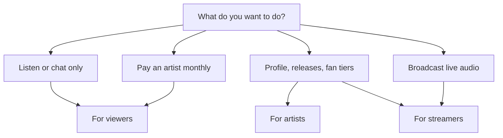

# Tahti guides — plain language

These are **“for dummies”** walkthroughs: short steps, no jargon where we can avoid it. They describe what works on Tahti **today**. For legal, money, and grant rules, see the longer docs linked at the bottom.

| Guide | Who it is for | Start here |
|-------|----------------|------------|
| **[For viewers](for-viewers.md)** | **Listeners** — tune in, chat, fan subscribe (no coop account required) | Tune in, chat, subscribe, downloads |
| **[For members](for-members.md)** | **Cooperative members** — €40/year, governance, voting | `/governance`, membership on dashboard |
| **[For artists](for-artists.md)** | **Artists** — members with a channel, releases, fan tiers | Dashboard, profile, fan tiers, releases |
| **[For streamers](for-streamers.md)** | **Live broadcast** (subset of artist) — OBS, Mixxx, etc. | RTMP, stream key, going LIVE, limits |
| **[Multistream / simulcast](multistream-simulcast.md)** | Mirror Tahti live to Twitch, YouTube, Kick, etc. | Paste each platform’s **stream key** in dashboard |

**Quick URLs (replace with real host in production):**

| What | URL pattern |
|------|-------------|
| Home | `https://tahti.live/` |
| Sign up | `/join` |
| Log in | `/login` |
| Your studio | `/dashboard` (after login) |
| Your live channel | `/c/your-slug` |
| Public profile | `/u/your-username` |
| Fan subscribe page | `/u/your-username/subscribe` |
| Release smart link | `/r/your-release-slug` |
| Embed player | `/embed/r/release-id` or `/embed/c/slug` |
| Transparency | `/transparency` |

---

## Which guide should I read?

- **Only listening?** → [For viewers](for-viewers.md)
- **Member with a channel who also goes live?** → [For artists](for-artists.md) **and** [For streamers](for-streamers.md)
- **Already live on Twitch and just need RTMP settings?** → [For streamers](for-streamers.md) (and [OBS guide](../obs-and-broadcasting-guides.md) for copy-paste fields)

---

## Deeper documentation

| Topic | Document |
|-------|----------|
| OBS / Mixxx / Traktor setup (detailed) | [obs-and-broadcasting-guides.md](../obs-and-broadcasting-guides.md) |
| Fan subscriptions & grants | [engagement-and-fansubs.md](../engagement-and-fansubs.md) |
| Profile, smart links, embeds | [profile-and-promo-toolkit.md](../profile-and-promo-toolkit.md) |
| Screen map & screenshots | [user-flows.md](../user-flows.md) |
| Technical user journeys | [journey-listener.md](../technical/journey-listener.md), [journey-member.md](../technical/journey-member.md), [journey-artist.md](../technical/journey-artist.md) |

---

*Tahti ry is a Finnish member cooperative. Annual membership is €40/year for artists who broadcast and use the full studio. Fan money goes to artists; the org takes a small operational fee on fan subs, not a revenue cut.*
