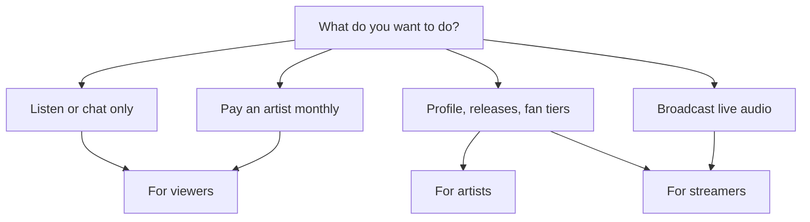

# Tahti guides — plain language

These are **“for dummies”** walkthroughs: short steps, no jargon where we can avoid it. They describe what works on Tahti **today**. For legal, money, and grant rules, see the longer docs linked at the bottom. Product inventory: **[feature catalog](../features.md)**. Open work: **[remaining-work](../remaining-work.md)**.

| Guide | Who it is for | Start here |
|-------|----------------|------------|
| **[For viewers](for-viewers.md)** | **Listeners** — tune in, chat, fan subscribe (account optional) | Tune in, chat, subscribe, downloads |
| **[For members](for-members.md)** | **Association members** — €40/year, governance, voting | `/governance`, membership on studio |
| **[How governance works](governance-explained.md)** | Deep dive for members and board — motions, AGM/board meetings, quorum | Annotated, with diagrams |
| **[For artists](for-artists.md)** | **Artists** — channel, releases, fan tiers, library | Studio home, profile, fan tiers, releases |
| **[For streamers](for-streamers.md)** | **Live broadcast** (subset of artist) — OBS, Mixxx, etc. | RTMP, stream key, going LIVE, limits |
| **[Multistream / simulcast](multistream-simulcast.md)** | Mirror Tahti live to Twitch, YouTube, Kick, etc. | Paste each platform’s **stream key** |
| **[Plugins and add-ons](plugins-and-addons.md)** | Extension categories | Channel widgets vs desktop player plugins (different systems) |

## Which UI am I using?

Tahti currently has **two web clients** on the same API:

| Client | Host | Studio paths | Notes |
| --- | --- | --- | --- |
| **Production** | [tahti.live](https://tahti.live) | `/dashboard/*` | Next.js `apps/web` — what most guides still screenshot |
| **Beta (next UX)** | [beta.tahti.live](https://beta.tahti.live) | `/studio/*` | Nuclear SPA in [tahti-player](https://github.com/janiluuk/tahti-player) |

Public listen URLs differ slightly (`/c/:slug` production vs `/channel/$slug` beta) but point at the same channels. There is **no native mobile app** yet — use the responsive site. Desktop Tauri player (local library, plugins, MCP) is also in tahti-player.

**Quick URLs:**

| What | Production | Beta |
|------|-------------|------|
| Home / listen | `https://tahti.live/` | `https://beta.tahti.live/` |
| Sign up | `/signup` (`/join` redirects) | `/join` |
| Log in | `/login` | `/login` |
| Your studio | `/dashboard` | `/studio` |
| Go live | `/dashboard/broadcast` | `/studio/go-live` |
| Your live channel | `/c/your-slug` | `/channel/your-slug` |
| Public profile | `/u/your-username` | `/u/your-username` |
| Fan subscribe | `/u/your-username/subscribe` | `/subscribe/your-username` |
| Release smart link | `/r/your-release-slug` | `/r/your-release-slug` |
| Transparency | `/transparency` | `/transparency` |

---

## Which guide should I read?

```mermaid
flowchart TD
  start[What do you want to do?]
  listen[Listen or chat only]
  support[Pay an artist monthly]
  publish[Profile, releases, fan tiers]
  live[Broadcast live audio]

  start --> listen
  start --> support
  start --> publish
  start --> live

  listen --> viewers[For viewers]
  support --> viewers
  publish --> artists[For artists]
  live --> streamers[For streamers]

  publish --> streamers
```

- **Only listening?** → [For viewers](for-viewers.md)
- **Member with a channel who also goes live?** → [For artists](for-artists.md) **and** [For streamers](for-streamers.md)
- **Already live on Twitch and just need RTMP settings?** → [For streamers](for-streamers.md) (and [OBS guide](../obs-and-broadcasting-guides.md) for copy-paste fields)

---

## Deeper documentation

| Topic | Document |
|-------|----------|
| OBS / Mixxx / Traktor setup (detailed) | [obs-and-broadcasting-guides.md](../obs-and-broadcasting-guides.md) |
| Fan subscriptions & grants | [engagement-and-fansubs.md](../engagement-and-fansubs.md) |
| Profile, smart links, embeds | [profile-and-promo-toolkit.md](../profile-and-promo-toolkit.md) |
| Flow pack (Mermaid + screenshots × 4 personas) | [flows/](../flows/README.md) |
| Screen map & user journeys (index) | [user-flows.md](../user-flows.md) |
| Technical user journeys | [journey-listener.md](../technical/journey-listener.md), [journey-member.md](../technical/journey-member.md), [journey-artist.md](../technical/journey-artist.md), [journey-director.md](../technical/journey-director.md), [journey-ops.md](../technical/journey-ops.md) |

---

*Tahti is built as a Finnish yhdistys (nonprofit association) model. Annual membership is €40/year and supports the shared platform; the free artist tier remains complete. Fan money goes to artists, with only the documented operational fee. Incorporation checklist status: [`remaining-work.md`](../remaining-work.md) Phase 0.*
