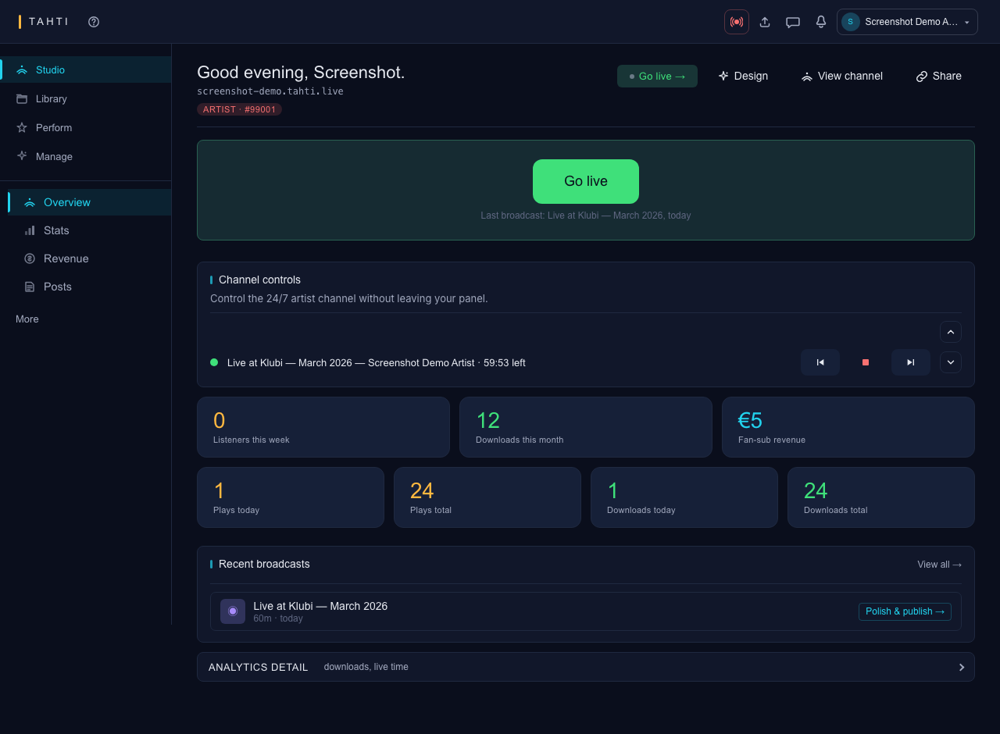
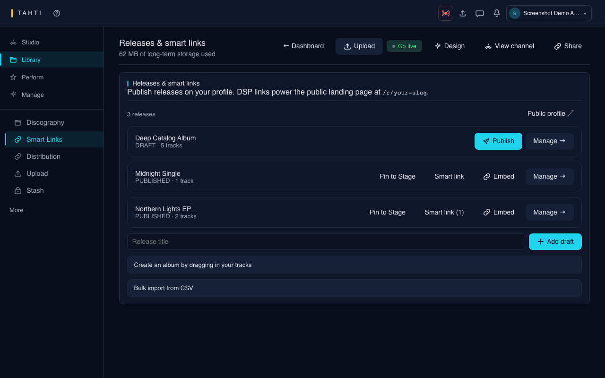
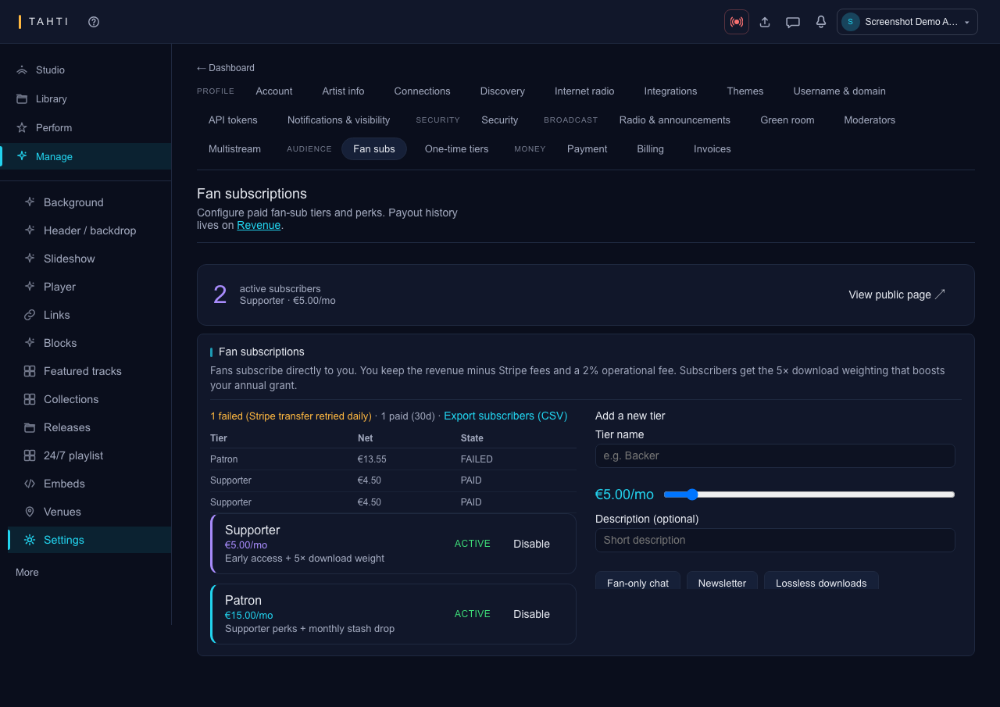

# Tahti for artists (members & studio)

This guide is for any artist account with a **channel**. Tahti ry membership adds membership benefits, but the free tier remains a complete artist product. Broadcasting itself is in **[For streamers](for-streamers.md)**. The complete inventory is in the [feature catalog](../features.md).

---

## Before you start

1. **Sign up:** `/join` → verify email (`/verify` link in mail).
2. **Optional membership:** €40/year supports Tahti ry and adds membership benefits such as lossless artist delivery and unlimited storage display.
3. **Log in anytime:** `/login` → `/dashboard`.

You get one **channel** (slug) and one **username** for your public profile.

_`/dashboard` after login: broadcast status, usage, revenue, and recent uploads in one view._

---

## Your important links

Copy these from the dashboard **Your channel** section:

| Link                         | Use when                              |
| ---------------------------- | ------------------------------------- |
| `/c/your-slug`               | “I’m live” or “listen to my archive”  |
| `/u/your-username`           | Bio, releases, main link in bio       |
| `/u/your-username/subscribe` | Patreon-style fan tiers               |
| `/r/release-slug`            | One link for Spotify/Bandcamp buttons |

---

## Dashboard tour (what each block does)

Open `/dashboard` after login.

| Section                   | What it does                                                                                                                                                                                      |
| ------------------------- | ------------------------------------------------------------------------------------------------------------------------------------------------------------------------------------------------- |
| **Tahti ry membership**   | Pay €40/year or **Manage billing** (Stripe portal when enabled).                                                                                                                                  |
| **Channel**               | Live/offline status, transport, now playing, active playlist, and channel links.                                                                                                                  |
| **24/7 playlist**         | Add archive or release tracks, preview, remove, and drag the offline queue into order.                                                                                                            |
| **Broadcast**             | RTMP/Icecast setup, OBS preset, test signal, pre-flight, recording, publishing, and Go Live.                                                                                                      |
| **Multistream**           | Mirror live to YouTube, Twitch, Kick, Facebook, TikTok, Mixcloud, Instagram (RTMP), or custom — paste each platform’s **stream key** ([guide](multistream-simulcast.md)).                         |
| **Radio & announcements** | Tahti Radio tools, announcement audio clips, and pinned chat notices.                                                                                                                             |
| **Fan subscriptions**     | Stripe Connect + fan tiers + perk codes.                                                                                                                                                          |
| **Releases**              | Draft/publish releases + **DSP URLs** for smart links.                                                                                                                                            |
| **Discography**           | Upload and manage tracks, sets, mixes, and catalog metadata.                                                                                                                                      |
| **Recordings**            | Review recorded live shows separately from the rest of the discography.                                                                                                                           |
| **Audio editor**          | Preview processing, edit waveforms, export, and retain numbered revisions.                                                                                                                        |
| **Channel design**        | Visual style (visualizer, brand accent, Saved Looks), header/backdrop, slideshow transitions, links, and player overlay text — with a live preview. See [below](#channel-designer-look-and-feel). |

---

## Channel Designer: look and feel

`/dashboard/channel/edit` is where you shape how your live channel page looks. It's one focused section at a time: pick a section on the left, edit it in the middle, and watch the live preview on the right update as you type — click a part of the preview to jump straight to the section that controls it. Nothing is published until you hit **Save** (or **Done**, which saves and returns to the dashboard).

| Section                   | What it controls                                                                                                                                                                                                                                                                |
| ------------------------- | ------------------------------------------------------------------------------------------------------------------------------------------------------------------------------------------------------------------------------------------------------------------------------- |
| **Visual style**          | The background visualizer behind your player (eleven presets — Water ripple, Aurora, Particle field, and others — each with its own speed/intensity/scale and an audio-reactive toggle), and your brand accent (six preset gradients, or a custom 5-color scheme).              |
| **Header & backdrop**     | The banner style at the top of your page — gradient, solid color, or a looping video (paid tiers) — plus the backdrop media that style uses, and whether your join date and live listener count show next to your name.                                                         |
| **Slideshow transitions** | Only appears once you turn on a gallery mode in Header & backdrop. Eight transition styles between images: four simple crossfades and four richer ones (particle dissolve, glitch wipe, cube flip, liquid distortion), plus how long each image shows and whether it autoplays. |
| **Links**                 | The link buttons in your channel banner — label and URL for each; the platform icon is picked automatically from the URL.                                                                                                                                                       |
| **Player overlay text**   | An optional stylized headline over your player — five text effects, with alignment control.                                                                                                                                                                                     |

Your name, avatar, country, pronouns, and tags aren't edited here — Header & backdrop links out to **Settings → Artist info** for those, so there's one place that saves them. Press kit lives there too, under the Branding tab.

### Saving a Look

Once you've got Visual style set up the way you want, you can save it as a named **Look** and switch between looks later (for a themed stream, a seasonal look, etc.) without re-doing the settings each time:

1. In **Visual style**, use the **Saved Looks** picker to pick an existing Look — it applies immediately to the section (still needs Save to go live).
2. Click **Save preset**, give it a name, and confirm. Saving under a name you've already used asks you to confirm before it overwrites that Look.
3. Select a Look and click **Delete** to remove it — this can't be undone.

### Profile

1. Share `/u/your-username` on Instagram, Linktree, etc.
2. Visitors see your display name, bio, releases, and link to the channel.

### Releases & smart links

_Dashboard → Releases: draft, publish, and attach DSP URLs per release._

1. Dashboard → **Releases** → **Add draft** (title + tracks metadata in v1).
2. Click **Publish** when ready (needs at least one track).
3. Click **DSP URLs** on a published release → paste Spotify, Bandcamp, Apple Music, etc.
4. Share **`/r/your-release-slug`** — fans see buttons for each service.

### Embed on your website

- Release player: `/embed/r/release-id`
- Channel mini-page: `/embed/c/your-slug`

---

## Step-by-step: fan subscriptions (money from fans)

_Dashboard → Settings → Audience → Fan subs: Stripe Connect status and tier cards._

### 1. Turn on Stripe Connect

1. Dashboard → **Fan subscriptions**.
2. If you see “Connect payouts”, complete **Stripe Express** onboarding (ID + bank).
3. Wait until **payments ready** (Stripe enables charges on your account).

### 2. Create tiers

Example tiers (you choose names and prices):

| Tier      | Price  | Example perks (one per line) |
| --------- | ------ | ---------------------------- |
| Backer    | €5/mo  | Early access                 |
| Supporter | €3/mo  | `FAN_CHAT`                   |
| Patron    | €10/mo | `FAN_NEWSLETTER`, `FLAC`     |

**Special perk codes** (type exactly):

| Code             | Effect                                                               |
| ---------------- | -------------------------------------------------------------------- |
| `FAN_CHAT`       | Active fans can use **fan-only chat** on `/c/your-slug`.             |
| `FAN_NEWSLETTER` | Lets you send newsletter to **fans only** (API: `audience: "fans"`). |
| `FLAC`           | Fans get lossless downloads where the platform supports it.          |

Free-text perks are shown on the subscribe page; only the codes above **turn on** platform features.

### 3. Share subscribe page

Link: `/u/your-username/subscribe`

Fans pay monthly via Stripe. You receive payouts minus Stripe fees and a **2% operational fee** (documented in [engagement-and-fansubs.md](../engagement-and-fansubs.md)).

### 4. When a fan cancels

They keep perks until the **billing period ends**, then about **7 days grace**. You do not need to do anything — status updates automatically.

---

## Step-by-step: archive (not live)

1. Dashboard → **Upload** → choose Track or Set / Mix, then drop a WAV, FLAC, MP3, AAC, or supported audio file.
2. Wait until processing finishes (worker transcodes).
3. Item appears on `/c/your-slug` for playback and downloads.

Downloads from fans can count toward **engagement** for annual grants (see transparency docs).

---

## Step-by-step: chat & community

1. **Announcements:** Dashboard → type a short pinned message (e.g. “New EP Friday”).
2. **Public chat:** Automatic on `/c/your-slug`; moderate by banning via API/tools as they ship.
3. **Fan chat:** Add `FAN_CHAT` to a tier; active fans see the extra panel when logged in.

---

## Member governance

Paid Tahti ry members can use `/governance` for motions and votes (cooperative decisions). This is separate from fan subscriptions.

---

## Feature status

Use the [feature catalog](../features.md) for implemented surfaces and required external services. Use [future-improvements.md](../future-improvements.md) for deferred work; smart links and DSP delivery are separate workflows.

---

## Checklist: “I’m ready to promote my Tahti”

- [ ] Email verified, membership active
- [ ] Stripe Connect **payments ready**
- [ ] At least one **fan tier** active (optional)
- [ ] **Published** release with **DSP URLs** (optional)
- [ ] Tested **one live show** ([streamers guide](for-streamers.md))
- [ ] Link in bio: `/u/username` or `/c/slug`

---

## Troubleshooting

| Problem                      | What to check                                                        |
| ---------------------------- | -------------------------------------------------------------------- |
| Subscribe disabled for fans  | Connect onboarding incomplete or `charges_enabled` false.            |
| No fan chat                  | Tier must include `FAN_CHAT` and fan must be logged in + subscribed. |
| Smart link empty             | Publish release + save DSP URLs in dashboard.                        |
| “Weekly limit” on newsletter | FREE = 1 send/week, ARTIST = 4, STUDIO = unlimited.                  |
| Broadcast stopped suddenly   | Weekly hour cap — see usage banner on dashboard.                     |

---

**Next:** [For streamers](for-streamers.md) · Detailed OBS: [obs-and-broadcasting-guides.md](../obs-and-broadcasting-guides.md) · [For viewers](for-viewers.md)
