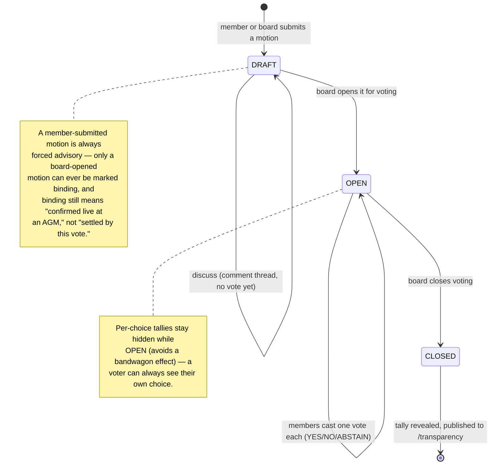
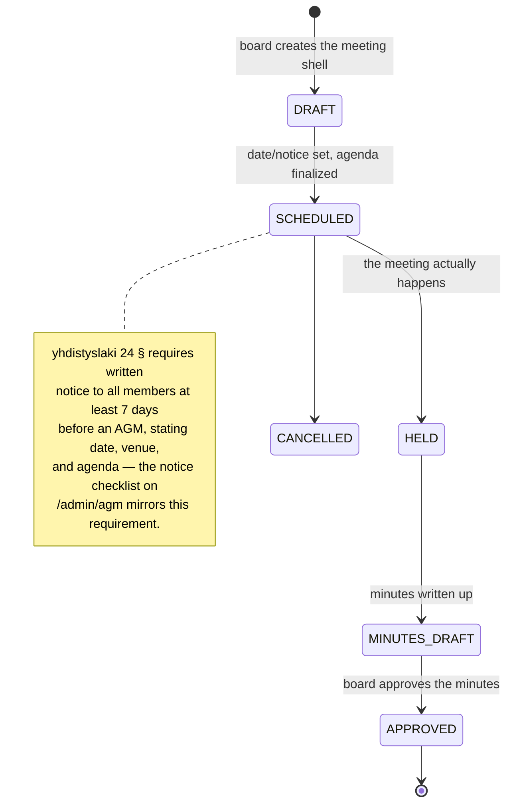

# How governance works — annotated guide

This is the deep-dive companion to [For members](for-members.md) §2. It walks
through both sides of governance: the **motion** a member can raise and vote
on today, and the **AGM/board meeting** record the board keeps. Everything
here is **advisory** until Tahti ry's adopted bylaws authorize binding
electronic voting — see the disclaimer on every governance screen and
[`docs/governance-and-legal.md`](../governance-and-legal.md) for the legal
status. Implementation status/gaps: [`docs/governance-worklog.md`](../governance-worklog.md).

---

## 1. The two governance surfaces

| Surface | Route | Who | Screenshot |
|---|---|---|---|
| Public-site governance portal | [`/governance`](/governance) | Members | [`member/governance.png`](../e2e-screenshots/member/governance.png) |
| Same feature, dashboard chrome | `/dashboard/governance` | Members | [`artist/governance.png`](../e2e-screenshots/artist/governance.png) |
| Board's meeting/document tools | `/admin/agm` | Board | [`admin/agm.png`](../e2e-screenshots/admin/agm.png) |
| Board resolutions, audit, reports | `/admin/governance/*` | Board | [`admin/governance.png`](../e2e-screenshots/admin/governance.png) |

`/governance` and `/dashboard/governance` call the same
`/api/v1/governance/*` endpoints — pick whichever chrome you're already in.

---

## 2. Motion lifecycle (what a member does)

**Annotated walkthrough** (numbers refer to the member-governance screenshot
above):

1. **Submit** — any member can draft a motion (title + description + a
   proposed open/close window). It starts in `DRAFT`.
2. **Discuss** — while `DRAFT`, anyone can post to the comment thread under
   the motion card. This is the "circulation" period before a vote opens.
3. **Board opens it** — a board member flips the motion to `OPEN`. Only from
   here can votes be cast.
4. **Vote** — each member gets exactly one vote (For / Against / Abstain).
   The card shows `N of M members voted` but not the breakdown yet.
5. **Board closes it** — the tally is revealed on the motion card and rolled
   into the "Statistics" panel (decided count, pass rate, average turnout).
6. **Published** — closed motions also appear on the public
   [`/transparency`](/transparency) history, independent of membership login.

**Related, same page:** the **Topics** panel is a lighter-weight companion —
members post and vote on product feature requests without the formal
motion/AGM ceremony; the board reviews open topics quarterly and publishes a
report (linked from the same panel).

---

## 3. AGM / board meeting lifecycle (what the board does)

This is the part that got real persistence and an admin UI in this session's
work — a meeting is no longer just a title, it's the whole record: agenda,
notice date, location or remote link, eligible-member count, quorum, live
attendance, and a linked document (e.g. the meeting notice, later the signed
minutes).

**Annotated walkthrough** (`/admin/agm` → "Governance records" panel):

1. **New meeting** — type (AGM / extraordinary general meeting / board
   meeting), schedule, notice-sent date, location or remote URL, eligible
   member count, quorum required, and an agenda (one item per line — reuses
   the same items the "Agenda builder" above it drafts).
2. **State** — a dropdown right on the meeting row moves it through
   `DRAFT → SCHEDULED → HELD → MINUTES_DRAFT → APPROVED` (or `CANCELLED`).
   Changing it patches the meeting immediately — no separate save step.
3. **Attendance** — expand a meeting row (▼) to see its agenda and record
   attendance per person (present/absent/excused). The **Quorum** column
   updates live: `presentCount / quorumRequired`, with a ✓ once quorum is
   met. This is what members eventually see on their own governance page as
   "quorum met/not met" — there's no separate publish step for attendance.
4. **New document record** — title, type (bylaws / policy / meeting notice /
   minutes / annual report / financial statement / audit report / other),
   description, effective date, an external URL or an uploaded file, an
   optional link back to the meeting it belongs to, and a **Publish
   immediately** checkbox. Unpublished documents are board-only; publishing
   is what makes them appear to members.
5. **Members see the result** on `/dashboard/governance` → "Association
   records": the 5 most recent published meetings (with quorum status) and
   documents, with a link to the full public transparency history.

**What still requires the adopted bylaws** (not built — advisory-only for
now): official binding ballots, secret-ballot protection, signed/redacted
minutes with immutable history, and board-role/term/election tracking. Full
list in [`governance-worklog.md`](../governance-worklog.md).

---

## 4. Where each piece lives in code (for the next person)

| Concept | API | Data model | UI |
|---|---|---|---|
| Motions, votes, discussion | `apps/api/src/routes/governance/index.ts` | `Motion`, `Vote`, `MotionComment` (`packages/db/prisma/schema.prisma`) | `apps/web/src/app/governance/motion-card.tsx` |
| Feature-request topics | `apps/api/src/routes/governance/feature-requests.ts` | `FeatureRequest*` | `apps/web/src/app/governance/feature-requests/` |
| Meetings, attendance, documents | `apps/api/src/routes/admin/governance-records.ts` | `GovernanceMeeting`, `GovernanceAttendance`, `GovernanceDocument` | `apps/web/src/app/admin/agm/governance-records-panel.tsx` |
| Board resolutions, audit, annual report | `apps/api/src/routes/admin/governance*.ts` | `BoardResolution`, `AuditLog` | `apps/web/src/app/admin/governance/*` |

Bulk discussion-thread lookup (`GET /api/v1/governance/motions/comments?ids=…`)
exists specifically so the list pages above don't fetch one motion's
comments at a time — see the comment on that route for why.
