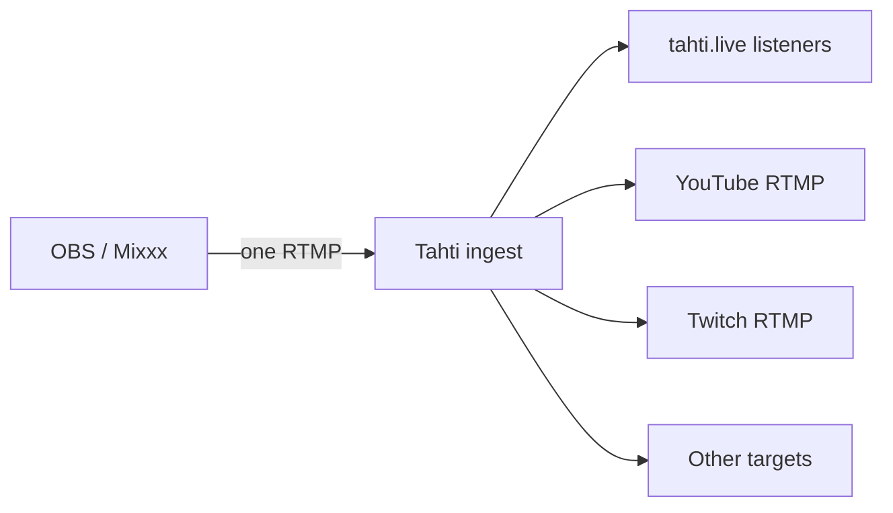

# Multistream / simulcast (Tahti → Twitch, YouTube, …)

**Simulcast** means: you send **one** live feed from OBS (or Mixxx) **to Tahti**, and Tahti **also** pushes that same audio to other platforms (Twitch, YouTube, Facebook, …) while you are live.

You do **not** connect OBS separately to each platform. You only configure OBS for **Tahti once**. The extra destinations are set up in the dashboard under **Multistream**.

---

## What you paste in the dashboard

For each destination you add:

| Field | What it is |
|-------|------------|
| **Platform** | Preset (YouTube, Twitch, …) or Custom |
| **Label** | Your name for it, e.g. “My Twitch” |
| **Stream key** | The **secret key** from that platform’s creator/live dashboard |

These are **stream keys** (RTMP secrets), **not**:

- Tahti login passwords  
- YouTube Data API keys  
- Twitch Client ID / OAuth app secrets  

Tahti stores your stream keys **encrypted**. They are only used to push your live audio to that platform’s RTMP ingest server.

**Custom RTMP:** If a service is not in the list (e.g. some regional sites), choose **Custom** and paste both **RTMP URL** and **stream key** from that service’s docs.

---

## Setup (every platform)

1. Log in → `/dashboard`.
2. Find **Multistream** → **+ Add target**.
3. Pick the **platform**, enter a **label**, paste the **stream key** from the steps below.
4. Leave **Active** checked (enabled).
5. Go live on Tahti as usual (OBS → Tahti RTMP). When your channel is **Live**, enabled targets receive the mirror feed.

You can add up to **5** targets per channel.

**Studio tier:** optional **always mirror** (auto-enable all targets each show). Other tiers: toggle **Active** per target before each broadcast.

---

## YouTube Live

1. Open [YouTube Studio](https://studio.youtube.com/) → **Create** → **Go live** (or **Live streaming**).
2. Choose **Stream** (not “Webcam” if you use OBS elsewhere).
3. Under **Stream settings**, copy the **Stream key** (click reveal / copy).
4. In Tahti: Platform **YouTube Live**, paste that key.  
   Tahti uses ingest: `rtmp://a.rtmp.youtube.com/live2` (you do not type this unless using Custom).

**Tip:** Reset the YouTube key if you ever leaked it; update the same target in Tahti with the new key.

---

## Twitch

1. Open [Twitch Creator Dashboard](https://dashboard.twitch.tv/) → **Settings** → **Stream**.
2. Copy the **Primary Stream key** (or reset and copy a new one).
3. In Tahti: Platform **Twitch**, paste the key.  
   Ingest: `rtmp://live.twitch.tv/app`

**Note:** Twitch keys are account-wide. One Tahti target per Twitch channel is enough.

---

## Facebook Live

1. [Facebook Live Producer](https://live.fb.com/) or Page → **Live video** → **Streaming software**.
2. Copy **Stream key** (and URL if shown; Tahti fills Facebook’s RTMP URL for you).
3. In Tahti: Platform **Facebook Live**, paste the key.

Facebook sometimes uses **persistent** stream keys per Page. Use the key for the Page you want to simulcast to.

---

## Kick

1. [Kick Creator Dashboard](https://kick.com/dashboard) → stream settings (or channel settings → stream key).
2. Copy **Stream URL** and **Stream key** if shown separately — in Tahti you only paste the **key** (Tahti sets Kick’s RTMP server).
3. In Tahti: Platform **Kick**, paste the key.

---

## TikTok Live (Live Studio / RTMP)

1. In **TikTok Live Studio** (desktop) or eligible Live setup, open **Stream settings** / **RTMP**.
2. Copy the **Server URL** and **Stream key** — in Tahti choose **TikTok Live** and paste the **key** only.

TikTok RTMP is not available in all regions or account types; if you do not see RTMP, that account cannot use this path yet.

---

## Mixcloud Live

1. Mixcloud **Live** / broadcast settings for your account.
2. Copy the **stream key** (and server if listed).
3. In Tahti: Platform **Mixcloud Live**, paste the key.

---

## Instagram Live (professional / RTMP)

Some Instagram Live setups expose RTMP for third-party tools:

1. Instagram **Professional dashboard** → Live → streaming software (wording varies).
2. Copy **RTMP URL** and **stream key**.
3. In Tahti: Platform **Instagram Live** if listed, or **Custom** with the full URL + key.

Requirements change often; if Instagram does not show RTMP, use their mobile app only.

---

## Custom (Restream, LinkedIn, regional RTMP, …)

Use when the platform gives you **RTMP URL + stream key**:

1. Tahti → **Custom**.
2. Paste **RTMP URL** exactly as documented (including `rtmps://` if required).
3. Paste **stream key**.

Examples: Restream ingest as a backup, corporate CDNs, radio stations with RTMP input.

---

## Security

| Do | Don’t |
|----|--------|
| Paste keys only in Tahti **Multistream** (password field) | Post stream keys in Discord, screenshots, or GitHub |
| Rotate keys on the platform if leaked | Reuse the same key on a public wiki |
| Remove old targets you no longer use | Share your **Tahti** RTMP key (that’s a different secret — for OBS → Tahti only) |

---

## Troubleshooting

| Problem | What to try |
|---------|-------------|
| Tahti Live but Twitch offline | Target not **Active**; wrong Twitch key; go live on Tahti first |
| Worked yesterday, fails today | Platform rotated key — paste new key in Tahti (PATCH by re-adding or update flow) |
| Only YouTube works | Other keys wrong or platform limits (e.g. TikTok RTMP not enabled) |
| “Maximum 5 targets” | Delete unused targets |
| Facebook never connects | Use Page stream key, not personal; check rtmps |

---

## How it works (short)

Liquidsoap on your channel reads enabled targets and pushes your live audio, plus a
video track showing your cover art and current title, to each RTMP URL using the
encrypted keys you saved — so YouTube/Twitch see a normal video stream.

---

**See also:** [For streamers](for-streamers.md) · [OBS setup](../obs-and-broadcasting-guides.md) · [For artists](for-artists.md)
