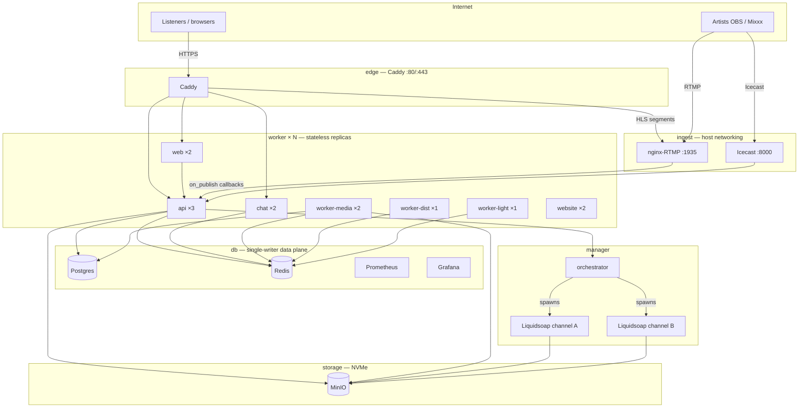
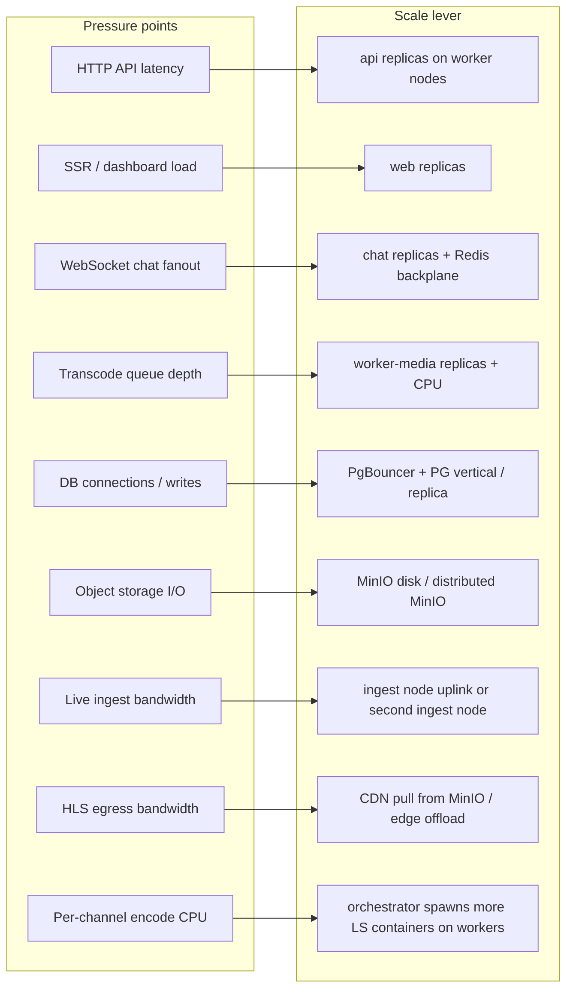
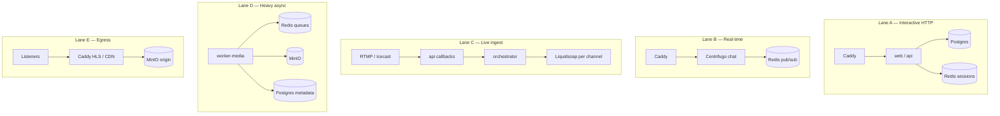
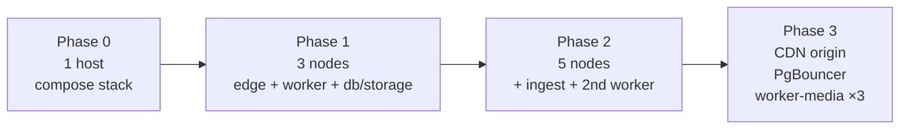

# Node distribution & scalable bottlenecks

How to place Tahti services across Swarm nodes so each **bottleneck scales independently**. Production layout is defined in [`infra/docker-stack.yml`](../infra/docker-stack.yml); local full stack is [`infra/docker-compose.stack.yml`](../infra/docker-compose.stack.yml) (single host, same logical roles).

---

## Node roles (Swarm labels)

| Label | Purpose | Scale pattern |
|-------|---------|---------------|
| `role=edge` | TLS, reverse proxy, HLS read from shared volume | **1 node** until egress > ~500 Mbps → CDN pull origin |
| `role=worker` | Stateless app tier: API, web, chat, workers, marketing site | **Add nodes + replicas** (primary horizontal scale) |
| `role=db` | Postgres, Redis, Prometheus, Grafana | **Vertical** first; then PgBouncer + read replica |
| `role=storage` | MinIO (archive, covers, recordings) | **Vertical + disk**; later distributed MinIO |
| `role=ingest` | RTMP + Icecast (host ports 1935 / 8000) | **1 node** per ingest path; split RTMP vs Icecast if saturated |
| `manager` | Swarm control + **orchestrator** (Docker socket) | **1 manager**; orchestrator stays singleton |

```bash
docker node update --label-add role=edge     <edge-host>
docker node update --label-add role=worker   <worker-01>
docker node update --label-add role=worker   <worker-02>
docker node update --label-add role=db       <db-host>
docker node update --label-add role=storage  <storage-host>
docker node update --label-add role=ingest   <ingest-host>
```

---

## Physical distribution (production target)



**Rule:** anything that holds **sessions, queues, or truth** stays on `db` / `storage`; anything that only **transforms or serves** scales on `worker`.

---

## Bottleneck map → what to scale



| Signal | Hot service | Node / action | Stack change |
|--------|-------------|---------------|--------------|
| API P95 > 500 ms | `api` | Add `role=worker` node; `replicas: 4+` | `docker service scale tahti_api=4` |
| Dashboard TTFB high | `web` | Same worker pool; `web` replicas 3+ | Stateless; `INTERNAL_API_BASE` → overlay `api` |
| Chat lag / 500+ WS | `chat` | Worker nodes; `chat` replicas 3+ | Redis must be backplane (already on `db`) |
| BullMQ `transcode-archive` depth > 50 | `worker-media` | Dedicated worker node, 4 CPU | `--queues=transcode-archive,record-live,fingerprint` only |
| Mixcloud/Revelator backlog | `worker-dist` | Scale replicas 2+ on worker | IO-bound to external APIs |
| PG connections > 80% max | `postgres` | **PgBouncer** on `db`; API → pooler | Do not scale API without pooler |
| MinIO disk > 70% | `minio` | `role=storage` bigger NVMe or 2nd storage node | Distributed erasure later |
| Caddy egress > 500 Mbps | `caddy` + HLS | CDN origin = MinIO; edge thin | See `docs/cdn-strategy.md` |
| RTMP disconnects under load | `rtmp-ingest` | Second ingest node (label `ingest`) | Host mode ports → one service per node |
| Many simultaneous live channels | Liquidsoap pods | More worker RAM/CPU; orchestrator on manager | Orchestrator uses Docker socket |

---

## Replica placement (current production defaults)

Spread replicas across **all** nodes with `role=worker` so Swarm anti-affinity keeps failure domains separate:

| Service | Replicas | Placement | Bottleneck type |
|---------|----------|-----------|-----------------|
| `api` | 3 | `worker` | CPU + DB pool |
| `web` | 2 | `worker` | CPU + API calls |
| `chat` | 2 | `worker` | WS + Redis |
| `worker-media` | 2 | `worker` | CPU (ffmpeg) + MinIO |
| `worker-dist` | 1 | `worker` | External API rate limits |
| `worker-light` | 1 | `worker` | Cron / rollup |
| `website` | 2 | `worker` | Static |
| `postgres` | 1 | `db` | **Do not** multi-replica without HA design |
| `redis` | 1 | `db` | Queue + chat; Sentinel later if needed |
| `minio` | 1 | `storage` | Disk throughput |
| `caddy` | 1 | `edge` | Network egress |
| `rtmp-ingest` / `icecast` | 1 each | `ingest` | Host ports, uplink |
| `orchestrator` | 1 | `manager` | Docker API + spawn LS |

---

## Traffic lanes (what must not share a bottleneck)



- **Lane A** scales with `api` + `web` on workers; protect **Lane A** from **Lane D** by never running ffmpeg on API containers.
- **Lane C** is **ingest-node + manager** bound; do not colocate ingest with `worker-media` at high broadcast count.
- **Lane E** is the first **fiber/CDN** bottleneck; scaling API replicas does not help listener playback.

---

## Growth phases (node count)



| Phase | Nodes | When |
|-------|-------|------|
| **0 — Dev** | Single machine (`stack-up.sh`) | Local screenshots, integration |
| **1 — Launch** | 3: edge, worker, db+storage combined | < 100 concurrent listeners |
| **2 — Growth** | + ingest, + worker #2 | API P95 or transcode queue rises |
| **3 — Scale** | Dedicated storage; CDN; PgBouncer | Egress or PG connections cap |

---

## Local Docker stack vs Swarm

| Concern | `docker-compose.stack.yml` | Production Swarm |
|---------|---------------------------|------------------|
| Node split | All services on one host | Labels enforce separation |
| Ports | `3010` / `3011` (avoid host conflicts) | 443 via Caddy |
| Orchestrator | Docker socket on same host | Manager only |
| Scale test | Not representative of egress | Use staging + `k6` per `docs/delivery-phases.md` |

---

## Related docs

- Swarm topology (phase 5): [`docs/technical/phase-5.md`](technical/phase-5.md)
- Scaling triggers table: [`docs/delivery-phases.md`](delivery-phases.md#scaling-reference)
- Infra ownership: [`docs/infra-strategy.md`](infra-strategy.md)
- CDN offload path: [`docs/cdn-strategy.md`](cdn-strategy.md)
- User-facing routes / screenshots: [`docs/user-flows.md`](user-flows.md)
