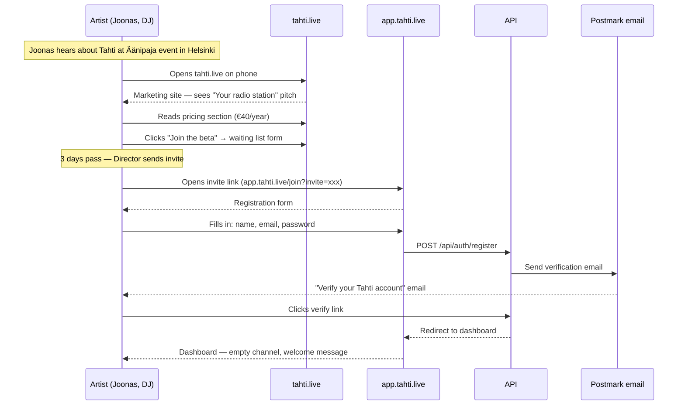
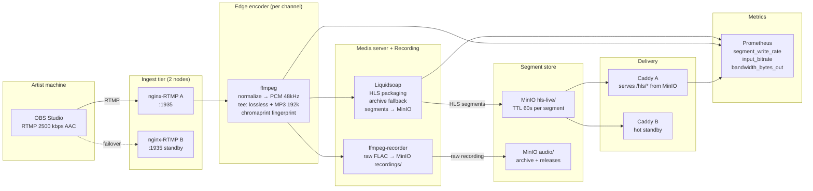
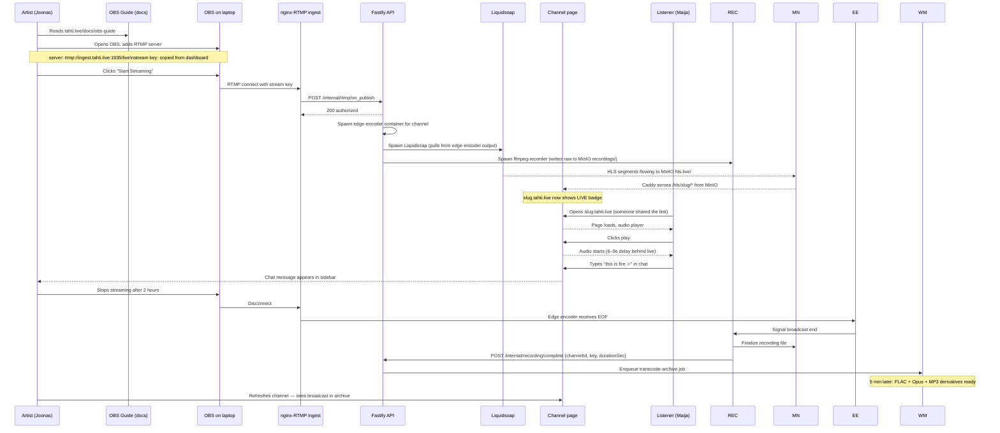
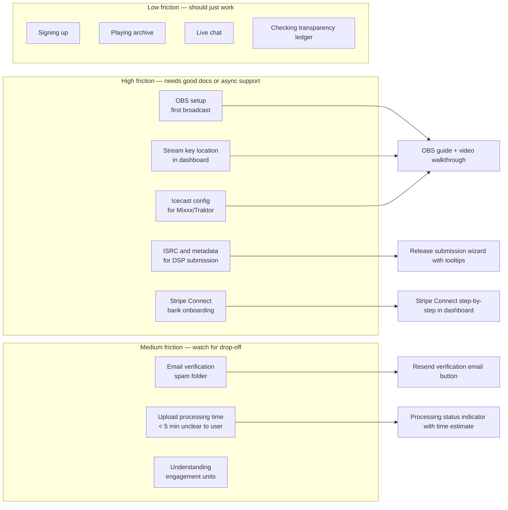

# User journey — Artist

The artist is Tahti's primary user. This document traces the full lifecycle from first hearing about Tahti to receiving their first annual grant, across all seven delivery phases.

---

## Experience overview

---

## Journey 1 — Discovery and registration

**Phase 1–4 relevant.**

---

## Journey 2 — First live broadcast (OBS)

**Phase 4 relevant.**

### Streaming infrastructure schematic

> **Issues raised:** STREAM-001 (segments must go to MinIO not volume), STREAM-002 (edge encoder must exist), STREAM-003 (DNS failover gap), STREAM-004 (recording must be separate container). All tracked in roadmap streaming backlog.

### Sequence

> **Issue ARTIST-001:** If OBS disconnects unexpectedly (network drop) before the graceful end signal, the recorder must detect the closed input stream and finalize the partial recording rather than discarding it. Tracked in roadmap.
> **Issue ARTIST-002:** Stream key rotation while live is not yet supported — tracked in roadmap.

---

## Journey 3 — First Mixxx broadcast (Icecast)

**Phase 4 relevant. Applies to DJs using hardware mixers.**

---

## Journey 4 — Archive upload

**Phase 4 relevant.**

---

## Journey 5 — Release to DSPs

**Phase 6 relevant.**

---

## Journey 6 — Receiving annual grant

**Phase 6 relevant. First real disbursement: Q1 Year 2.**

---

## Friction map (where artists need support)

---

## Detailed steps (implemented today)

| Journey | Step | Web | API | E2e |
|---------|------|-----|-----|-----|
| 1 — Register & verify | Sign up | `/join` | `POST /api/auth/register` | `vital-flows.sh` |
| 1 | Email verify | `/verify` | `GET /api/auth/verify` | seed token (manual) |
| 1 | Activate membership | `/dashboard` | `POST /api/me/membership/checkout` | `artist.sh` (`/api/me/membership`) |
| 2 — First broadcast | Stream settings | `/dashboard` | `GET /api/me/stream-settings` | `artist.sh`, `dashboard-player.sh` |
| 2 | Icecast auth | — | `POST /internal/icecast/on_connect` | `artist.sh` |
| 2 | Multistream help | `/help/multistream` | `GET /api/me/rtmp-targets` | `artist.sh` |
| 3 — Releases & fan tiers | Dashboard studio | `/dashboard` | `GET /api/me/releases`, `GET /api/me/fan-tiers` | `artist.sh`, `dashboard-player.sh` |
| 4 — Archive upload | Upload flow | `/dashboard` | `POST /api/uploads/*` | not in bash e2e (worker/MinIO) |
| 5 — DSP delivery | Release publish | `/dashboard` | Revelator worker queue | not in bash e2e |
| 6 — Grant receipt | Transparency | `/transparency` | public ledger + grants report | `director.sh`, `vital-flows.sh` |

---

## Automated coverage

| Layer | Script / test |
|-------|----------------|
| CI bash | `tests/e2e/user-journeys.sh` → `journeys/artist.sh`, `dashboard-player.sh` |
| Playwright (local) | `tests/e2e/user-journeys.mjs`, `dashboard-player.mjs` |
| Vitest | `apps/api/src/routes/journeys/persona-journeys.test.ts` (artist describe) |
| Fixtures | `apps/api/scripts/seed-e2e-screenshots.ts` (demo EP, archive, fan tier) |
| Index | [user-flows.md](../user-flows.md) |
