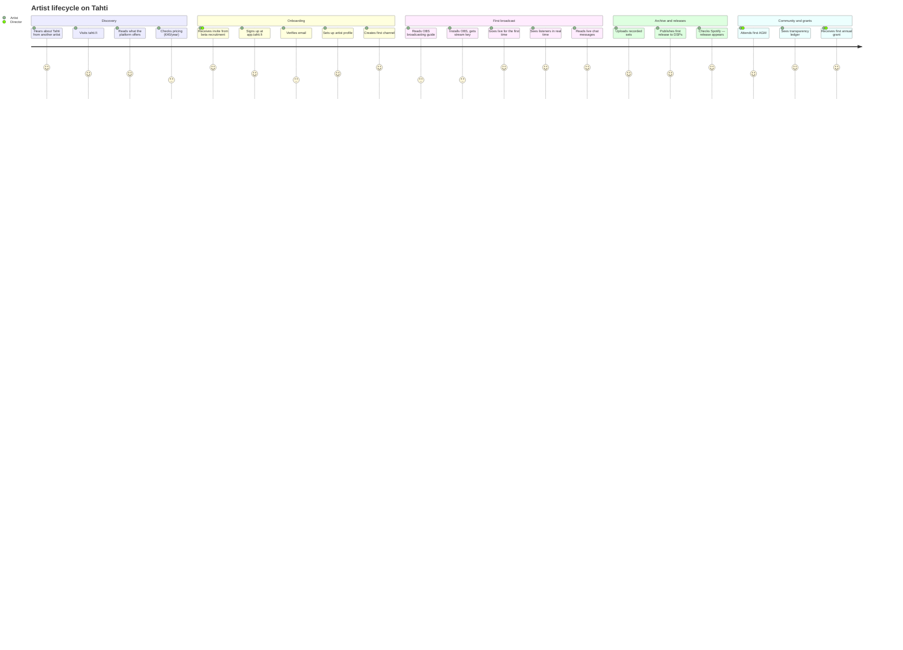
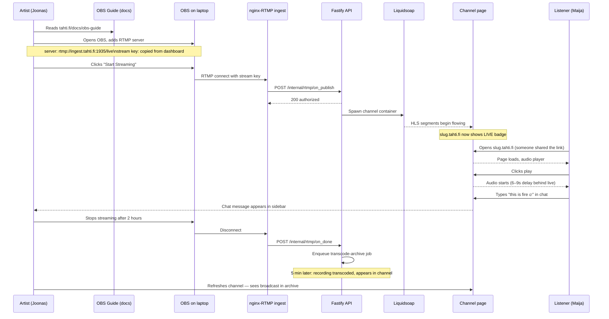
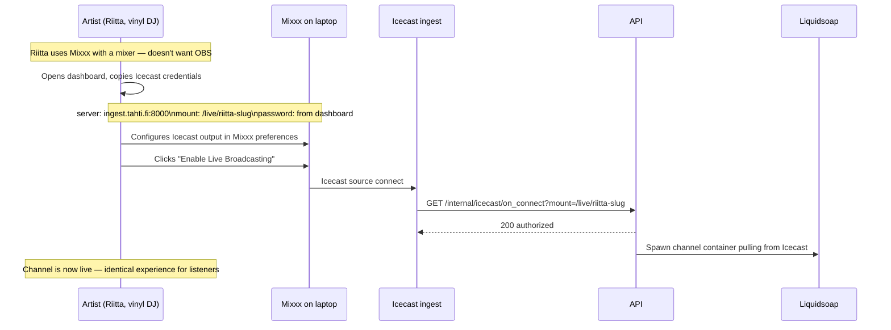
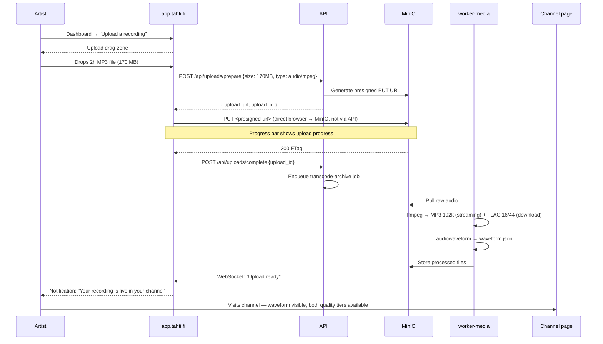
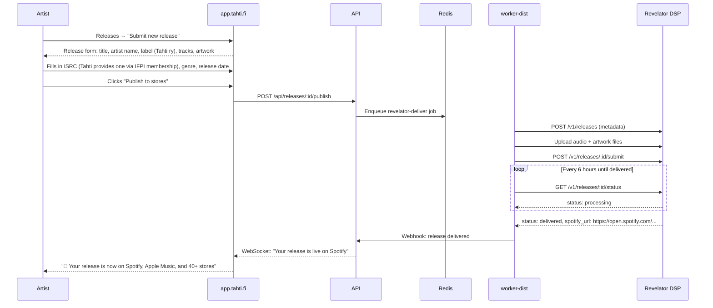
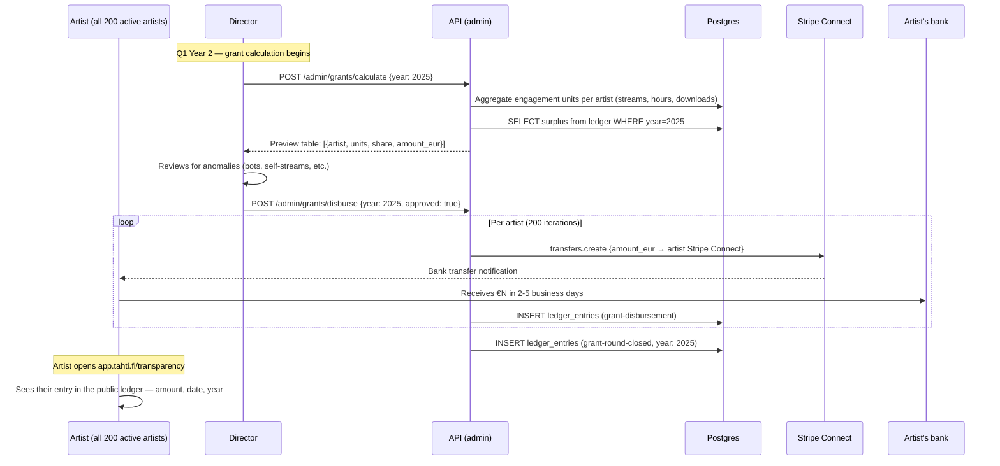
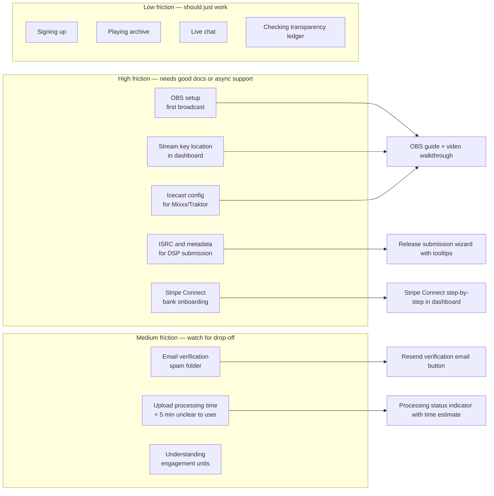

# User journey — Artist

The artist is Tahti's primary user. This document traces the full lifecycle from first hearing about Tahti to receiving their first annual grant, across all seven delivery phases.

---

## Experience overview

---

## Journey 1 — Discovery and registration

**Phase 1–4 relevant.**

---

## Journey 2 — First live broadcast (OBS)

**Phase 4 relevant.**

---

## Journey 3 — First Mixxx broadcast (Icecast)

**Phase 4 relevant. Applies to DJs using hardware mixers.**

---

## Journey 4 — Archive upload

**Phase 4 relevant.**

---

## Journey 5 — Release to DSPs

**Phase 6 relevant.**

---

## Journey 6 — Receiving annual grant

**Phase 6 relevant. First real disbursement: Q1 Year 2.**

---

## Friction map (where artists need support)

