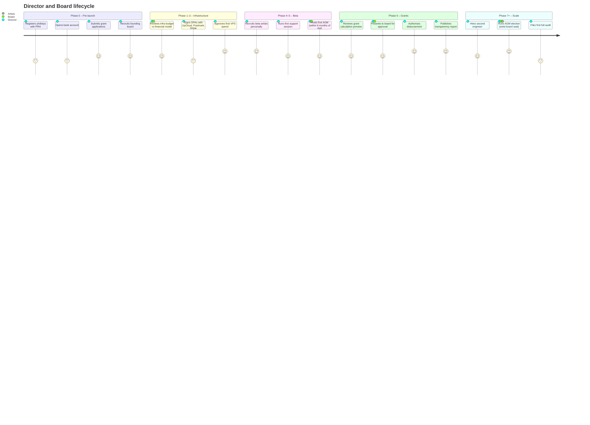
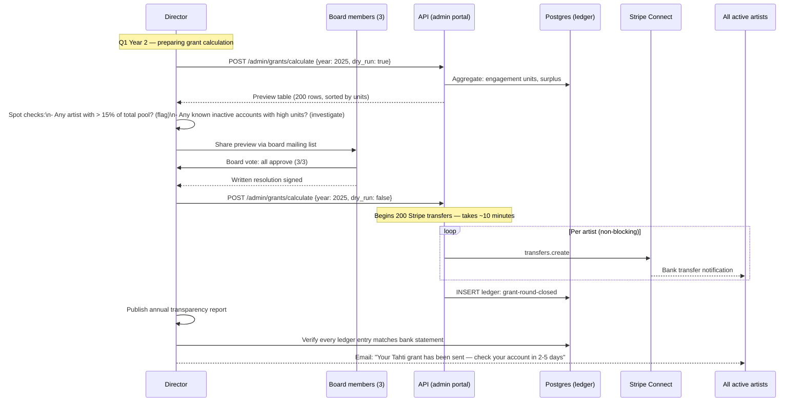
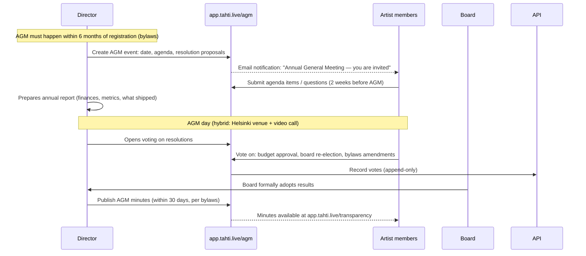
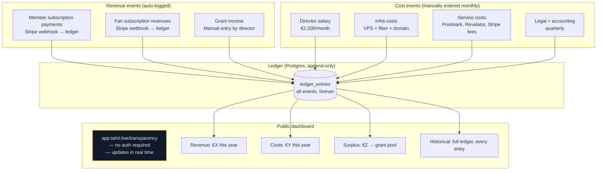
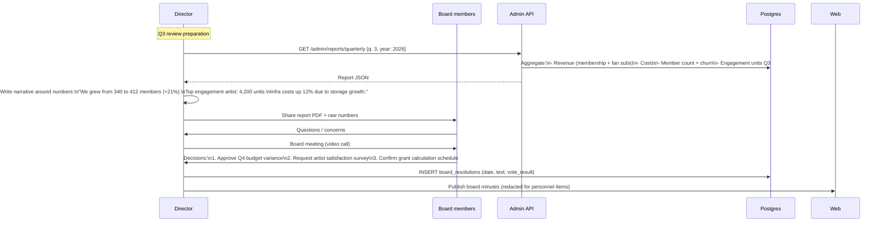
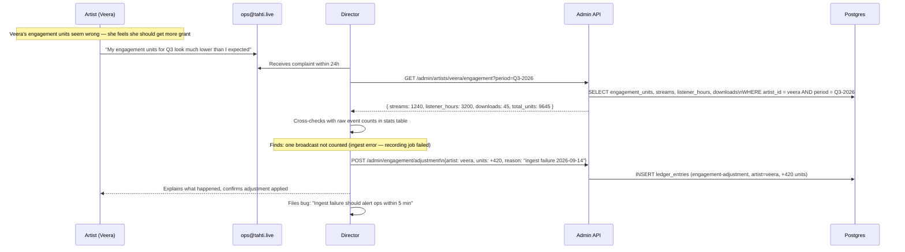
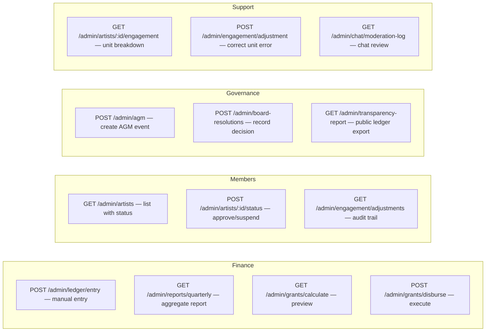
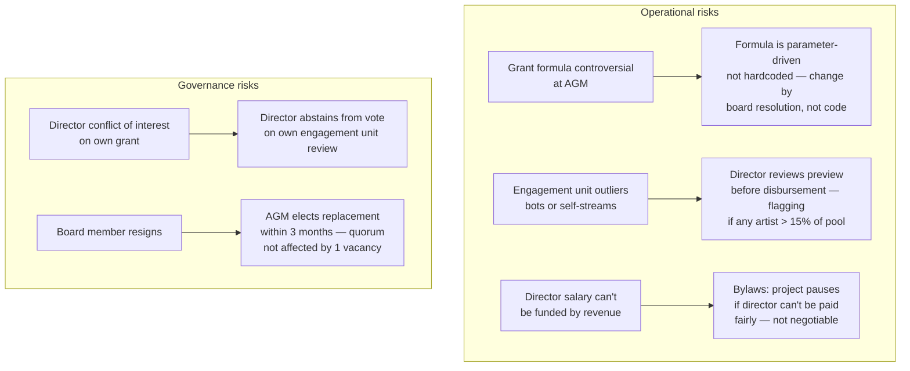

# User journey — Director / Board

The director is the executive of Tahti ry — accountable for finances, governance, artist relations, and grant management. The board oversees the director and votes on strategic decisions. Both use the platform's transparency tooling and admin interfaces.

---

## Experience overview

---

## Journey 1 — Annual grant review and disbursement

**Phase 6. The most significant governance action of the year.**

---

## Journey 2 — AGM governance (first year)

---

## Journey 3 — Financial transparency

**Monthly reporting. Fully public.**

---

## Journey 4 — Quarterly board review

**Every quarter. Structured cadence.**

---

## Journey 5 — Artist complaint handling

**The director is the first point of escalation.**

---

## Director's admin interface requirements

These are the API endpoints / admin UI pages the director needs. None of these are artist-facing.

---

## Governance risk map

