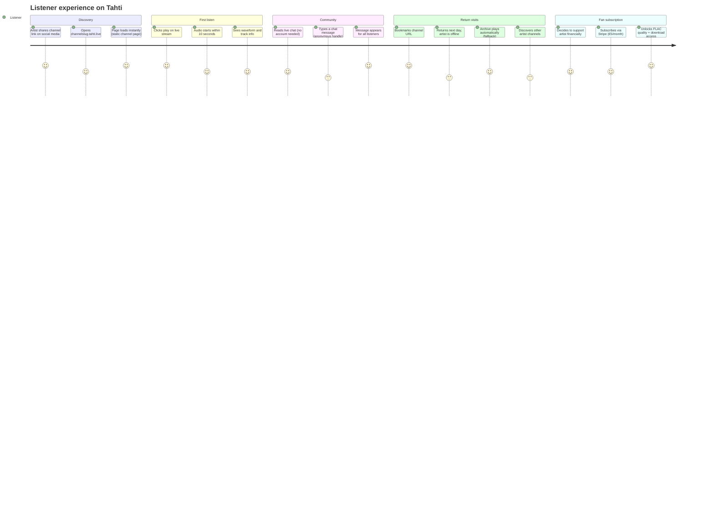
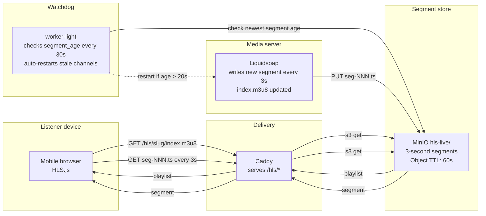
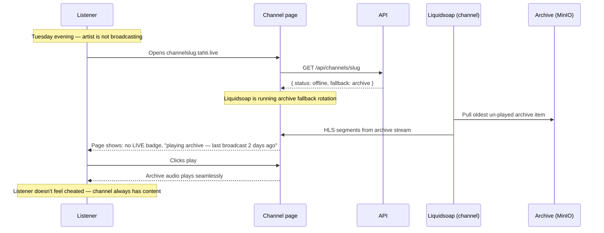
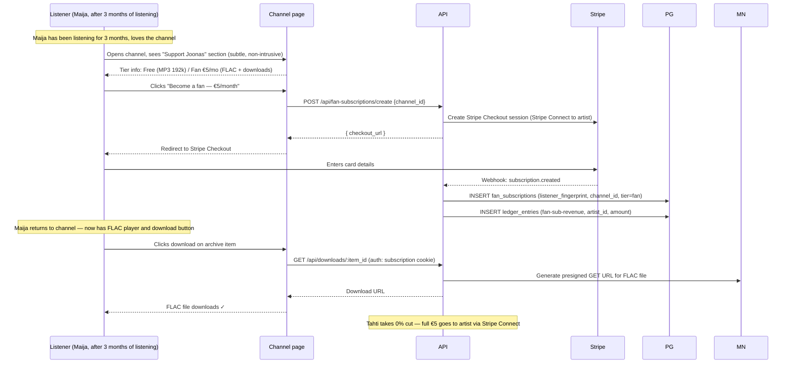
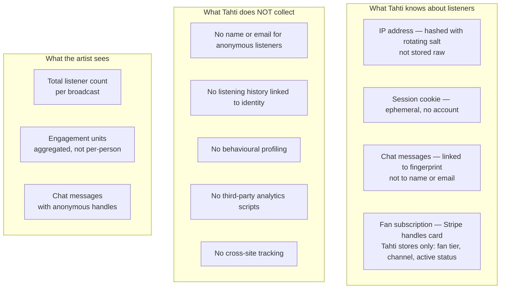
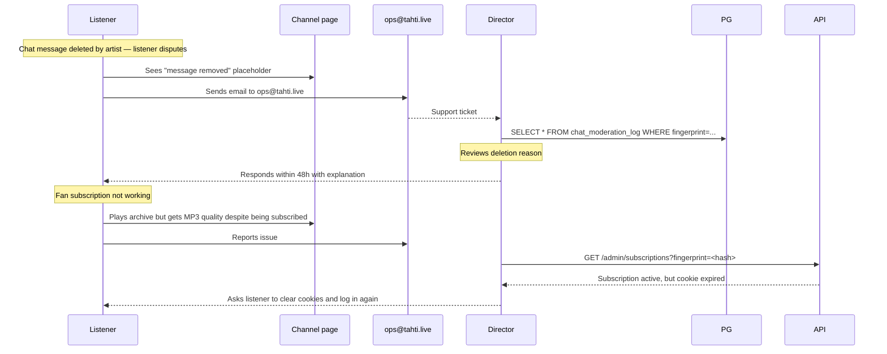

# User journey — Listener

Listeners are anonymous by default. They need no account to tune in, chat, or browse channels. This aligns with the constitution's Rule 3 (anonymous listening by default).

---

## Experience overview



---

## Journey 1 — First listen (anonymous)

**Phase 4 relevant.**

### Streaming delivery schematic



> **Issue LISTENER-001:** On slow mobile (4G, 100ms RTT), the 3s segment interval plus 2-segment buffer = ~6s startup delay. HLS.js shows a spinner with no text — the channel page must show an explicit "Buffering..." state with a time estimate. Tracked in roadmap.
> **Issue STREAM-005:** Without the watchdog, a crashed Liquidsoap container produces no new segments but the playlist still exists in MinIO with old entries. Listeners get `404` on segment fetches and HLS.js stalls silently. The watchdog detects this via segment age check.

```mermaid
sequenceDiagram
    participant L as Listener (Maija)
    participant Link as Shared link (Instagram)
    participant CH as channelslug.tahti.live
    participant API as API (SSR)
    participant HLS as stream.tahti.live (HLS)

    L->>Link: Sees artist's Instagram story: "live now — tahti.live/joonas"
    L->>CH: Opens link on phone (mobile browser)
    CH->>API: SSR: GET /api/channels/joonas (channel data)
    API-->>CH: Channel metadata, current broadcast, last 10 archive items
    CH-->>L: Page renders (< 1s on 4G)

    Note over L,CH: Page shows: artist name, LIVE badge, waveform, chat
    L->>CH: Taps play
    CH->>HLS: GET /hls/joonas/index.m3u8
    HLS-->>CH: Playlist (3s segments)
    CH->>HLS: GET /hls/joonas/seg-001.ts ... seg-003.ts
    HLS-->>CH: Audio segments (buffering ~2 segments)
    CH-->>L: Audio playing ✓ (6–9s delay behind live)

    Note over L: Maija listens for 45 minutes
    L->>CH: Types "amazing set 🎵" in chat
    CH->>API: POST /api/chat/channel:joonas (fingerprint-based anon)
    API->>API: Moderation check (not banned)
    API-->>CH: Centrifugo publish
    CH-->>L: Message appears as "anon_7f3b: amazing set 🎵"
    CH-->>All: Broadcast to all connected listeners
```

---

## Journey 2 — Offline fallback (archive playback)

**Phase 4 relevant. The channel always plays — live or archive.**

> **Issue ARTIST-003 / LISTENER-002:** When an artist goes offline, the archive fallback begins within 10 seconds. But if the archive is cold in MinIO (not recently accessed), Liquidsoap must fetch segments from MinIO before it can serve them. This can produce a brief silence. Mitigation: Liquidsoap should pre-buffer the first 3 archive segments on startup, before going into fallback mode. Additionally, there is currently no "Next broadcast: Thursday 22:00" signal — the channel page shows "offline" with no further information, which is a dead end for returning listeners.



---

## Journey 3 — Fan subscription

**Phase 6 relevant. The listener voluntarily subscribes — never prompted by algorithm.**



---

## Journey 4 — Listener discovers new artists

**Phase 4+ relevant. No algorithmic discovery — only human paths.**

```mermaid
flowchart LR
    L[Listener] --> CH1[Visits one channel\nfrom shared link]
    CH1 --> Notice[Notices "Related channels"\nsection — artist-curated list\nnot algorithm]
    Notice --> CH2[Visits another channel]
    CH2 --> CH3[Artist's profile shows\ncollaborators and label-mates]
    CH3 --> CH4[Listener bookmarks\nfavourite channels manually]

    Note1["Discovery is human:\nartists mention each other\nin chat, social, at shows.\nTahti does NOT rank or\nrecommend algorithmically."]

    style Note1 fill:#1a2340,stroke:#f0a500,color:#e8eaf6
```

---

## Privacy model



---

## Listener support flow


