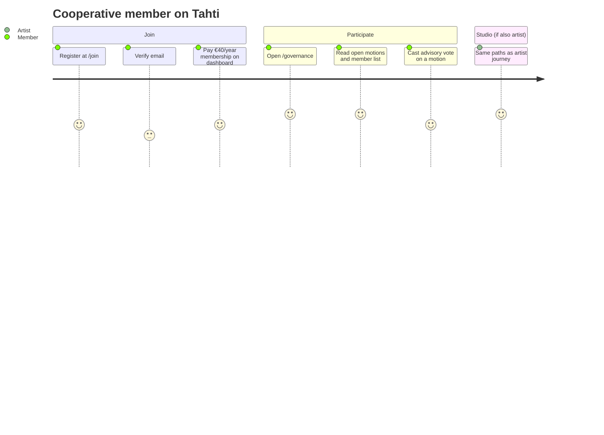
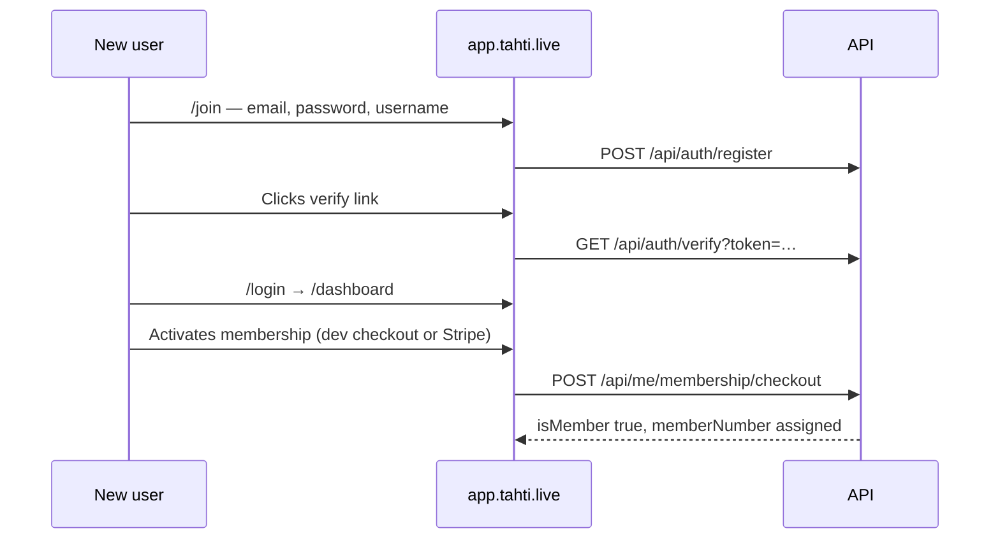
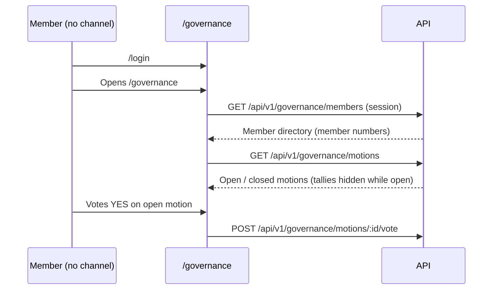

# User journey — Cooperative member

A **member** is a verified Tahti ry cooperative member (€40/year). Members can vote on governance motions, see the member directory, and use the full studio if they are also an **artist** (channel + releases). This is separate from **fan subscriptions** (paying an individual artist).

| Persona | Account | Typical routes |
|---------|---------|----------------|
| **Listener** | Optional | `/c/:slug`, `/u/:username`, `/r/:slug` |
| **Member** | Required, `isMember` | `/governance`, `/dashboard` (membership block) |
| **Artist** | Member + channel | `/dashboard`, `/c/:slug`, fan tiers, stream settings |

See [for-members.md](../guides/for-members.md) for step-by-step guidance.

---

## Experience overview

---

## Journey 1 — Become a member

**Covered by API e2e:** `artist onboarding` in `vital-flows.test.ts` (register → verify → membership checkout).

---

## Journey 2 — Governance (members only)

**Covered by bash e2e:** `tests/e2e/journeys/member.sh` and Vitest `persona-journeys.test.ts`.

Non-members receive **401** on governance routes (see `vital-flows.sh` auth guards).

---

## Journey 3 — Member who is not an artist

Many members only listen and vote. They use the **listener** paths for audio and **governance** for cooperative decisions. They do not need RTMP keys or releases.

---

## Automated coverage

| Layer | Script / test |
|-------|----------------|
| CI bash | `tests/e2e/user-journeys.sh` → `journeys/listener.sh`, `artist.sh`, `member.sh` |
| Playwright (local) | `tests/e2e/user-journeys.mjs` |
| Vitest | `apps/api/src/routes/journeys/persona-journeys.test.ts` |
| Fixtures | `apps/api/scripts/seed-e2e-screenshots.ts` (demo motion + fan sub) |
