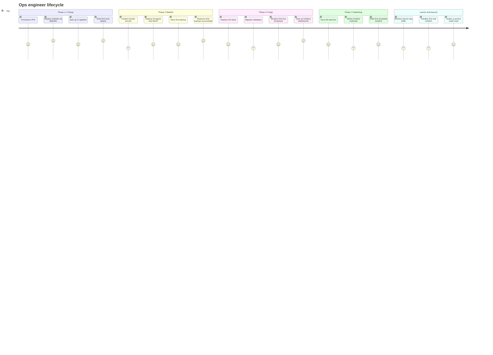
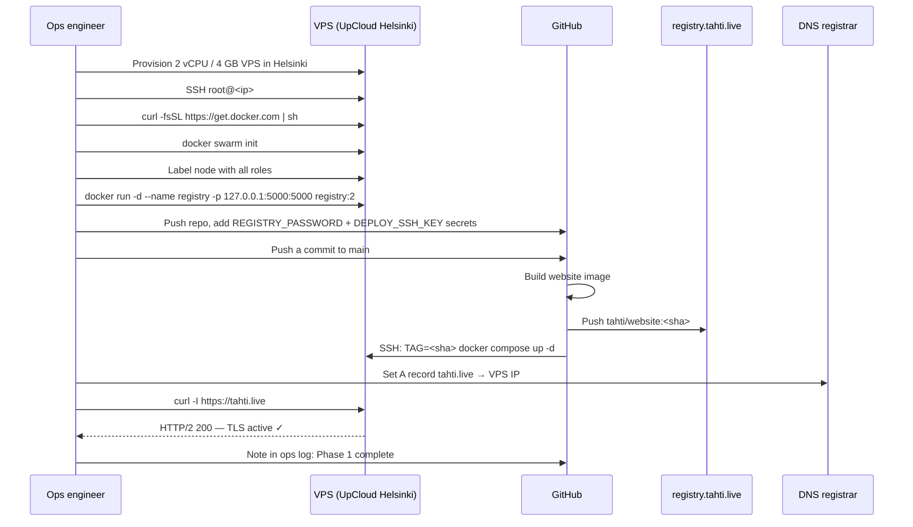
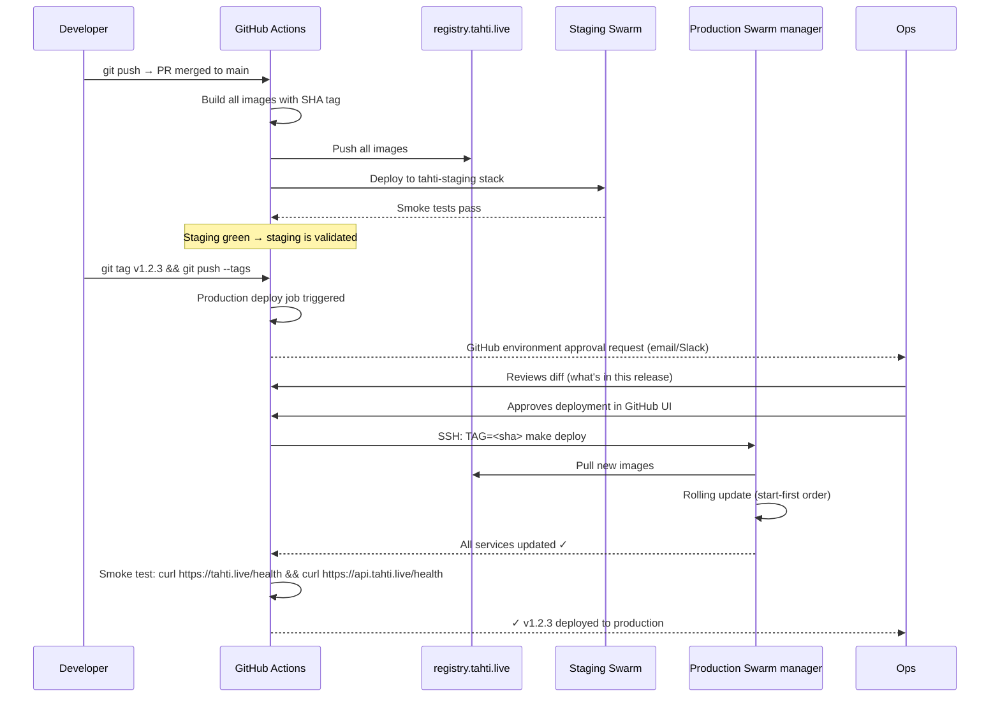
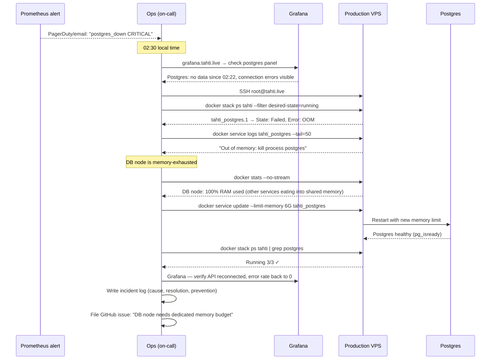
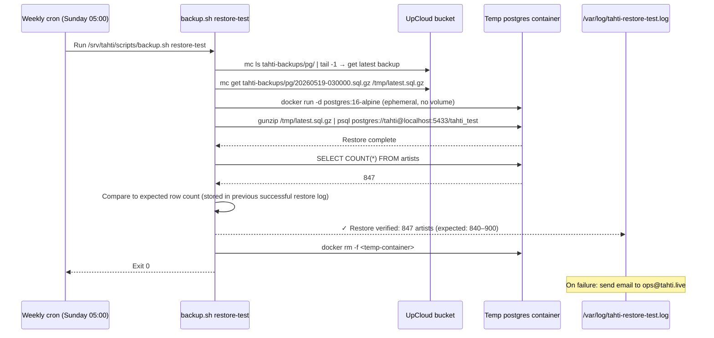
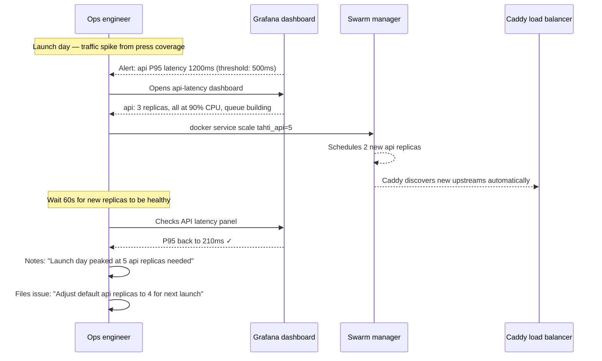
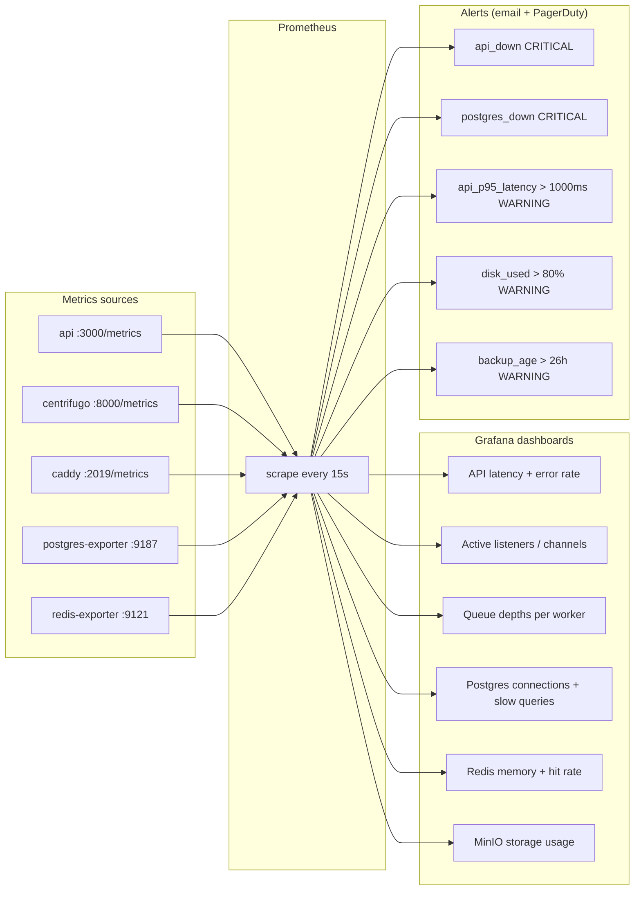
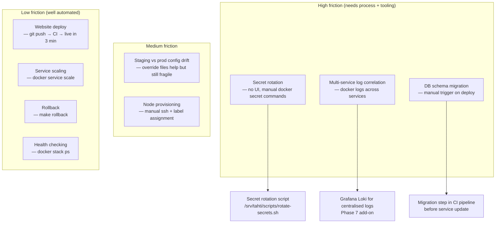

# User journey — Ops engineer

The ops engineer (initially the director or a volunteer contractor) is responsible for deploying, monitoring, and recovering the platform. This document covers the full ops lifecycle from first deploy to scaling decisions.

---

## Experience overview

---

## Journey 1 — First deploy (Phase 1)

---

## Journey 2 — Production deploy (rolling update)

**Daily routine once CI is set up.**

---

## Journey 3 — Incident response (Postgres down)

---

## Journey 4 — Backup and restore verification

**Weekly automated + monthly manual drill.**

---

## Journey 5 — Scaling under load (launch day)

---

## Monitoring setup reference

---

## Ops friction map

---

## Detailed steps (implemented today)

Deploy and incident journeys above describe the full ops lifecycle. **API-level smoke tests** validate what CI and on-call can curl without SSH:

| Journey | Step | Endpoint | E2e |
|---------|------|----------|-----|
| Monitoring | Liveness | `GET /health` | `ops.sh`, `vital-flows.sh`, Vitest |
| Monitoring | Dependency matrix | `GET /api/v1/status` | `ops.sh`, Vitest |
| Monitoring | Prometheus scrape | `GET /metrics` (`tahti_api_healthy`, uptime, backup age) | `ops.sh`, Vitest |
| Monitoring | OpenAPI | `GET /docs` | `ops.sh` |
| Incident | Postgres down | manual SSH + `docker service update` | runbook only |
| Backup drill | Restore test | `scripts/backup.sh restore-test` | manual / cron on prod |

Grafana dashboards and alert rules: `ops/monitoring/vimage6/`.

---

## Automated coverage

| Layer | Script / test |
|-------|----------------|
| CI bash | `tests/e2e/user-journeys.sh` → `journeys/ops.sh`; also `vital-flows.sh` health/status |
| Vitest | `persona-journeys.test.ts` (ops describe) |
| Index | [user-flows.md](../user-flows.md) |
