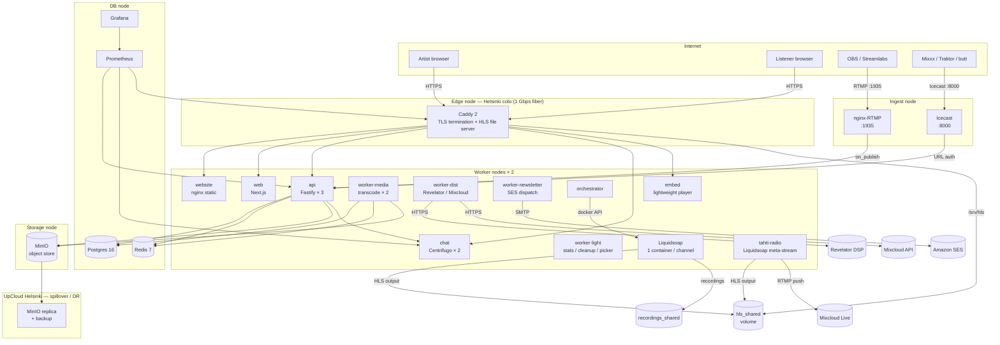
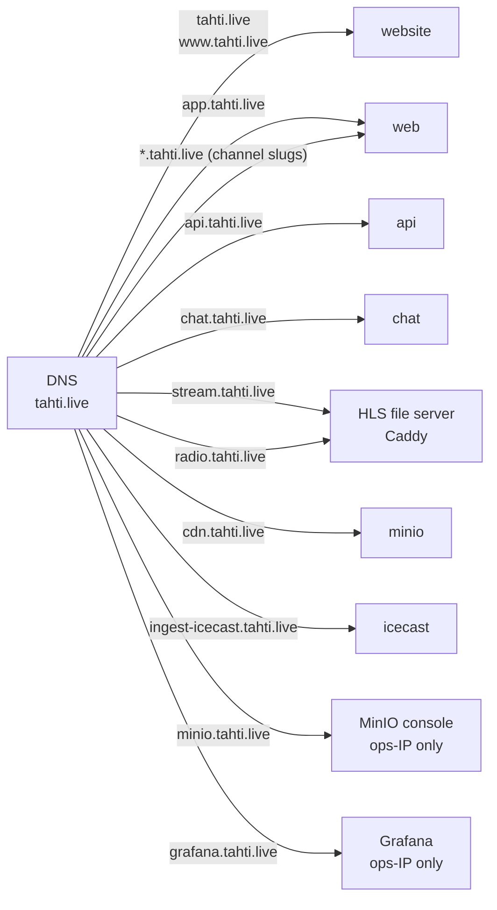

# Tahti — technical overview

This directory contains technical documentation for each delivery phase, user journeys, and architecture diagrams. All diagrams use [Mermaid](https://mermaid.js.org/) and render in GitHub, GitLab, Notion, and most modern docs tools.

## Phase timeline

```mermaid
gantt
    title Tahti delivery phases
    dateFormat  YYYY-MM-DD
    axisFormat  %b %Y
    todayMarker on

    section Legal / Grants
    Phase 0 – Legal & grants            :done, p0, 2025-10-01, 2026-01-15

    section Infrastructure
    Phase 1 – Website live              :done, p1, 2026-01-15, 2026-02-01
    Phase 2 – Dev environment           :done, p2, 2026-02-01, 2026-03-01
    Phase 3 – Stateful services         :active, p3, 2026-03-01, 2026-05-15
    Phase 5 – Staging cluster           :p5, 2026-05-01, 2026-06-01

    section Product — MVP
    Phase 4 – Artist app alpha (M0–M5)  :active, p4, 2026-04-01, 2026-06-15
    Phase 6 – Distribution & ledger (M6–M10) :p6, 2026-05-15, 2026-07-15
    Phase 7 – Hardening (M11)          :p7, 2026-07-01, 2026-08-01

    section Beta
    Closed beta (invite-only)           :crit, beta, 2026-06-15, 2026-08-01
    Public beta launch                  :milestone, 2026-08-01, 0d

    section Post-launch features
    Phase 8 – Artist profiles & releases (M12)  :p8, 2026-09-01, 2026-11-01
    Phase 9 – Newsletter & promo toolkit (M13–M14) :p9, 2026-11-01, 2027-01-15
    Phase 10 – Community: tagging, Radio, venues (M15–M17) :p10, 2027-01-15, 2027-04-01
    Phase 11 – Engagement & fan-subs (M18–M20) :p11, 2027-04-01, 2027-06-30
```

## Closed beta: 15.6–1.8.2026

| Milestone | Date | Criteria |
|-----------|------|----------|
| Beta opens (invite-only) | 15 June 2026 | Phase 4 exit criteria met; 5 anchor artists onboarded |
| Mid-beta review | 15 July 2026 | P0 bugs < 3 open; OBS guide success rate ≥ 80% |
| Beta closes / public beta opens | 1 August 2026 | Load test passed; 20+ active beta artists; Phase 7 hardening complete |

## CDN and hosting policy

**Primary: owned hardware in Finnish colocation**, served via Caddy directly. No commercial CDN (Bunny, Cloudflare, Fastly, etc.) — see `docs/infra-strategy.md` for rationale.

**Secondary: UpCloud Helsinki** for spillover egress and off-site backups. UpCloud is Finnish-owned and Helsinki-based, maintaining the "all-Finnish infrastructure" grant narrative.

**Hetzner Helsinki (under evaluation):** Hetzner operates a Helsinki data center with significantly lower per-GB pricing than UpCloud (see `docs/hosting-budget.md`). May be introduced as a secondary or DR tier in Y2. Does not affect the GDPR posture (EU-jurisdiction throughout).

**What this means for services:**
- `stream.tahti.fi` → Caddy on owned hardware (no CDN hop)
- `cdn.tahti.fi` → MinIO on owned hardware; UpCloud mirror for DR
- Embed assets (~25 KB) → served by the `embed` service on owned hardware; UpCloud cache for high-traffic periods

## Full production architecture



## Service inventory

| Service | Image | Network | Phase | Role |
|---------|-------|---------|-------|------|
| `website` | `registry.tahti.live/tahti/website` | edge | 1 | Marketing site at tahti.live |
| `web` | `registry.tahti.live/tahti/web` | internal + edge | 4 | Artist app at app.tahti.live + channel subdomains |
| `api` | `registry.tahti.live/tahti/api` | internal + edge | 4 | Fastify REST + webhook target |
| `chat` | `centrifugo/centrifugo:v5` | internal + edge | 4 | WebSocket hub for live chat |
| `worker-media` | `registry.tahti.live/tahti/worker` | internal | 4 | Transcode, archive, fingerprint |
| `worker-dist` | `registry.tahti.live/tahti/worker` | internal | 6 | Revelator DSP + Mixcloud upload |
| `worker-light` | `registry.tahti.live/tahti/worker` | internal | 4 | Stats rollup, chat cleanup, picker |
| `worker-newsletter` | `registry.tahti.live/tahti/worker` | internal | 9 | SES newsletter dispatch + bounces |
| `orchestrator` | `registry.tahti.live/tahti/orchestrator` | internal | 4 | Spawns Liquidsoap per channel |
| `tahti-radio` | `registry.tahti.live/tahti/liquidsoap-image` | internal | 10 | 24/7 meta-stream → Mixcloud Live |
| `embed` | `registry.tahti.live/tahti/embed` | internal + edge | 9 | Lightweight iframe player |
| `icecast` | `moul/icecast` | ingest + internal | 4 | Icecast source ingress |
| `rtmp-ingest` | `tiangolo/nginx-rtmp` | ingest + internal | 4 | OBS/RTMP ingress |
| `postgres` | `postgres:16-alpine` | internal | 3 | Primary database |
| `redis` | `redis:7-alpine` | internal | 3 | Sessions, queues, presence |
| `minio` | `minio/minio` | internal + edge | 3 | Object storage |
| `caddy` | `caddy:2-alpine` | edge | 1 | TLS proxy, HLS file server |
| `prometheus` | `prom/prometheus` | internal | 3 | Metrics scrape |
| `grafana` | `grafana/grafana` | internal + edge | 3 | Dashboards (ops-only) |

## Key port map

### Production (Swarm / colocation)

| External port | Protocol | Service |
|---------------|----------|---------|
| 80 / 443 | HTTPS | Caddy (all web traffic) |
| 1935 | RTMP | nginx-RTMP (OBS ingest) |
| 8000 | HTTP+Icecast | Icecast (Mixxx ingest) |

### Local dev stack (`docker-compose.stack.yml`)

All host-side ports sit above 15 000 to avoid collisions with other local services. Override any via env var before running `./scripts/stack-up.sh`.

| Service | Env var | Host port | URL |
|---------|---------|-----------|-----|
| web (Next.js) | `WEB_PORT` | 17777 | http://localhost:17777 |
| api (Fastify) | `API_PORT` | 15011 | http://localhost:15011 |
| orchestrator | `ORCHESTRATOR_PORT` | 15003 | http://localhost:15003 |
| chat (Centrifugo) | `CHAT_PORT` | 18000 | http://localhost:18000 |
| mailhog SMTP | `MAILHOG_SMTP_PORT` | 15025 | — |
| mailhog UI | `MAILHOG_UI_PORT` | 18025 | http://localhost:18025 |
| minio API | `MINIO_PORT` | 19000 | http://localhost:19000 |
| minio console | `MINIO_CONSOLE_PORT` | 19001 | http://localhost:19001 |
| icecast | `ICECAST_PORT` | 18100 | http://localhost:18100 |
| website (marketing) | `WEBSITE_PORT` | 18080 | http://localhost:18080 |
| rtmp-ingest | `RTMP_PORT` | 1935 | rtmp://localhost:1935 |

### Local dev stack — build notes

- **Centrifugo config:** channel-level settings (`presence`, `history_size`, `history_ttl`, namespaces) must live in a config file in v5, not CLI flags. Dev config is at `infra/stack/centrifugo.dev.json`; production config at `infra/centrifugo.json`.
- **Workspace packages in Dockerfiles:** `apps/api/Dockerfile` and `apps/worker/Dockerfile` must explicitly `COPY` every `packages/*` the app imports. Currently required: `db`, `ledger`, `mixcloud`, `revelator` (worker only), `shared`. Missing entries cause `ERR_MODULE_NOT_FOUND` at startup.

## Domain routing



## Phase documents

| Phase | Doc | Milestones | Goal |
|-------|-----|------------|------|
| 1 | [phase-1.md](phase-1.md) | — | tahti.live live over HTTPS |
| 2 | [phase-2.md](phase-2.md) | — | `make dev` works; CI + registry |
| 3 | [phase-3.md](phase-3.md) | — | Postgres / Redis / MinIO in prod with backups |
| 4 | [phase-4.md](phase-4.md) | M0–M5 | Artist app alpha — accounts, broadcast, archive, chat |
| 5 | [phase-5.md](phase-5.md) | — | 3-node staging Swarm; auto-deploy pipeline |
| 6 | [phase-6.md](phase-6.md) | M6–M10 | Distribution, transparency ledger, grants |
| 7 | [phase-7.md](phase-7.md) | M11 | Hardening, load test, public launch |
| 8 | [phase-8.md](phase-8.md) | M12 | Artist profiles, releases, smart links |
| 9 | [phase-9.md](phase-9.md) | M13–M14 | Newsletter, promo toolkit, embed, social auto-post |
| 10 | [phase-10.md](phase-10.md) | M15–M17 | Artist tagging, Tahti Radio, venue calendar |
| 11 | [phase-11.md](phase-11.md) | M18–M20 | Downloads, fan-subscriptions, tier gating |

**Node placement & bottlenecks:** [scaling-node-distribution.md](../scaling-node-distribution.md) — Swarm labels, replica map, and what to scale when API, chat, transcode, DB, or egress saturates.

**Audit & deferred work:** [project-roadmap.md](../project-roadmap.md#build-audit--current-state-2026-06-03) (milestone matrix), [future-improvements.md](../future-improvements.md) (hardening/optimisation/refactor backlog).

## User journey documents

| Perspective | Doc | Phases covered |
|-------------|-----|---------------|
| Artist | [journey-artist.md](journey-artist.md) | 1 → 11 |
| Listener | [journey-listener.md](journey-listener.md) | 4 → 11 |
| Ops engineer | [journey-ops.md](journey-ops.md) | 1 → 7 |
| Director / Board | [journey-director.md](journey-director.md) | 3 → 11 |
