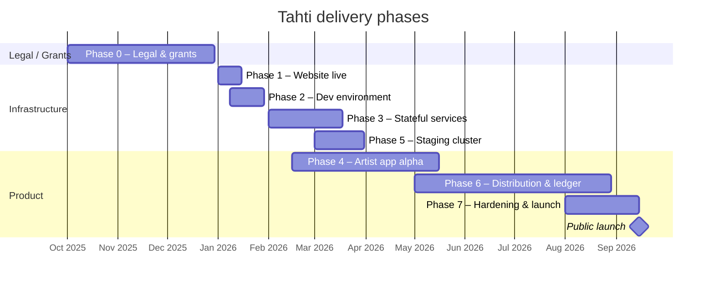
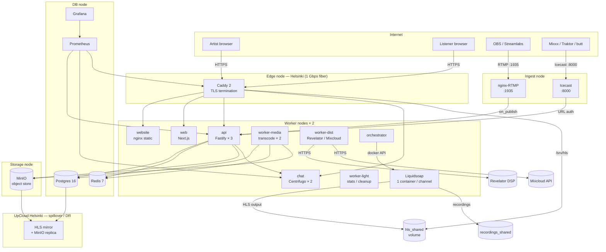
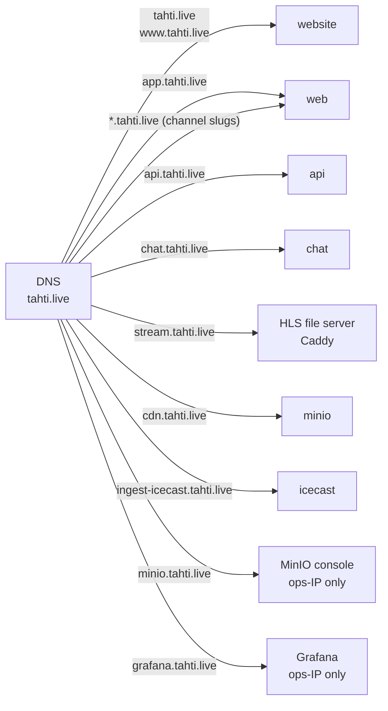

# Tahti — technical overview

This directory contains technical documentation for each delivery phase, user journeys, and architecture diagrams. All diagrams use [Mermaid](https://mermaid.js.org/) and render in GitHub, GitLab, Notion, and most modern docs tools.

## Phase timeline

## Full production architecture

## Service inventory

| Service | Image | Network | Role |
|---------|-------|---------|------|
| `website` | `registry.tahti.live/tahti/website` | edge | Marketing site at tahti.live |
| `web` | `registry.tahti.live/tahti/web` | internal + edge | Artist app at app.tahti.live + channel subdomains |
| `api` | `registry.tahti.live/tahti/api` | internal + edge | Fastify REST + webhook target |
| `chat` | `centrifugo/centrifugo:v5` | internal + edge | WebSocket hub for live chat |
| `worker-media` | `registry.tahti.live/tahti/worker` | internal | Transcode, archive, fingerprint |
| `worker-dist` | `registry.tahti.live/tahti/worker` | internal | Revelator DSP + Mixcloud upload |
| `worker-light` | `registry.tahti.live/tahti/worker` | internal | Stats rollup, chat cleanup |
| `orchestrator` | `registry.tahti.live/tahti/orchestrator` | internal | Spawns Liquidsoap per channel |
| `icecast` | `moul/icecast` | ingest + internal | Icecast source ingress |
| `rtmp-ingest` | `tiangolo/nginx-rtmp` | ingest + internal | OBS/RTMP ingress |
| `postgres` | `postgres:16-alpine` | internal | Primary database |
| `redis` | `redis:7-alpine` | internal | Sessions, queues, presence |
| `minio` | `minio/minio` | internal + edge | Object storage |
| `caddy` | `caddy:2-alpine` | edge | TLS proxy, HLS file server |
| `prometheus` | `prom/prometheus` | internal | Metrics scrape |
| `grafana` | `grafana/grafana` | internal + edge | Dashboards (ops-only) |

## Key port map

| External port | Protocol | Service |
|---------------|----------|---------|
| 80 / 443 | HTTPS | Caddy (all web traffic) |
| 1935 | RTMP | nginx-RTMP (OBS ingest) |
| 8000 | HTTP+Icecast | Icecast (Mixxx ingest) |

## Domain routing

## Phase documents

| Phase | Doc | Goal |
|-------|-----|------|
| 1 | [phase-1.md](phase-1.md) | tahti.live live over HTTPS |
| 2 | [phase-2.md](phase-2.md) | `make dev` works; CI + registry |
| 3 | [phase-3.md](phase-3.md) | Postgres / Redis / MinIO in prod with backups |
| 4 | [phase-4.md](phase-4.md) | Artist app alpha — accounts, broadcast, archive |
| 5 | [phase-5.md](phase-5.md) | 3-node staging Swarm; auto-deploy pipeline |
| 6 | [phase-6.md](phase-6.md) | Distribution, transparency ledger, grants |
| 7 | [phase-7.md](phase-7.md) | Hardening, load test, public launch |

**Node placement & bottlenecks:** [scaling-node-distribution.md](../scaling-node-distribution.md) — Swarm labels, replica map, and what to scale when API, chat, transcode, DB, or egress saturates.

## User journey documents

| Perspective | Doc | Phases covered |
|-------------|-----|---------------|
| Artist | [journey-artist.md](journey-artist.md) | 1 → 7 |
| Listener | [journey-listener.md](journey-listener.md) | 4 → 7 |
| Ops engineer | [journey-ops.md](journey-ops.md) | 1 → 7 |
| Director / Board | [journey-director.md](journey-director.md) | 3 → 7 |
