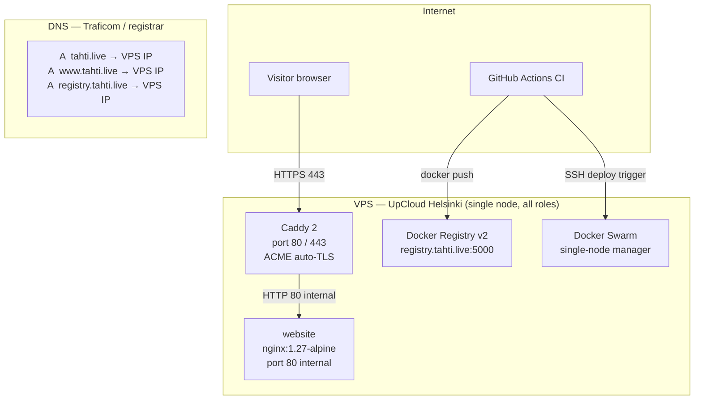
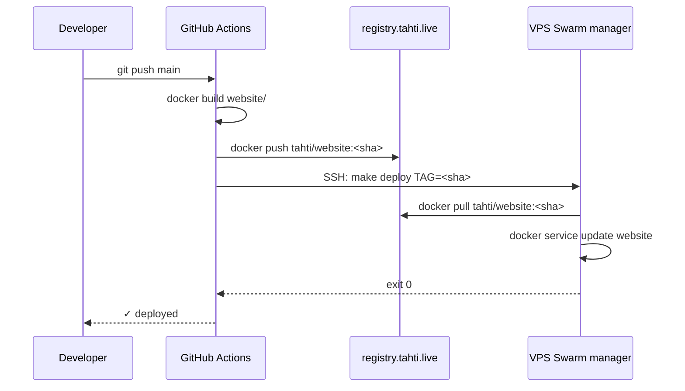

# Phase 1 — Website live

**Goal:** `tahti.live` and `www.tahti.live` serve the marketing site over HTTPS with a valid Let's Encrypt certificate. No manual steps after `git push` to main.

**Timeline:** Week 1–2  
**Entry state:** domain registered at Traficom, single VPS provisioned (UpCloud Helsinki, 2 vCPU / 4 GB).  
**Services deployed:** `website`, `caddy`.

---

## Architecture



## Deployment sequence



## Runbook

### 1 — Provision the VPS

```bash
# On the VPS as root
apt-get update && apt-get install -y curl
curl -fsSL https://get.docker.com | sh
systemctl enable docker
```

### 2 — Init single-node Swarm and label it

```bash
docker swarm init
NODE_ID=$(docker info -f '{{.Swarm.NodeID}}')
docker node update --label-add role=worker  $NODE_ID
docker node update --label-add role=edge    $NODE_ID
docker node update --label-add role=db      $NODE_ID
docker node update --label-add role=storage $NODE_ID
docker node update --label-add role=ingest  $NODE_ID
```

### 3 — Run a self-hosted Docker Registry

```bash
docker run -d \
  --name registry \
  --restart=always \
  -p 127.0.0.1:5000:5000 \
  -v registry_data:/var/lib/registry \
  registry:2
```

Add a Caddy route to proxy `registry.tahti.live` → `localhost:5000` (add to Caddyfile, reload).

### 4 — Build and push the website image

```bash
# On your local machine
make build-website TAG=init
docker save registry.tahti.live/tahti/website:init | ssh root@<vps-ip> docker load
# Or from CI once the registry DNS is live:
make push TAG=init
```

### 5 — Deploy website-only stack

Create `infra/docker-stack-phase1.yml` (subset of the main stack — website + caddy only):

```yaml
# infra/docker-stack-phase1.yml
version: "3.9"
networks:
  edge: { driver: overlay }
volumes:
  caddy_data:
  caddy_config:
configs:
  caddyfile: { file: ./Caddyfile }
services:
  website:
    image: registry.tahti.live/tahti/website:${TAG:-latest}
    networks: [edge]
    deploy:
      replicas: 1
      placement: { constraints: [node.labels.role == worker] }
  caddy:
    image: caddy:2-alpine
    networks: [edge]
    ports:
      - { target: 80,  published: 80,  mode: host }
      - { target: 443, published: 443, mode: host }
    volumes:
      - caddy_data:/data
      - caddy_config:/config
    configs:
      - { source: caddyfile, target: /etc/caddy/Caddyfile }
    deploy:
      replicas: 1
      placement: { constraints: [node.labels.role == edge] }
```

```bash
TAG=init docker stack deploy -c infra/docker-stack-phase1.yml tahti
```

### 6 — Set DNS

At your registrar, set:
```
A    tahti.live          →  <VPS IP>
A    www.tahti.live      →  <VPS IP>
A    registry.tahti.live →  <VPS IP>
```

TTL 300 for rapid iteration; raise to 3600 after confirming TLS.

### 7 — Verify

```bash
curl -I https://tahti.live
# HTTP/2 200
# server: Caddy

curl -I https://www.tahti.live
# HTTP/2 200 (Caddy redirects www → apex or serves both)

curl -s https://tahti.live | grep -c "Tahti"
# Should be > 0
```

## CI pipeline (`.github/workflows/website.yml`)

```yaml
name: website

on:
  push:
    branches: [main]
    paths: [website/**]

jobs:
  deploy:
    runs-on: ubuntu-24.04
    steps:
      - uses: actions/checkout@v4
      - name: Build
        run: |
          docker build -t registry.tahti.live/tahti/website:${{ github.sha }} website/
      - name: Push
        run: |
          echo ${{ secrets.REGISTRY_PASSWORD }} | docker login registry.tahti.live -u tahti --password-stdin
          docker push registry.tahti.live/tahti/website:${{ github.sha }}
      - name: Deploy
        run: |
          ssh -o StrictHostKeyChecking=no deploy@tahti.live \
            "TAG=${{ github.sha }} make -C /srv/tba-platform deploy"
```

## Exit criteria

| Check | Command | Expected |
|-------|---------|----------|
| HTTPS responds | `curl -I https://tahti.live` | HTTP/2 200 |
| Certificate valid | `curl -v https://tahti.live 2>&1 \| grep issuer` | Let's Encrypt |
| www redirects | `curl -I https://www.tahti.live` | 200 or 301→apex |
| `/health` works | `curl https://tahti.live/health` | `ok` |
| Response time | `curl -w "%{time_total}" -o /dev/null https://tahti.live` | < 0.3 s |
| CI deploys | Push a whitespace change to `website/index.html` | Redeploys within 3 min |

## What is NOT deployed yet

- No Postgres, Redis, MinIO — no statefulness in this phase.
- No API — the site is purely static.
- No authentication — no user-facing forms that do anything.

Any CTA button on the site that says "Sign up" should link to a waiting-list form (Tally.so or similar) — not to an API that doesn't exist yet.
