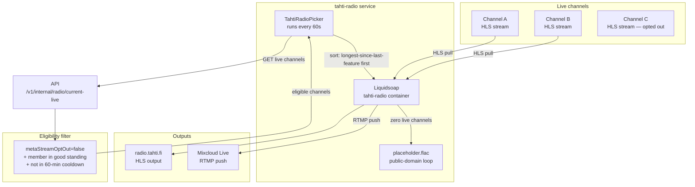
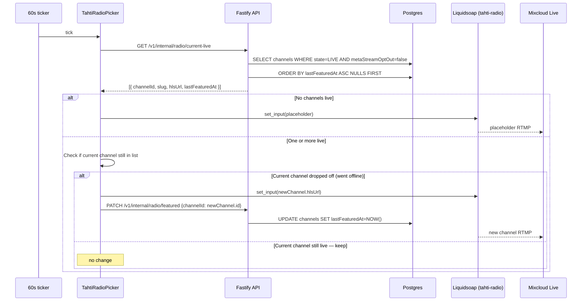

# Phase 10 — Community features: tagging, Tahti Radio, venue calendar (M15–M17)

**Goal:** artists can cross-reference each other with @-mentions, the org operates a 24/7 meta-stream that relays live channels (multistreamed to Mixcloud), and venues can publish iCalendar feeds of upcoming broadcasts.

**Timeline:** Months 19–21  
**Entry state:** Phase 9 complete, promo tools live.  
**New services:** `tahti-radio` (perpetual Liquidsoap container for the meta-stream).

---

## Artist tagging architecture

```mermaid
flowchart TD
    subgraph "Input surfaces"
        Bio[Profile bio\nMarkdown @handle]
        Ann[Channel announcements]
        Cred[Release credits\n"Featuring @handle"]
        Chat[Chat messages]
    end

    subgraph "Resolution (server-side render)"
        Resolver[Tag resolver\n@handle → tahti.fi/u/handle]
        Unknown[Unknown handle → plain text\nnever broken link]
    end

    subgraph "Notification (async)"
        WL[worker-light\ntag-notification queue]
        PG[(Postgres\ntag_events table)]
        PM[Postmark\ndigest email]
    end

    Bio --> Resolver
    Ann --> Resolver
    Cred --> Resolver
    Chat --> Resolver

    Resolver --> WL
    WL --> PG
    WL --> PM
    PM -- "You were mentioned by @X" --> Artist
```

**Tag resolution in Markdown:** a remark plugin runs at render time, replacing `@handle` with `[displayName](https://tahti.fi/u/handle)` if the handle exists, or leaving it as plain text if not. The resolution is cached per-handle with a 5-minute TTL in Redis.

**Notification dedup:** the worker collects all tag events for an artist within a 24-hour window and sends one digest email ("You were mentioned 3 times today: by @x in their bio, by @y in a release credit, ..."). Max one digest per artist per day.

**Anti-abuse controls:**

| Rule | Value |
|------|-------|
| Max @-mentions per artist per day (across all surfaces) | 20 |
| Muted artist | can still tag, but target gets no notification |
| Deleted artist tag | renders as `@deleted-user`, no link |

---

## Tahti Radio architecture



## Tahti Radio picker sequence



## Tahti Radio Liquidsoap template

The `tahti-radio` service uses a fixed Liquidsoap script (not the per-channel template). Key points:

- Input: `input.hls(url)` with dynamic URL updated via Liquidsoap telnet API
- Output 1: HLS to `/srv/hls/radio/` (served by Caddy as `stream.tahti.fi/radio/`)
- Output 2: `output.url(url, ...)` RTMP to Mixcloud Live
- Fallback: `single("/srv/tahti-radio/placeholder.flac")` on any input failure

The Picker updates the active input by writing to Liquidsoap's telnet interface — no container restart needed. If the telnet call fails, the Picker retries once; on second failure it logs an alert.

---

## Venue calendar architecture

```mermaid
graph TB
    subgraph "Venue account"
        V[Venue signs up\ntahti.fi/venues/register]
        VD[Venue dashboard\n/dashboard/broadcasts/new]
    end

    subgraph API
        VP[/v1/venues\nVenue profiles + directory]
        VB[/v1/venues/:slug/broadcasts]
        IC[/v1/venues/:slug/calendar.ics]
    end

    subgraph "Public surfaces"
        Dir[tahti.fi/venues\npublic directory]
        VPage[tahti.fi/v/:slug\nvenue profile]
        Cal[calendar.ics\niCal feed]
    end

    subgraph "Artist side"
        ADash[Artist dashboard\n"Upcoming at venues"]
    end

    V --> VP
    VD --> VB
    VB --> IC
    IC --> Cal
    VP --> Dir
    VP --> VPage
    VB --> ADash
```

## Venue broadcast iCal feed

The iCalendar feed renders dynamically from Postgres — no file on disk:

```
GET /v1/venues/:slug/calendar.ics

HTTP/1.1 200 OK
Content-Type: text/calendar; charset=utf-8
Cache-Control: public, max-age=300

BEGIN:VCALENDAR
VERSION:2.0
PRODID:-//Tahti ry//EN
X-WR-CALNAME:Kulttuurikeskus Caisa — Tahti Broadcasts
BEGIN:VEVENT
DTSTART:20260920T200000Z
DTEND:20260920T230000Z
SUMMARY:DJ Name — Live Set
DESCRIPTION:Stream at https://tahti.fi/c/djname
UID:broadcast-<id>@tahti.fi
END:VEVENT
...
END:VCALENDAR
```

The `startAt`/`endAt` values come from `VenueBroadcast`. If `endAt` is NULL (artist hasn't set an end time), it defaults to `startAt + 3 hours` in the iCal output.

## New services (Phase 10)

**`tahti-radio`** — new Docker service, single perpetual container:

```yaml
tahti-radio:
  image: registry.tahti.fi/tahti/liquidsoap-image:${TAG:-latest}
  command: ["/srv/scripts/tahti-radio.liq"]
  networks: [internal]
  volumes:
    - hls_shared:/srv/hls
    - /srv/tahti-radio/placeholder.flac:/srv/tahti-radio/placeholder.flac:ro
  deploy:
    replicas: 1
    restart_policy: { condition: any, delay: 5s }
    placement: { constraints: [node.labels.role == worker] }
```

The Picker runs as a recurring job inside `worker-light` — not a separate service.

## New API routes (Phase 10)

```
# Tagging — public (no auth)
GET    /v1/u/:handle/mentions         → public mentions (opt-in only)

# Tagging — artist-authed
PATCH  /v1/me/settings/mentions       → { enabled: bool }
POST   /v1/me/mentions/mute/:handle   → mute this artist from mentioning you
DELETE /v1/me/mentions/mute/:handle   → unmute

# Tahti Radio — public
GET    /v1/radio/now-playing          → current channel + artist name
GET    /v1/radio/history              → last 10 featured channels (for UI)

# Tahti Radio — internal (orchestrator/worker-light only)
GET    /v1/internal/radio/current-live
PATCH  /v1/internal/radio/featured    → update lastFeaturedAt

# Venues — public (no auth)
GET    /v1/venues                     → directory (verified venues only)
GET    /v1/venues/:slug               → venue profile
GET    /v1/venues/:slug/broadcasts    → upcoming + recent broadcasts (JSON)
GET    /v1/venues/:slug/calendar.ics  → iCalendar feed

# Venues — venue-authed
POST   /v1/venues                     → register venue (goes to UNVERIFIED)
PATCH  /v1/venues/:slug               → update profile
POST   /v1/venues/:slug/broadcasts    → create broadcast
PATCH  /v1/venues/:slug/broadcasts/:id
DELETE /v1/venues/:slug/broadcasts/:id → cancel (state=CANCELED)

# Venues — admin
PATCH  /v1/admin/venues/:slug/verify  → set verifiedAt
```

## Channel opt-out setting (Tahti Radio)

Add to channel settings page:

```
☑ Include my live broadcasts on Tahti Radio
   (Default: on. When on, your channel may be relayed on radio.tahti.fi and Mixcloud.)
```

Stored as `Channel.metaStreamOptIn: boolean @default(true)`. The Picker filters `WHERE metaStreamOptIn = true`.

## Exit criteria

| Check | Method | Expected |
|-------|--------|----------|
| @-mention resolves | Write `@validhandle` in bio | Renders as link on profile |
| @-mention unknown | Write `@doesnotexist` in bio | Renders as plain text, no broken link |
| Mention notification | Write `@otherartist` in release credits | Other artist gets email digest |
| Mute works | Artist A mutes Artist B, B mentions A | A receives no notification |
| Radio starts | Two artists go live | radio.tahti.fi plays one within 60s |
| Radio switches | First artist goes offline | Picks up second artist within 60s |
| Radio fallback | All artists offline | Placeholder loop plays, no silence |
| Mixcloud live | Check Mixcloud account | Stream visible on `mixcloud.com/tahti-radio` |
| Opt-out respected | Artist opts out, goes live | Never appears in Tahti Radio rotation |
| Venue registers | Submit venue form | Venue in state UNVERIFIED, not in directory |
| Venue verified | Admin verifies | Venue appears in `tahti.fi/venues` |
| Broadcast created | Venue adds event for next week | Appears in JSON and iCal feed |
| iCal parses | Open feed in Apple Calendar | Event shows correct time and title |
