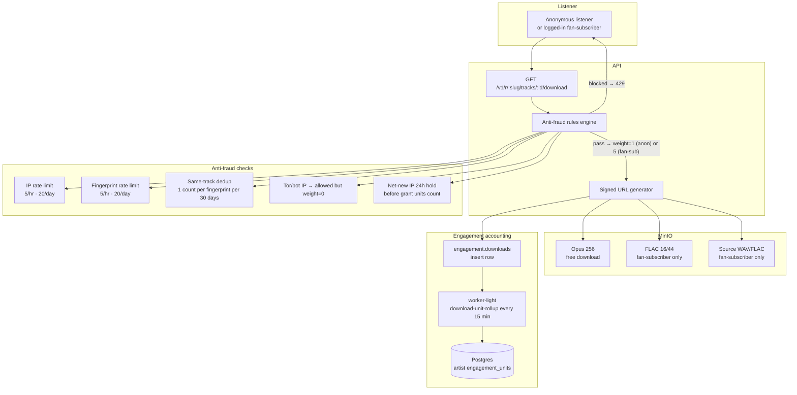
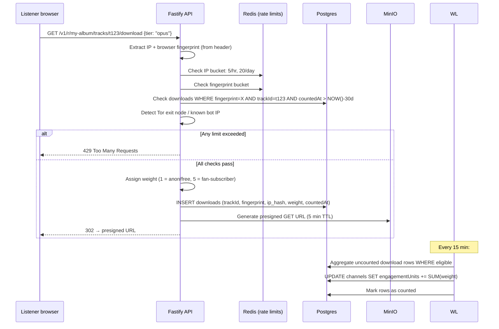
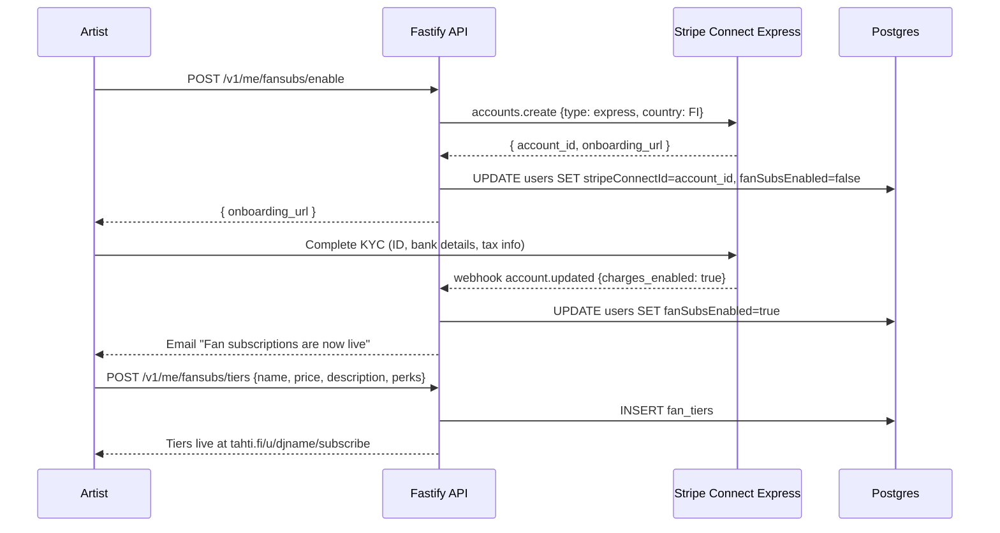

# Phase 11 — Engagement and monetization: downloads, fan-subs, tier gating (M18–M20)

**Goal:** downloads become a first-class action with anti-fraud and grant-unit accounting; artists can accept direct fan subscriptions via Stripe Connect; free-tier artists are gently limited to 1 hour of live broadcasting per week while member artists broadcast lossless FLAC.

**Timeline:** Months 22–24  
**Entry state:** Phase 10 complete, Tahti Radio live.  
**New services:** none — existing services extended. Stripe Connect Express onboarding added to `api`.

---

## Downloads architecture



## Download anti-fraud sequence



---

## Fan-subscription architecture

```mermaid
graph TB
    subgraph "Artist setup"
        A[Artist dashboard\n"Enable fan subscriptions"]
        SC[Stripe Connect Express\nonboarding]
    end

    subgraph "Listener subscribe"
        L[Listener\n"Support DJ Name"]
        SK[Stripe Checkout]
    end

    subgraph "Money flow"
        Stripe[Stripe Platform account]
        OrgFee[2% operational fee\n→ org account]
        Artist[97.9% (approx)\n→ artist Stripe Connect]
    end

    subgraph "Access grants"
        Sub[fan_subscriptions table]
        FLAC[FLAC downloads unlocked]
        Badge[Supporter badge in chat]
        NL[Fan-only newsletter list]
    end

    A --> SC
    SC -- KYC approved --> A
    L --> SK
    SK --> Stripe
    Stripe --> OrgFee
    Stripe --> Artist
    SK --> Sub
    Sub --> FLAC
    Sub --> Badge
    Sub --> NL
```

## Fan-subscription onboarding flow



## Listener subscribe flow

```mermaid
sequenceDiagram
    participant L as Listener
    participant Web as Next.js
    participant API as Fastify API
    participant Stripe as Stripe Checkout
    participant PG as Postgres

    L->>Web: GET tahti.fi/u/djname/subscribe
    Web->>API: GET /v1/u/djname/fansubs/tiers
    API-->>Web: [{ tierId, name, priceEur, perks }]
    Web-->>L: Tier selection page

    L->>API: POST /v1/fansubs/checkout {tierId}
    API->>Stripe: checkout.sessions.create {
      payment_method_types: [card],
      mode: subscription,
      line_items: [...],
      application_fee_percent: 2,
      transfer_data: { destination: artist.stripeConnectId }
    }
    Stripe-->>API: { session_url }
    API-->>L: 302 → Stripe Checkout

    L->>Stripe: Enter card, complete payment
    Stripe-->>API: webhook checkout.session.completed
    API->>PG: INSERT fan_subscriptions {listenerId, artistId, tierId, stripeSubId}
    API->>PG: Upsert listener account (email, Stripe customer ID)
    API->>PM: Send "Welcome — you're now supporting DJ Name"
    API->>PM: Send password-setup link to listener (if first subscription)
```

## Payout cron (monthly)

```mermaid
flowchart LR
    Cron[1st of month\n00:00 UTC] --> Q[worker-light\nfansub-payout queue]
    Q --> PG[(Postgres\nfan_subscriptions)]
    Q --> SC[Stripe Connect\nTransfer API]
    SC --> PG2[INSERT ledger_entries\nFANSUB_PASSTHROUGH]
    PG2 --> Ledger[/transparency\nledger visible]
```

The ledger entry category `FANSUB_PASSTHROUGH` records: gross amount, 2% operational fee (org income), net to artist. The fan-sub gross is **not** counted as org revenue — only the 2% fee is.

---

## Tier gating architecture

```mermaid
flowchart TD
    subgraph "Free artist going live"
        A[Artist starts broadcast] --> Check{weeklyLiveSecondsUsed\n< 3600?}
        Check -- Yes → broadcast live --> Track[Increment counter\nevery 60s]
        Track --> W45{≥ 2700s?}
        W45 -- Yes --> Banner45["Dashboard banner:\n'45 min used · 15 min left'"]
        Track --> W55{≥ 3300s?}
        W55 -- Yes --> Banner55["Dashboard banner:\n'55 min used · 5 min left'"]
        Track --> W60{= 3600s}
        W60 -- Yes --> Grace[60s grace period]
        Grace --> Stop[Orchestrator: graceful stop\n"Weekly hour up — resets Monday 00:00 UTC"\nListeners transition to archive]
        Check -- No → Block[Broadcast blocked\nupgrade CTA shown]
    end

    subgraph "Member artist"
        PA[Artist starts broadcast] --> PCheck{isMember=true?}
        PCheck -- Yes → NoGate[No gate applied\nFLAC output rendered]
    end

    subgraph "Monday reset cron"
        MC[weekly-broadcast-reset\nEvery Mon 00:00 UTC]
        MC --> PG[(Postgres)]
        MC --> Reset[UPDATE users SET weeklyLiveSecondsUsed=0\nWHERE tier=FREE]
    end
```

## Audio quality routing

```mermaid
flowchart LR
    subgraph "Liquidsoap channel template"
        LS[Liquidsoap] --> MP3["stream-mp3-192/\nMP3 192 kbps HLS"]
        LS --> FLAC_OUT["stream-flac/\nFLAC 16/44 HLS"]
    end

    subgraph "API player routing"
        PR[GET /v1/c/:slug\nReturns manifest URL]
    end

    subgraph "Decision"
        D{Artist tier}
        D -- FREE → MP3_URL[MP3 manifest URL]
        D -- PAID → FLAC_URL[FLAC manifest URL]
    end

    PR --> D
    D --> MP3_URL
    D --> FLAC_URL
```

The listener doesn't choose quality — the artist's tier determines which manifest URL the API returns. All listeners on a member artist's channel hear FLAC.

## Grant engagement unit formula (authoritative)

This is the formula that overrides the listener-hours approach used in the earlier grant cron draft (M9). Update M9 implementation to use this:

```
engagement_units(artist, year) =
    SUM(downloads.weight)          -- anonymous/free: weight=1; fan-subscriber: weight=5
  + SUM(fan_sub_euros × 10)       -- €1 of fan-sub = 10 engagement units
```

**Not counted:**
- Listener-hours (vanity metric, displayed but never fed into grants)
- Stream starts
- Chat messages

**Grant pool allocation (updated M9):**

```
grant_pool = (annual_surplus) × 0.9   (10% to operating reserve)

artist_share = (artist_engagement_units / total_eligible_units) × grant_pool

Eligibility: paying-member channels with engagement_units > 0
No minimum threshold for engagement units — even 1 download counts.
```

## New Stripe secrets

```bash
# Stripe Connect platform secret key (for Connect onboarding + transfers)
echo -n "<sk_live_...>" | docker secret create stripe_secret_key -
echo -n "<whsec_...>" | docker secret create stripe_webhook_secret -
```

## New API routes (Phase 11)

```
# Downloads — public
GET    /v1/r/:slug/tracks/:id/download?tier=opus|flac|source
       → anti-fraud check → 302 signed URL

# Fan subscriptions — public
GET    /v1/u/:handle/fansubs/tiers    → available tiers + prices
POST   /v1/fansubs/checkout           → create Stripe Checkout session
GET    /v1/fansubs/portal             → Stripe customer portal (manage subscription)

# Fan subscriptions — artist-authed
POST   /v1/me/fansubs/enable          → start Stripe Connect onboarding
GET    /v1/me/fansubs/status          → Connect account status + earnings summary
POST   /v1/me/fansubs/tiers           → create tier
PATCH  /v1/me/fansubs/tiers/:id       → update tier
DELETE /v1/me/fansubs/tiers/:id       → archive tier (existing subs unaffected)
GET    /v1/me/fansubs/subscribers     → subscriber list (count + tier breakdown)

# Stripe webhooks — internal
POST   /v1/internal/stripe/webhook    → handles: checkout.session.completed,
                                         customer.subscription.deleted,
                                         account.updated (Connect)

# Tier gating — internal (orchestrator calls this)
GET    /v1/internal/channels/:id/live-gate
       → { allowed: bool, secondsUsed: number, secondsRemaining: number }
```

## Migration notes

The grant disbursement code in M9 must be updated before the first real grant run:

1. Remove `listener_hours` from the grant calculation query.
2. Add `engagement_units` column to `channels` (or compute from `engagement.downloads` aggregation).
3. Update the grant cron to use the formula above.
4. Dry-run on synthetic data before any real payout.

## Exit criteria

| Check | Method | Expected |
|-------|--------|----------|
| Anonymous download | Download a track (no account) | Opus 256 file served |
| Rate limit | Download same track 6× in 1 hour (same IP) | 429 on 6th attempt |
| Dedup | Download same track 3× same fingerprint in 7 days | engagement_units incremented once |
| Fan-sub download | Fan-subscriber downloads FLAC | FLAC 16/44 file served |
| Weight correct | Fan-sub downloads 5 tracks | engagement_units += 25 (5 × weight=5) |
| Connect onboard | Artist enables fan-subs | Stripe Connect onboarding completes |
| Fan-sub payment | Listener subscribes €5/month | Payment recorded, supporter badge in chat |
| 2% fee | Check Stripe dashboard | Application fee = €0.10 on €5 charge |
| Payout cron | Run monthly cron | Artist payout + ledger entries created |
| Free tier cap | Free artist broadcasts 61 min | Graceful stop at 60 min, archive resumes |
| Weekly reset | Monday 00:00 UTC | weeklyLiveSecondsUsed reset to 0 |
| Member artist no cap | Member artist broadcasts 3 hours | No interruption |
| Audio quality | Member artist live | Listeners receive FLAC manifest |
| Audio quality | Free artist live | Listeners receive MP3 192 manifest |
| Grant formula | Dry-run grant calc | Uses engagement_units, not listener_hours |
