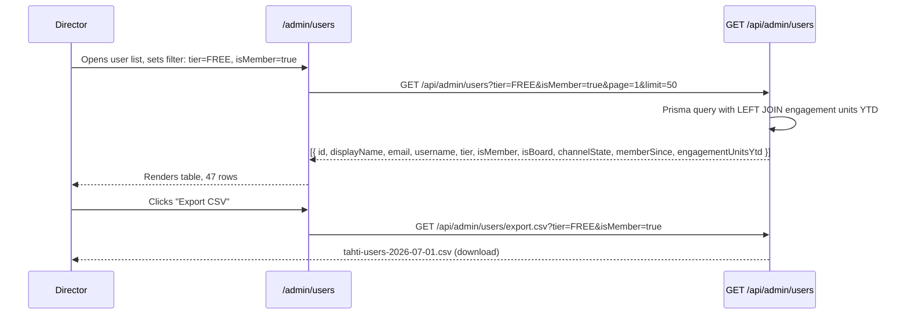
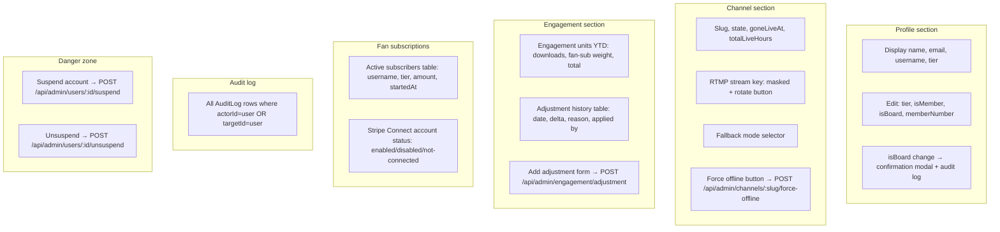
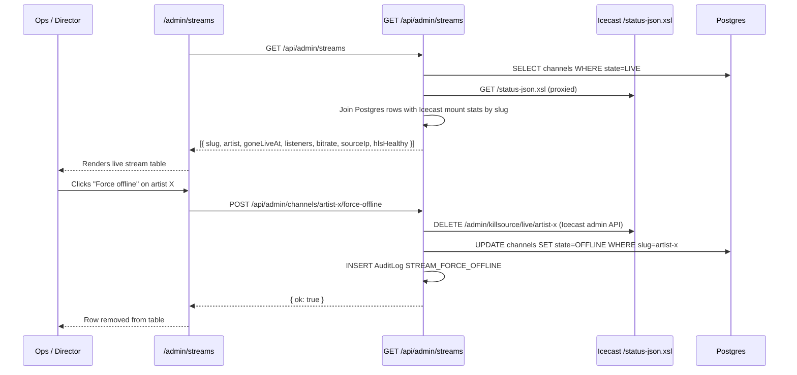
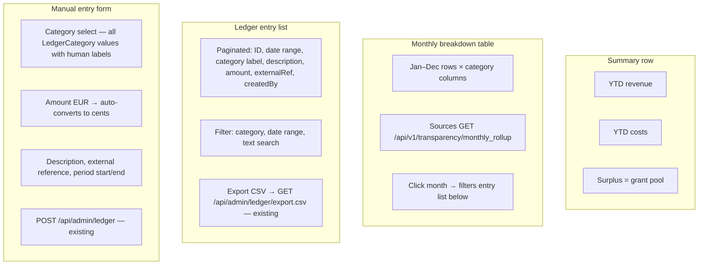
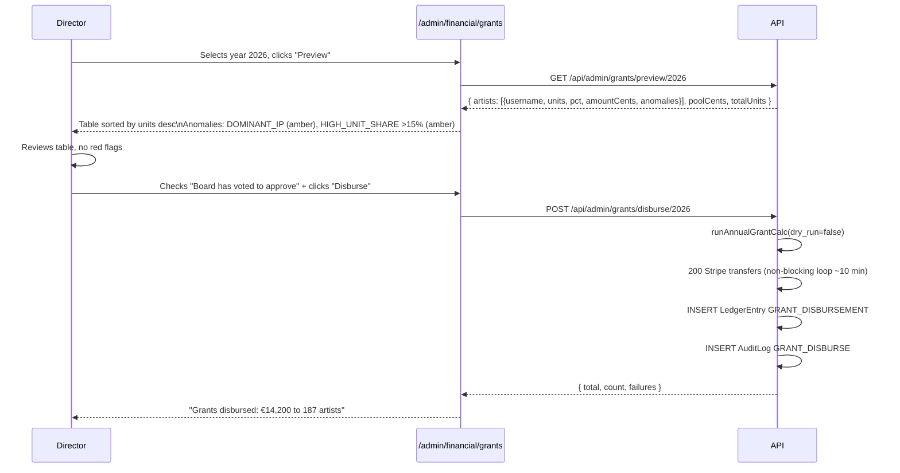
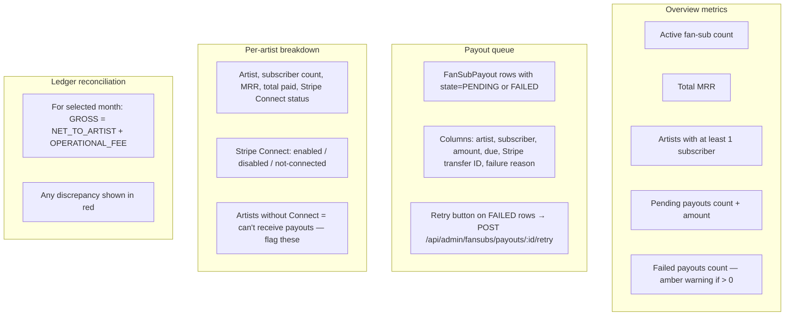
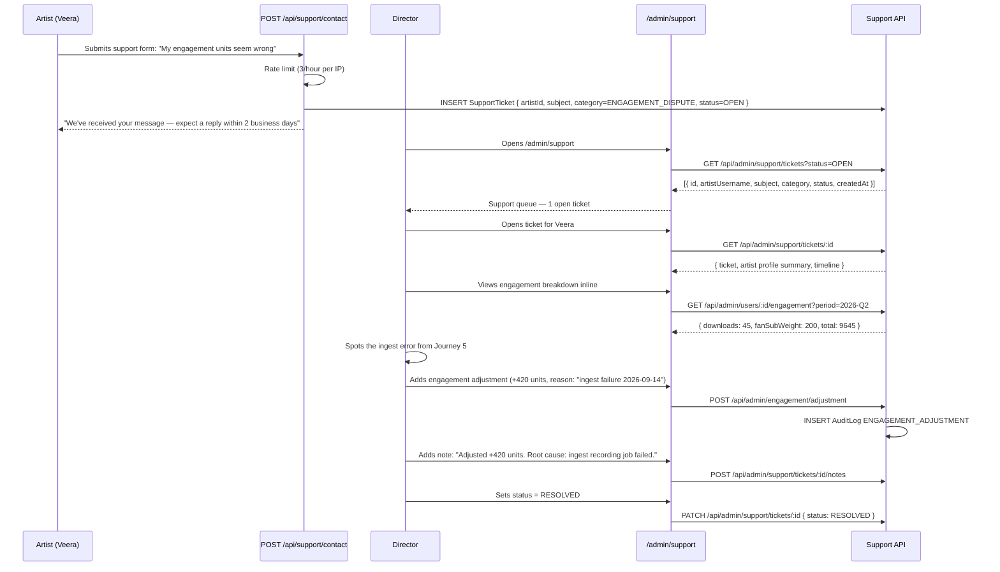
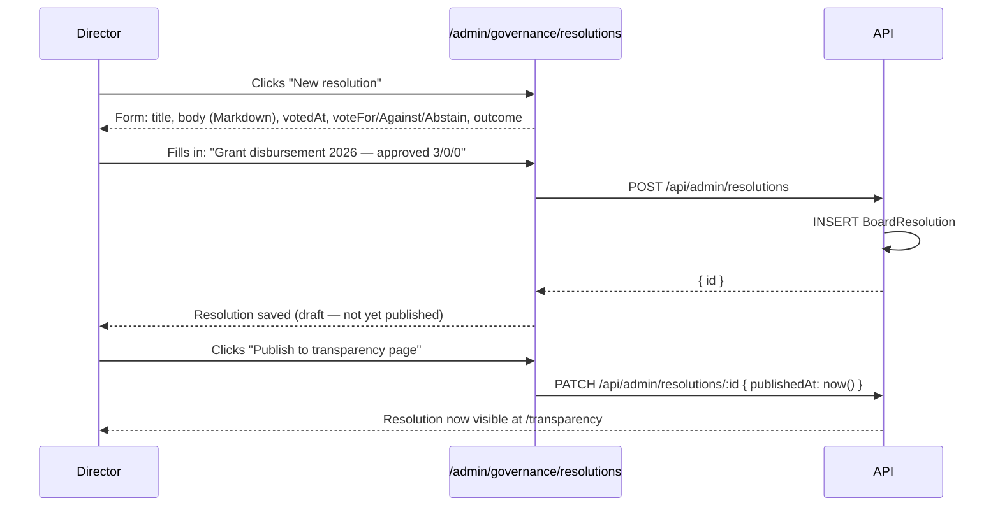
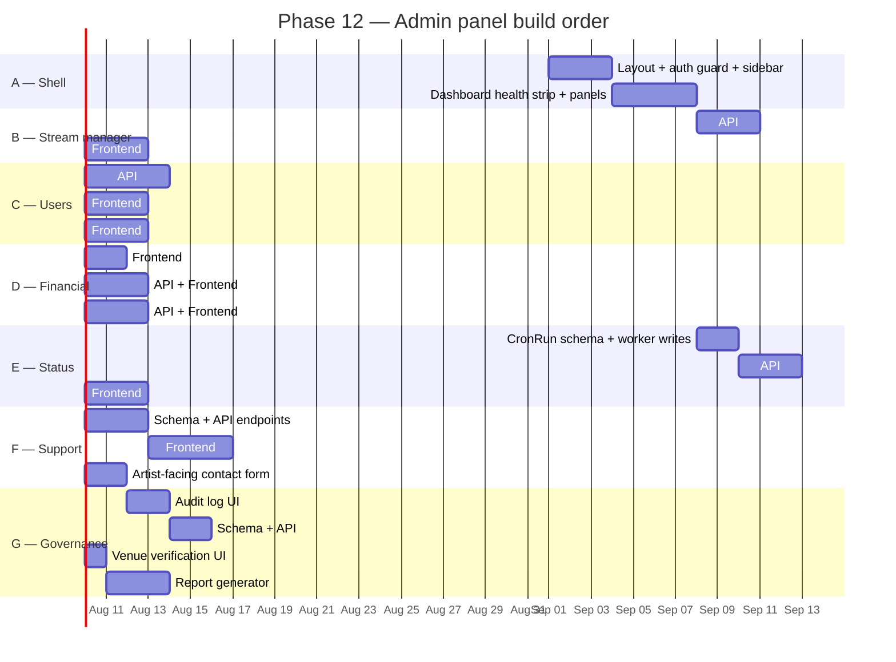

# Phase 12 — Admin panel: operations, finance, governance, support (M21)

**Goal:** A comprehensive `app.tahti.live/admin/*` section giving the director, board, and ops engineer a single surface for user management, stream operations, financial oversight, service health monitoring, support case handling, and governance tooling — replacing ad-hoc SSH, direct DB edits, and CSV downloads.

**Timeline:** Months 25–30 (post-public-beta)
**Entry state:** Phase 11 complete. Platform has paying fan-subscribers, a grant round has been run, and the director is managing the org with manual processes.
**New services:** none — extends `api` and `web`. One new Postgres schema (`admin`) for support tickets, board resolutions, and cron run logs.

---

## Architecture

### Access model

```mermaid
graph LR
    subgraph "Browser"
        U[User visits /admin/*]
    end

    subgraph "Next.js — apps/web"
        L[admin/layout.tsx\nrequireBoard server check]
        P[Admin page components\nserver components]
        SA[Server actions\nfor mutations]
    end

    subgraph "API — apps/api"
        BG[requireBoard middleware\nalready exists]
        AR[/api/admin/* routes]
        ER[Existing public routes\n/api/v1/transparency, /api/v1/status]
    end

    U --> L
    L -- "isBoard=false → redirect /login" --> U
    L -- "isBoard=true" --> P
    P -- "direct API_URL fetch" --> AR
    SA -- "direct API_URL fetch" --> AR
    AR --> BG
```

The existing `requireBoard` middleware on the API handles authentication. The frontend `admin/layout.tsx` adds a redundant check (reads session via `GET /api/auth/me`) so unauthenticated users never see the chrome. All mutations are audit-logged to the existing `AuditLog` table.

### URL structure

```
/admin                             → redirect → /admin/dashboard
/admin/dashboard                   → health strip, stream summary, finance snapshot
/admin/users                       → paginated user directory
/admin/users/[id]                  → user detail + actions
/admin/streams                     → active stream manager
/admin/financial                   → financial overview
/admin/financial/ledger            → ledger entries + manual entry form
/admin/financial/grants            → grant preview + disbursement
/admin/financial/fansubs           → fan-sub revenue + payout queue
/admin/status                      → service health + infra monitoring
/admin/support                     → support ticket queue
/admin/support/[id]                → ticket detail + timeline
/admin/governance                  → audit log, resolutions, venues, reports
/admin/governance/audit            → full audit log viewer
/admin/governance/resolutions      → board resolutions
/admin/governance/venues           → venue verification queue
/admin/governance/report           → annual transparency report generator
```

### Design

Dark brand surface (same tokens as the marketing site and the `/listen` page). Board users see an `Admin` nav item in their dashboard sidebar after login. The admin section does not share the light admin surface of the artist dashboard — it uses `.auth-card--dark` and the Three.js background only on the auth pages; the admin shell itself is a full dark layout matching `--bg: #0a0f1e`.

---

## M21-A — Dashboard (`/admin/dashboard`)

The first screen after entering the admin section. Read-only overview updated on every page load (plus client-side refresh every 30 seconds for the health strip and stream count).

### Panels

**Health strip** — a row of coloured status dots across the top. Sources `GET /api/v1/status` (existing endpoint). Maps the `checks` object to dots: green = state `ok`, amber = `degraded`, red = `down`. Clicking a dot scrolls to the full service detail in `/admin/status`.

| Check ID | Service |
|---|---|
| `postgres` | Postgres 16 |
| `redis` | Redis 7 |
| `minio` | MinIO object store |
| `icecast` | Icecast2 streaming server |
| `centrifugo` | Centrifugo chat |
| `worker` | BullMQ worker heartbeat |

**Live now** — count of channels in `state=LIVE`, list of slugs + artist names + elapsed time since `goneLiveAt`. Links to `/admin/streams`.

**Finance snapshot** — year-to-date figures from `GET /api/v1/transparency/ytd`: revenue, costs, surplus (= grant pool balance). One amber warning if any `FanSubPayout` with `state=FAILED` exists.

**Member pulse** — total member count, new members this month, lapsed count. From new `GET /api/admin/stats/members`.

**Queue health** — depth of each BullMQ queue as a mini bar chart. Amber if waiting > 50, red if waiting > 200. From new `GET /api/admin/stats/queues`. Queues covered: `newsletter-dispatch`, `transcode-release-track`, `mixcloud-upload`, `fan-sub-payout`, `fan-sub-expire`, `download-fraud-scan`.

**Cron log** — table of the 10 cron jobs from `worker-crons.md`, their last run time, duration, and outcome (✓ / ✗). From new `CronRun` table written by the worker at job start and end.

**Recent audit events** — last 10 `AuditLog` rows: actor, action (human-readable), target, timestamp. Link to full log.

### New API endpoints (M21-A)

| Method | Path | Description |
|---|---|---|
| `GET` | `/api/admin/stats/members` | Total, new-this-month, lapsed member counts |
| `GET` | `/api/admin/stats/queues` | BullMQ job counts per queue name |

### New schema (M21-A)

```prisma
model CronRun {
  id          BigInt    @id @default(autoincrement())
  jobName     String
  startedAt   DateTime
  finishedAt  DateTime?
  outcome     CronOutcome?
  errorMessage String?
  @@index([jobName, startedAt(sort: Desc)])
  @@schema("admin")
}

enum CronOutcome {
  SUCCESS
  ERROR
  @@schema("admin")
}
```

Worker change: at the start of every cron handler, `INSERT CronRun(jobName, startedAt)`; on completion, `UPDATE CronRun SET finishedAt, outcome`.

---

## M21-B — User management (`/admin/users`, `/admin/users/[id]`)

### User list

Paginated, filterable table of all `User` records.



**Columns:** member#, display name, email, username, tier, member, board, channel state, member since, engagement units YTD, actions (View, Suspend).

**Filters:** tier, isMember, isBoard, channel state (LIVE / OFFLINE / none), memberSince date range, free-text (displayName / email / username).

**Sort:** any column; default memberNumber asc.

### User detail (`/admin/users/[id]`)



### New API endpoints (M21-B)

| Method | Path | Description |
|---|---|---|
| `GET` | `/api/admin/users` | Paginated user list with engagement totals; query params: page, limit, tier, isMember, isBoard, channelState, search, sort |
| `GET` | `/api/admin/users/export.csv` | Filtered user export |
| `GET` | `/api/admin/users/:id` | Full user record: profile, channel, membership, engagement summary |
| `PATCH` | `/api/admin/users/:id` | Update tier, isMember, isBoard, memberNumber |
| `GET` | `/api/admin/users/:id/engagement` | Per-user engagement breakdown for a period |
| `POST` | `/api/admin/engagement/adjustment` | Add engagement unit correction (Journey 5 from journey-director.md) |
| `POST` | `/api/admin/users/:id/suspend` | Set suspendedAt + suspendReason; audit-logged |
| `POST` | `/api/admin/users/:id/unsuspend` | Clear suspendedAt; audit-logged |

### New schema (M21-B)

Add to `User` model:
```prisma
suspendedAt   DateTime?
suspendReason String?
```

Add to `AuditAction` enum:
```prisma
ENGAGEMENT_ADJUSTMENT
USER_SUSPEND
USER_UNSUSPEND
BOARD_ROLE_CHANGE
```

---

## M21-C — Stream manager (`/admin/streams`)

The operational view of what is currently on air. Client-side auto-refresh every 15 seconds.



### Panels

**Active streams table**

| Column | Source |
|---|---|
| Artist + avatar | Postgres `user` join |
| Channel slug | `/c/[slug]` link |
| Live since / elapsed | `goneLiveAt` |
| Listeners | Icecast `listeners` |
| Bitrate (kbps) | Icecast `bitrate` |
| Source IP | Icecast `source_ip` |
| HLS health | HTTP HEAD on HLS playlist URL |
| Actions | Force offline, Rotate key, View public page |

**Icecast mounts panel** — raw list of all Icecast mount points, not just those matching a Tahti channel. Helps detect ghost streams or stale keys still connected.

**RTMP ingest panel** — nginx-RTMP stat XML parsed: currently connected publishers, bytes in/out, publish duration per mount.

**Fallback status panel** — channels with `state=OFFLINE` and non-none `fallbackMode`. Shows whether the fallback audio file is reachable.

**Worker transcode queue** — failed `transcode-release-track` jobs with error message and retry button.

### New API endpoints (M21-C)

| Method | Path | Description |
|---|---|---|
| `GET` | `/api/admin/streams` | All LIVE channels with Icecast stats joined |
| `POST` | `/api/admin/channels/:slug/force-offline` | Kick Icecast source + set state=OFFLINE; audit-logged |
| `GET` | `/api/admin/icecast/mounts` | Proxied Icecast status JSON |
| `GET` | `/api/admin/rtmp/stats` | Proxied nginx-RTMP stat XML → JSON |

Add to `AuditAction` enum:
```prisma
STREAM_FORCE_OFFLINE
```

---

## M21-D — Financial dashboard (`/admin/financial`)

Three sub-pages covering ledger entries, grant management, and fan-sub flows.

### Ledger (`/admin/financial/ledger`)



**LedgerCategory human labels:**

| Enum value | Label |
|---|---|
| `REVENUE_SUBSCRIPTION` | Membership fees |
| `REVENUE_DISTRIBUTION` | Streaming royalties (Revelator) |
| `REVENUE_GRANT_INBOUND` | Grants received |
| `REVENUE_DONATION` | One-time donations |
| `COST_INFRASTRUCTURE` | VPS, fibre, domains |
| `COST_DISTRIBUTION_PASSTHROUGH` | Revelator fees |
| `COST_OPERATIONS` | Postmark, Stripe, software |
| `COST_SALARY` | Director salary |
| `COST_AUDIT` | Annual audit |
| `COST_PROFESSIONAL_SERVICES` | Legal, accounting |
| `GRANT_DISBURSEMENT` | Outgoing artist grants |
| `RESERVE_TRANSFER` | Reserve fund transfers |
| `FAN_SUB_GROSS_RECEIVED` | Fan-sub payments in |
| `FAN_SUB_NET_TO_ARTIST` | Fan-sub passed to artist |
| `FAN_SUB_OPERATIONAL_FEE` | Tahti operational cut |

All existing API endpoints used; no new endpoints needed for this sub-page.

### Grant management (`/admin/financial/grants`)



**Disbursement guard conditions** — all must be true before the Disburse button becomes active:
1. Preview has been run and is currently displayed
2. Zero red-severity anomaly flags in the preview
3. Checkbox "I confirm the board has voted in writing to approve this disbursement" is checked

**Grant history table** — past grant rounds: year, total disbursed (EUR), artist count, disbursedAt, disbursedBy. Per-round detail shows individual `GrantRecord` rows with Stripe transfer IDs and state (PENDING / CONFIRMED / PAID / UNCLAIMED).

### New API endpoints (M21-D grants)

| Method | Path | Description |
|---|---|---|
| `POST` | `/api/admin/grants/disburse/:year` | Execute grant round (dry_run=false wrapper); audit-logged |
| `GET` | `/api/admin/grants/history` | List past grant rounds with totals |
| `GET` | `/api/admin/grants/history/:year` | Per-artist `GrantRecord` rows for a round |

Add to `AuditAction` enum:
```prisma
GRANT_DISBURSE
```

### Fan subscriptions (`/admin/financial/fansubs`)



### New API endpoints (M21-D fansubs)

| Method | Path | Description |
|---|---|---|
| `GET` | `/api/admin/fansubs/overview` | Summary metrics |
| `GET` | `/api/admin/fansubs/payouts` | Payout queue; query: state=PENDING\|FAILED |
| `GET` | `/api/admin/fansubs/by-artist` | Per-artist revenue + Stripe Connect status |
| `POST` | `/api/admin/fansubs/payouts/:id/retry` | Retry a failed payout; audit-logged |

---

## M21-E — Service status (`/admin/status`)

Full infrastructure observability within the admin panel.

### Service health table

Extends the existing `GET /api/v1/status` data. Each row: service name, description, current state, latency (ms), whether critical, uptime % over rolling 30 days.

| Service | Check method |
|---|---|
| API | HTTP `/health` |
| Postgres | Prisma `$queryRaw SELECT 1` latency |
| Redis | PING latency |
| MinIO | S3 `HeadBucket` |
| Icecast | HTTP `GET /status-json.xsl` |
| Centrifugo | HTTP `/health` |
| RTMP ingest | TCP connect port 1935 |
| Worker | Redis key `worker:heartbeat` age < 90s |
| Email | Last Postmark send < 1h (from audit log) |
| Stripe | Last webhook received < 1h |

Uptime % requires storing check results. Options: (a) write a `HealthCheckLog` row every 60 seconds in the worker, (b) query Prometheus if Prometheus is set up (preferred per `journey-ops.md` monitoring setup). Implementation should detect which is available and fall back to the simple check age.

### Docker stack status

Table mirroring `docker stack ps tahti`: service name, desired replicas, running replicas, image tag, last update. Sourced from `GET /api/admin/infra/docker` — a new endpoint on the `orchestrator` service (which already has Docker socket access) that reads `docker service ls` output.

### BullMQ queue panel

Bar chart + table per queue: waiting, active, delayed, failed, completed (last 24h). Failed job rows: job name, data (truncated), error, retry button. Sourced from `GET /api/admin/stats/queues` (already defined in M21-A).

### Cron job log

Table of each cron's last 10 `CronRun` records: started, finished, duration, outcome. Sourced from the new `CronRun` table (M21-A schema).

### Disk and resource usage

| Metric | Source |
|---|---|
| Disk usage (each mount) | `/api/admin/infra/resources` — df output |
| RAM used / available | `/api/admin/infra/resources` — free output |
| MinIO: total objects, bytes, by bucket | MinIO admin API |

### Backup status

| Check | Source |
|---|---|
| Last Postgres backup timestamp + size | Redis key set by `backup.sh` |
| Last MinIO backup timestamp + size | Redis key set by `backup.sh` |
| Restore test result | Redis key written by weekly restore-test cron |

Age thresholds: > 26 h = amber, > 48 h = red (matching existing alert policy in `journey-ops.md`).

### New API endpoints (M21-E)

| Method | Path | Description |
|---|---|---|
| `GET` | `/api/admin/infra/docker` | Docker service list from orchestrator |
| `GET` | `/api/admin/infra/resources` | Disk + RAM usage from host |
| `GET` | `/api/admin/infra/backups` | Backup timestamps + restore test result from Redis |

---

## M21-F — Support (`/admin/support`, `/admin/support/[id]`)

Lightweight internal case management. Replaces the current workflow of handling artist complaints via personal email with no audit trail.



### Ticket list (`/admin/support`)

Columns: ID, artist (username + link to user detail), subject, category, status badge, created, updated, assigned to.

Filters: status (OPEN / IN_PROGRESS / RESOLVED), category (ENGAGEMENT_DISPUTE / TECHNICAL / FINANCIAL / OTHER), assigned to board member.

### Ticket detail (`/admin/support/[id]`)

**Context panel** — artist profile summary pulled from user detail API: displayName, email, tier, memberSince, channel state, engagement units YTD, Stripe Connect status.

**Timeline** — append-only log of case events: created, status changes, notes added, actions taken (engagement adjustments, other API calls from this ticket). Each entry has author and timestamp.

**Quick actions panel:**
- Inline engagement breakdown (calls `GET /api/admin/users/:id/engagement`)
- Inline engagement adjustment form
- Copy email address
- Change status / assign to board member

**Chat moderation log** — `AuditLog` rows where action is `CHAT_BAN` / `CHAT_UNBAN` / `CHAT_MESSAGE_DELETE` involving this artist's channel. Relevant for conduct-related cases.

### New schema (M21-F)

```prisma
model SupportTicket {
  id           BigInt              @id @default(autoincrement())
  artistId     String?
  artist       User?               @relation(fields: [artistId], references: [id], onDelete: SetNull)
  subject      String
  category     SupportCategory
  status       SupportStatus       @default(OPEN)
  assignedToId String?
  assignedTo   User?               @relation("SupportAssignee", fields: [assignedToId], references: [id], onDelete: SetNull)
  notes        SupportTicketNote[]
  createdAt    DateTime            @default(now())
  updatedAt    DateTime            @updatedAt
  @@index([status, createdAt(sort: Desc)])
  @@schema("admin")
}

model SupportTicketNote {
  id        BigInt         @id @default(autoincrement())
  ticketId  BigInt
  ticket    SupportTicket  @relation(fields: [ticketId], references: [id], onDelete: Cascade)
  body      String
  authorId  String
  author    User           @relation(fields: [authorId], references: [id], onDelete: Cascade)
  createdAt DateTime       @default(now())
  @@schema("admin")
}

enum SupportCategory {
  ENGAGEMENT_DISPUTE
  TECHNICAL
  FINANCIAL
  OTHER
  @@schema("admin")
}

enum SupportStatus {
  OPEN
  IN_PROGRESS
  RESOLVED
  @@schema("admin")
}
```

### New API endpoints (M21-F)

| Method | Path | Description |
|---|---|---|
| `POST` | `/api/support/contact` | Artist-facing form (no auth, rate-limited); creates ticket |
| `GET` | `/api/admin/support/tickets` | Ticket list; query: status, category, assignedTo, page, limit |
| `GET` | `/api/admin/support/tickets/:id` | Ticket detail + artist summary + timeline |
| `POST` | `/api/admin/support/tickets` | Create ticket manually (board member) |
| `POST` | `/api/admin/support/tickets/:id/notes` | Append note to timeline |
| `PATCH` | `/api/admin/support/tickets/:id` | Update status, assignedToId |

---

## M21-G — Governance (`/admin/governance`)

### Audit log viewer (`/admin/governance/audit`)

Full `AuditLog` table as a paginated, filterable UI. Uses the same data as `GET /api/admin/audit/export.csv` (existing) but rendered in the browser.

**Columns:** timestamp, actor (displayName + link), action (human-readable label), target (linked to user or channel if applicable), metadata (expandable JSON).

**Filters:** action type (multi-select), actor username, date range, target ID.

**Export** — date-range CSV download via existing endpoint.

**Action labels:**

| AuditAction | Human label |
|---|---|
| `CHAT_BAN` | Chat: user banned |
| `CHAT_UNBAN` | Chat: ban lifted |
| `CHAT_MESSAGE_DELETE` | Chat: message deleted |
| `STREAM_KEY_ROTATE` | Stream key rotated |
| `STREAM_FORCE_OFFLINE` | Stream forced offline |
| `LEDGER_ENTRY_CREATE` | Ledger: entry created |
| `GRANT_DISBURSE` | Grant round disbursed |
| `ENGAGEMENT_ADJUSTMENT` | Engagement units adjusted |
| `USER_SUSPEND` | Account suspended |
| `USER_UNSUSPEND` | Suspension lifted |
| `BOARD_ROLE_CHANGE` | Board role changed |

### Board resolutions (`/admin/governance/resolutions`)

Formal record of board decisions. Required by Finnish association law (`yhdistyslaki`) — minutes must be kept and accessible to members.



### New schema (M21-G)

```prisma
model BoardResolution {
  id           BigInt    @id @default(autoincrement())
  title        String
  body         String    // Markdown
  votedAt      DateTime
  outcome      ResolutionOutcome
  voteFor      Int
  voteAgainst  Int
  voteAbstain  Int
  createdById  String
  createdBy    User      @relation(fields: [createdById], references: [id])
  publishedAt  DateTime?
  createdAt    DateTime  @default(now())
  @@schema("admin")
}

enum ResolutionOutcome {
  PASSED
  FAILED
  DEFERRED
  @@schema("admin")
}
```

### New API endpoints (M21-G)

| Method | Path | Description |
|---|---|---|
| `GET` | `/api/admin/resolutions` | List resolutions (all or published-only via query param) |
| `POST` | `/api/admin/resolutions` | Create resolution |
| `PATCH` | `/api/admin/resolutions/:id` | Update / publish / retract |

### Venue verification (`/admin/governance/venues`)

UI for the existing `GET /api/admin/venues` and `POST /api/admin/venues/:slug/verify` endpoints (already implemented in M17). Table of pending venues: name, city, submitter, submitted date, verify button. No new API work needed.

### Annual report generator (`/admin/governance/report`)

One-click report assembly for the annual transparency report. Selects a year, pulls from ledger + grants + member stats, renders a preview (Markdown), and saves to MinIO as a versioned document.

Report structure:
1. Financial summary — income by category, costs by category, surplus, grant pool
2. Grant disbursement — artist table (respecting `publicAttribution=false` → anonymous rows), total disbursed
3. Member statistics — total members, new, lapsed, board composition
4. Platform metrics — total live hours, archive items published, fan-sub count, unique listeners (if tracked)
5. Board resolutions passed during the year

**New API endpoint:**

| Method | Path | Description |
|---|---|---|
| `POST` | `/api/admin/reports/annual/:year` | Assemble report, save to MinIO, return document URL |
| `GET` | `/api/admin/reports` | List previously generated reports |

---

## Implementation order



**Estimated total: ~25 development days** (5 weeks solo, or 2.5 weeks with two engineers).

Phases A–D (shell, stream manager, users, financial ledger) cover the director's critical-path needs and should ship first. Phases E–G (status monitoring, support, governance) add operational depth before the platform reaches meaningful scale.

---

## Summary of all new API endpoints

| Phase | Method | Path |
|---|---|---|
| A | `GET` | `/api/admin/stats/members` |
| A | `GET` | `/api/admin/stats/queues` |
| B | `GET` | `/api/admin/streams` |
| B | `POST` | `/api/admin/channels/:slug/force-offline` |
| B | `GET` | `/api/admin/icecast/mounts` |
| B | `GET` | `/api/admin/rtmp/stats` |
| C | `GET` | `/api/admin/users` |
| C | `GET` | `/api/admin/users/export.csv` |
| C | `GET` | `/api/admin/users/:id` |
| C | `PATCH` | `/api/admin/users/:id` |
| C | `GET` | `/api/admin/users/:id/engagement` |
| C | `POST` | `/api/admin/engagement/adjustment` |
| C | `POST` | `/api/admin/users/:id/suspend` |
| C | `POST` | `/api/admin/users/:id/unsuspend` |
| D | `POST` | `/api/admin/grants/disburse/:year` |
| D | `GET` | `/api/admin/grants/history` |
| D | `GET` | `/api/admin/grants/history/:year` |
| D | `GET` | `/api/admin/fansubs/overview` |
| D | `GET` | `/api/admin/fansubs/payouts` |
| D | `GET` | `/api/admin/fansubs/by-artist` |
| D | `POST` | `/api/admin/fansubs/payouts/:id/retry` |
| E | `GET` | `/api/admin/infra/docker` |
| E | `GET` | `/api/admin/infra/resources` |
| E | `GET` | `/api/admin/infra/backups` |
| F | `POST` | `/api/support/contact` |
| F | `GET` | `/api/admin/support/tickets` |
| F | `POST` | `/api/admin/support/tickets` |
| F | `GET` | `/api/admin/support/tickets/:id` |
| F | `POST` | `/api/admin/support/tickets/:id/notes` |
| F | `PATCH` | `/api/admin/support/tickets/:id` |
| G | `GET` | `/api/admin/resolutions` |
| G | `POST` | `/api/admin/resolutions` |
| G | `PATCH` | `/api/admin/resolutions/:id` |
| G | `POST` | `/api/admin/reports/annual/:year` |
| G | `GET` | `/api/admin/reports` |

## Summary of all new schema

| Model / Enum | Phase | Purpose |
|---|---|---|
| `CronRun` | A | Worker cron execution log |
| `User.suspendedAt`, `User.suspendReason` | C | Account suspension |
| `SupportTicket` | F | Support case |
| `SupportTicketNote` | F | Case timeline entries |
| `SupportCategory`, `SupportStatus` | F | Ticket classification |
| `BoardResolution` | G | Formal board decision record |
| `ResolutionOutcome` | G | Resolution vote result |
| `AuditAction` additions | B/C/D | `STREAM_FORCE_OFFLINE`, `ENGAGEMENT_ADJUSTMENT`, `USER_SUSPEND`, `USER_UNSUSPEND`, `BOARD_ROLE_CHANGE`, `GRANT_DISBURSE` |
