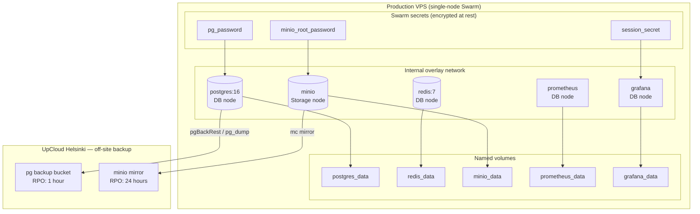
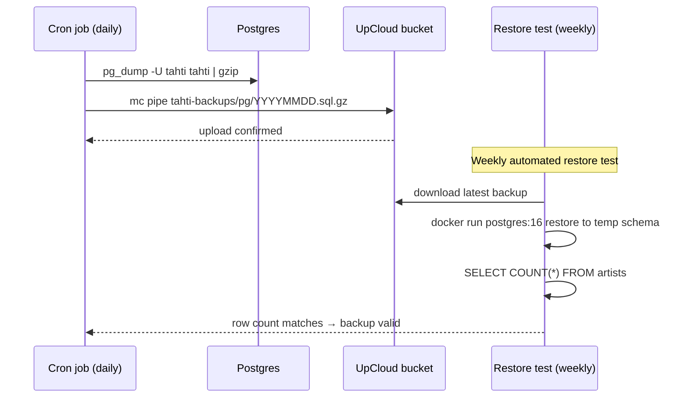
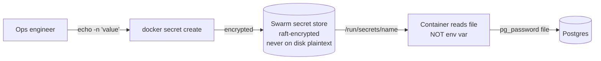

# Phase 3 — Stateful services in production

**Goal:** Postgres, Redis, and MinIO running on the production node with Docker Swarm secrets, automated daily backups to UpCloud, and a tested restore procedure.

**Timeline:** Month 1–2  
**Entry state:** Phase 2 complete, CI is green.  
**New production services:** postgres, redis, minio, prometheus, grafana.

---

## Architecture



## Backup and restore flow



## Secret management



## Runbook

### Step 1 — Init Swarm (if not done in Phase 1)

```bash
docker swarm init
NODE_ID=$(docker info -f '{{.Swarm.NodeID}}')
for role in worker edge db storage ingest; do
  docker node update --label-add role=$role $NODE_ID
done
```

### Step 2 — Create all secrets

```bash
# Postgres password (use a password manager to generate)
openssl rand -base64 32 | docker secret create pg_password -

# MinIO root password
openssl rand -base64 32 | docker secret create minio_root_password -

# Session secret (used by API and Grafana admin)
openssl rand -base64 48 | docker secret create session_secret -

# RTMP key encryption (Phase 4)
openssl rand -base64 32 | docker secret create rtmp_key_encryption_key -

# Centrifugo HMAC secret (Phase 4)
openssl rand -base64 32 | docker secret create centrifugo_secret -

# Chat fingerprint salt (Phase 4)
openssl rand -hex 32 | docker secret create chat_fingerprint_salt -

# External API keys (Phase 6) — placeholder values for now
echo -n "placeholder" | docker secret create revelator_api_key -
echo -n "placeholder" | docker secret create mixcloud_client_secret -
echo -n "placeholder" | docker secret create smtp_password -
```

Verify:
```bash
docker secret ls
# NAME                     CREATED         UPDATED
# pg_password              2 minutes ago   ...
# minio_root_password      2 minutes ago   ...
# session_secret           2 minutes ago   ...
# ...
```

### Step 3 — Deploy stateful services

Copy the full stack file to the server and deploy:

```bash
# On VPS
cd /srv/tahti
TAG=latest docker stack deploy -c infra/docker-stack.yml tahti
```

Wait for healthy status:
```bash
watch docker stack ps tahti --no-trunc
# All tasks should show "Running" state
```

### Step 4 — Initialize MinIO buckets

```bash
# Install mc (MinIO client)
curl -O https://dl.min.io/client/mc/release/linux-amd64/mc
chmod +x mc && mv mc /usr/local/bin/

# Configure alias using the minio_root_password secret
MC_PASS=$(docker secret inspect minio_root_password --pretty 2>/dev/null | grep -v 'Driver')
mc alias set tahti http://localhost:9000 tahti <paste_minio_password>

# Create buckets
mc mb tahti/audio
mc mb tahti/covers
mc mb tahti/waveforms
mc mb tahti/backups

# Set lifecycle: audio archive to cold after 90 days
mc ilm add --expiry-days 730 tahti/audio  # hard delete after 2 years
```

### Step 5 — Run first DB migration

```bash
# From the API container or CI:
docker run --rm \
  --network tahti_internal \
  -e DATABASE_URL=postgres://tahti@postgres:5432/tahti \
  registry.tahti.live/tahti/api:latest \
  node dist/migrate.js
```

### Step 6 — Set up backup cron

Create `/etc/cron.d/tahti-backup`:
```cron
# Postgres daily backup at 03:00
0 3 * * * root /srv/tahti/scripts/backup.sh all >> /var/log/tahti-backup.log 2>&1

# MinIO mirror at 04:00
30 3 * * * root /srv/tahti/scripts/backup.sh status >> /var/log/tahti-backup.log 2>&1 || true

# Weekly restore test (Sunday 05:00)
0 5 * * 0 root /srv/tahti/scripts/backup.sh restore-test >> /var/log/tahti-restore-test.log 2>&1
```

Create `/srv/tahti/scripts/backup-postgres.sh`:
```bash
#!/bin/bash
set -e
DATE=$(date +%Y%m%d-%H%M)
CONTAINER=$(docker ps -qf name=tahti_postgres)
docker exec "$CONTAINER" pg_dump -U tahti tahti | \
  gzip | \
  mc pipe tahti/backups/pg/${DATE}.sql.gz
echo "[$DATE] Postgres backup complete"
```

### Step 7 — Verify Grafana

Grafana is accessible at `http://<vps-ip>:3000` (internal only — restrict via firewall or Caddy IP filter before Phase 4).

Default login: admin / value of `session_secret`. Change on first login.

Import dashboards:
- Postgres: Grafana dashboard ID `9628`
- Redis: ID `11835`
- Node Exporter: ID `1860`

## Volume inspection

```bash
# List volumes
docker volume ls | grep tahti

# Inspect data directory size
docker run --rm -v tahti_postgres_data:/data alpine du -sh /data

# Emergency volume backup before destructive operation
docker run --rm \
  -v tahti_postgres_data:/source:ro \
  -v $(pwd):/dest \
  alpine tar czf /dest/postgres_data_$(date +%Y%m%d).tar.gz -C /source .
```

## Exit criteria

| Check | Command | Expected |
|-------|---------|----------|
| Postgres healthy | `docker exec tahti_postgres.1.xxx pg_isready -U tahti` | `accepting connections` |
| Redis healthy | `docker exec tahti_redis.1.xxx redis-cli ping` | `PONG` |
| MinIO healthy | `curl -s http://<vps-ip>:9000/minio/health/live` | `200` |
| Secrets set | `docker secret ls \| wc -l` | ≥ 10 |
| Backup ran | `mc ls tahti/backups/pg/ \| tail -1` | File dated today |
| Restore test | `cat /var/log/tahti-restore-test.log \| tail -5` | `row count matches` |
| No failed tasks | `docker stack ps tahti --filter desired-state=running` | No `Failed` entries |
