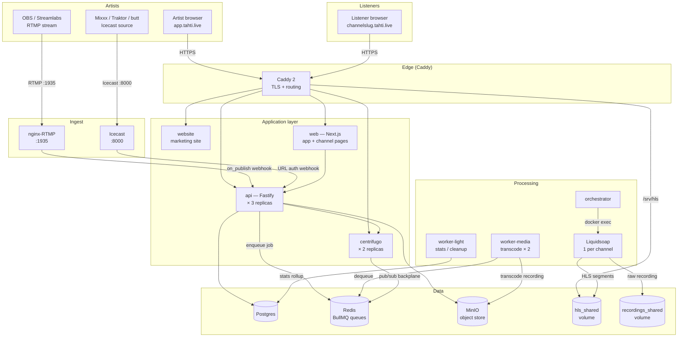
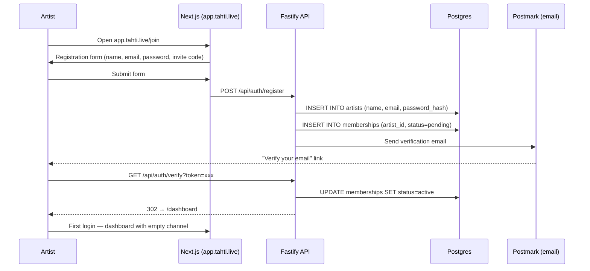
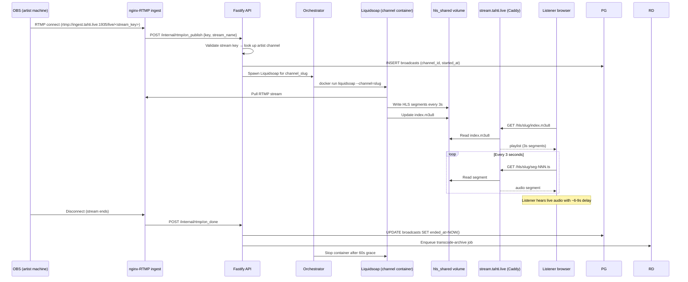
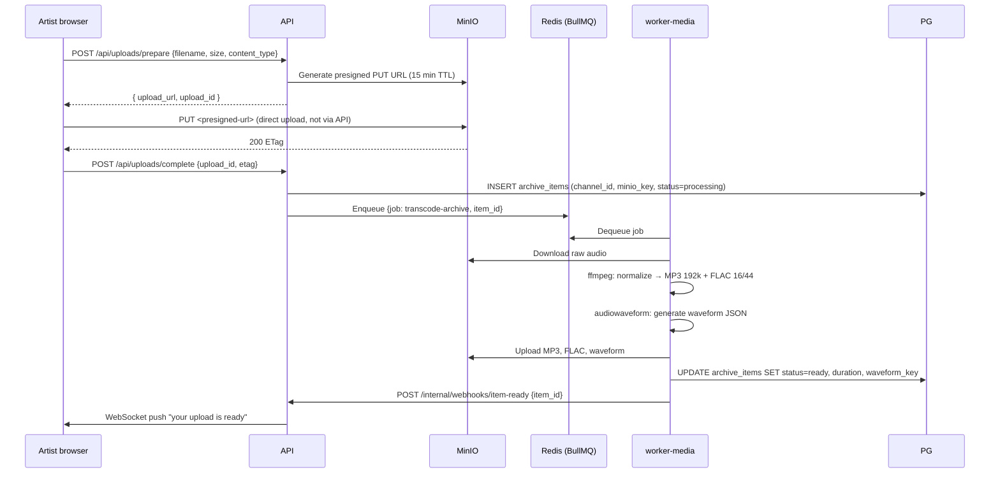
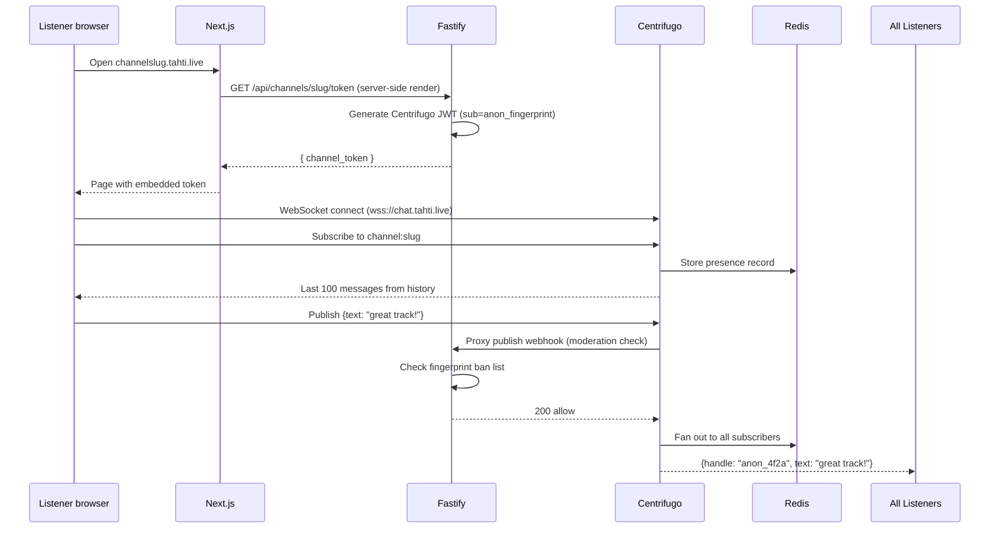
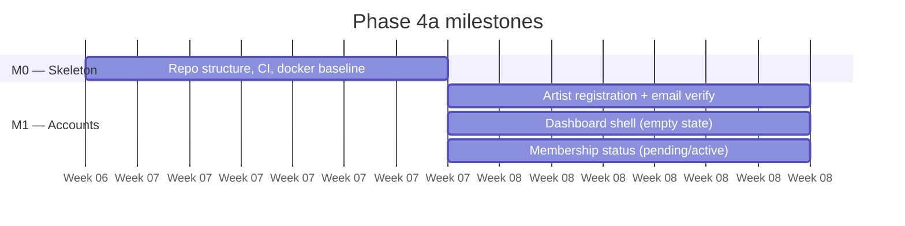

# Phase 4 — Artist app alpha

**Goal:** a hand-recruited artist can sign up, create a channel, broadcast live via OBS or Mixxx, and have the broadcast auto-archived. Listeners can tune in and chat in real time.

**Timeline:** Month 2–5 (milestones M0–M5 from `docs/AGENT.md`)  
**Entry state:** Phase 3 complete, stateful services running.  
**New services:** api, web, worker-media, worker-light, orchestrator, chat, icecast, rtmp-ingest.

---

## Full alpha architecture



## Artist registration flow



## Live broadcast flow (OBS → listener)



## Archive upload flow



## Live chat flow



## Sub-phase breakdown

### 4a — Skeleton + accounts (M0–M1, Weeks 1–4)



**Deliverable:** artist can register, verify email, log in, see empty dashboard.

### 4b — Channel + archive (M2, Weeks 5–6)

**Deliverable:** artist can upload an MP3, see it transcoded and listed in their channel. Listeners can visit `slug.tahti.live` and play the archive item.

### 4c — Live broadcast (M3–M4, Weeks 7–10)

**Deliverable:** OBS guide published, artist follows it, stream is live. Icecast ingress also works for Mixxx. Auto-archive fires within 5 minutes of stream end.

### 4d — Live chat (M5, Weeks 11–12)

**Deliverable:** anonymous listener types a message, it appears for all connected listeners in < 200 ms. Channel artist can see and delete messages.

## Deployment checklist (on top of Phase 3)

```bash
# Deploy the full stack (all new services)
TAG=<sha> docker stack deploy -c infra/docker-stack.yml tahti

# Check all services are running
docker stack services tahti

# Run DB migrations
docker exec -it $(docker ps -qf name=tahti_api) node dist/migrate.js

# Verify API health
curl https://api.tahti.live/health

# Verify chat WebSocket
wscat -c wss://chat.tahti.live/connection/websocket

# Check worker queues are processing
docker logs $(docker ps -qf name=tahti_worker-media) | tail -20
```

## Exit criteria

| Check | Method | Expected |
|-------|--------|----------|
| Artist registration | Sign up at app.tahti.live | Email arrives in < 30s |
| Email verification | Click link in email | Dashboard opens |
| Archive upload | Upload 10 min MP3 | Ready in < 5 min |
| Live stream | OBS → RTMP → listener | Audio in < 10s delay |
| Stream auto-archive | End OBS stream | Archive item appears in < 5 min |
| Live chat | 2 browser tabs | Message appears in < 200 ms |
| 50 concurrent listeners | k6 load test | No 5xx, P95 latency < 500 ms |
| Artist non-technical guide | Ask a non-technical volunteer to broadcast | Succeeds without support |
