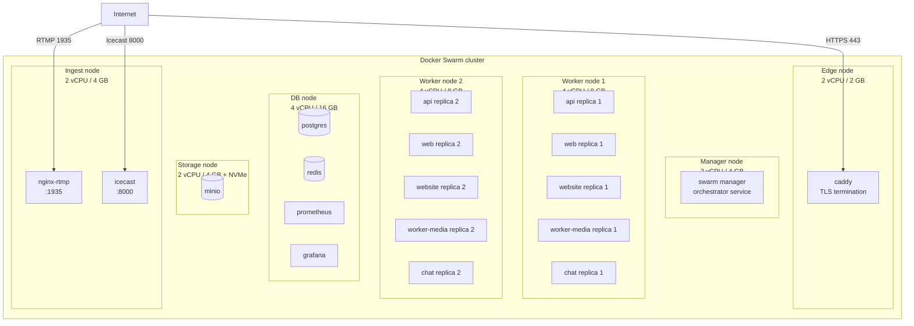
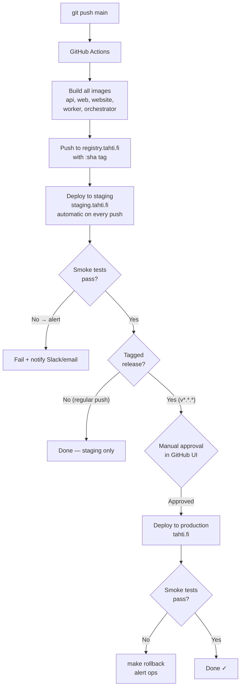
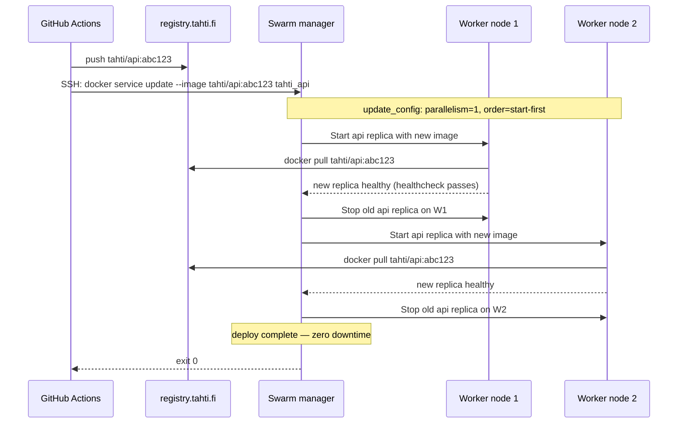

# Phase 5 — Staging cluster

**Goal:** a structurally identical copy of production (3-node Swarm) auto-deploys on every push to `main`. Production only deploys on a tagged release. Both environments use real data structures, different data.

**Timeline:** Month 3–4 (parallel with Phase 4 app work)  
**Entry state:** Phase 2 CI working, Phase 3 secrets management understood.

---

## Multi-node Swarm topology



## Deploy pipeline — staging vs production



## Service update sequence (rolling deploy)



## Node provisioning

### Manager node

```bash
# Install Docker
curl -fsSL https://get.docker.com | sh

# Init Swarm (save join token)
docker swarm init --advertise-addr <manager-private-ip>

# Get tokens for other nodes
docker swarm join-token worker   # → copy for worker nodes
docker swarm join-token manager  # → copy if adding manager replicas

# Label manager
docker node update --label-add role=worker $( docker info -f '{{.Swarm.NodeID}}' )
```

### Worker nodes (repeat for each)

```bash
# Install Docker
curl -fsSL https://get.docker.com | sh

# Join Swarm (paste the join command from manager)
docker swarm join --token <SWMTKN-...> <manager-ip>:2377

# Back on manager — label the new node
docker node ls  # get node ID
docker node update --label-add role=worker <node-id>
```

### Specialised nodes

```bash
# DB node
docker node update --label-add role=db <db-node-id>

# Storage node
docker node update --label-add role=storage <storage-node-id>

# Edge node
docker node update --label-add role=edge <edge-node-id>

# Ingest node
docker node update --label-add role=ingest <ingest-node-id>
```

## Staging environment config

Staging uses a separate `infra/docker-stack.staging.yml` that overrides:
- Fewer replicas (1 each instead of 2-3)
- Staging domain (`staging.tahti.fi`)
- Separate Swarm secrets (real keys but throw-away data)

```bash
# On staging manager
TAG=<sha> docker stack deploy \
  -c infra/docker-stack.yml \
  -c infra/docker-stack.staging.yml \
  tahti-staging
```

`infra/docker-stack.staging.yml` (override file):
```yaml
version: "3.9"
services:
  api:
    deploy:
      replicas: 1
  web:
    deploy:
      replicas: 1
    environment:
      NEXT_PUBLIC_API_BASE: https://api.staging.tahti.fi
      NEXT_PUBLIC_CHAT_BASE: https://chat.staging.tahti.fi
  website:
    deploy:
      replicas: 1
  chat:
    deploy:
      replicas: 1
  worker-media:
    deploy:
      replicas: 1
```

## CI pipeline additions

```yaml
# .github/workflows/deploy.yml

name: deploy

on:
  push:
    branches: [main]
  push:
    tags: ['v*.*.*']

jobs:
  build:
    runs-on: ubuntu-24.04
    outputs:
      tag: ${{ github.sha }}
    steps:
      - uses: actions/checkout@v4
      - name: Build all images
        run: |
          make build TAG=${{ github.sha }}
      - name: Push to registry
        run: |
          echo "${{ secrets.REGISTRY_PASSWORD }}" |
            docker login registry.tahti.fi -u tahti --password-stdin
          make push TAG=${{ github.sha }}

  deploy-staging:
    needs: build
    runs-on: ubuntu-24.04
    steps:
      - uses: appleboy/ssh-action@v1
        with:
          host: ${{ secrets.STAGING_HOST }}
          username: root
          key: ${{ secrets.DEPLOY_SSH_KEY }}
          script: |
            cd /srv/tahti
            TAG=${{ github.sha }} docker stack deploy \
              -c infra/docker-stack.yml \
              -c infra/docker-stack.staging.yml \
              tahti-staging
      - name: Smoke test staging
        run: |
          sleep 30
          curl -f https://staging.tahti.fi/health
          curl -f https://api.staging.tahti.fi/health

  deploy-production:
    needs: deploy-staging
    runs-on: ubuntu-24.04
    if: startsWith(github.ref, 'refs/tags/v')
    environment: production   # requires manual approval in GitHub UI
    steps:
      - uses: appleboy/ssh-action@v1
        with:
          host: ${{ secrets.PROD_HOST }}
          username: root
          key: ${{ secrets.DEPLOY_SSH_KEY }}
          script: |
            cd /srv/tahti
            TAG=${{ github.sha }} make deploy
      - name: Smoke test production
        run: |
          sleep 30
          curl -f https://tahti.fi/health
          curl -f https://api.tahti.fi/health
      - name: Rollback on failure
        if: failure()
        uses: appleboy/ssh-action@v1
        with:
          host: ${{ secrets.PROD_HOST }}
          username: root
          key: ${{ secrets.DEPLOY_SSH_KEY }}
          script: cd /srv/tahti && make rollback
```

## Exit criteria

| Check | Method | Expected |
|-------|--------|----------|
| 3-node Swarm healthy | `docker node ls` on manager | All nodes `Ready Active` |
| Services spread across nodes | `docker stack ps tahti` | api/web on Worker1+2 |
| Push deploys staging | Push a commit | staging.tahti.fi updated < 5 min |
| Tag deploys production | Create `git tag v0.1.0 && git push --tags` | Requires approval, then deploys |
| Rollback works | `make rollback` | All services step back to previous image |
| No data cross-contamination | Query staging DB | Only staging test artists visible |
