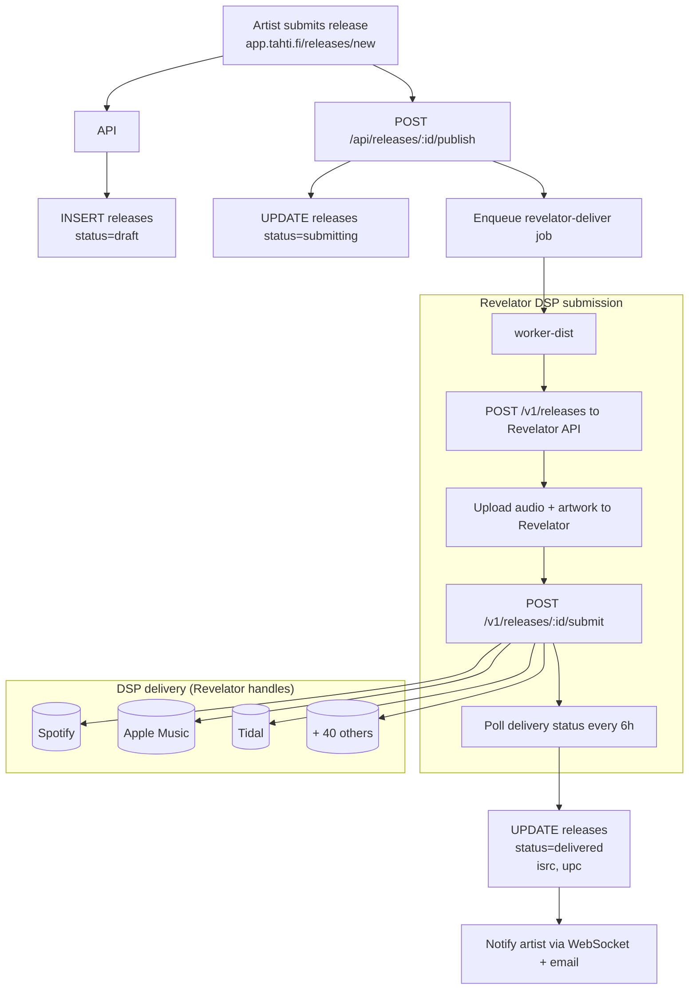
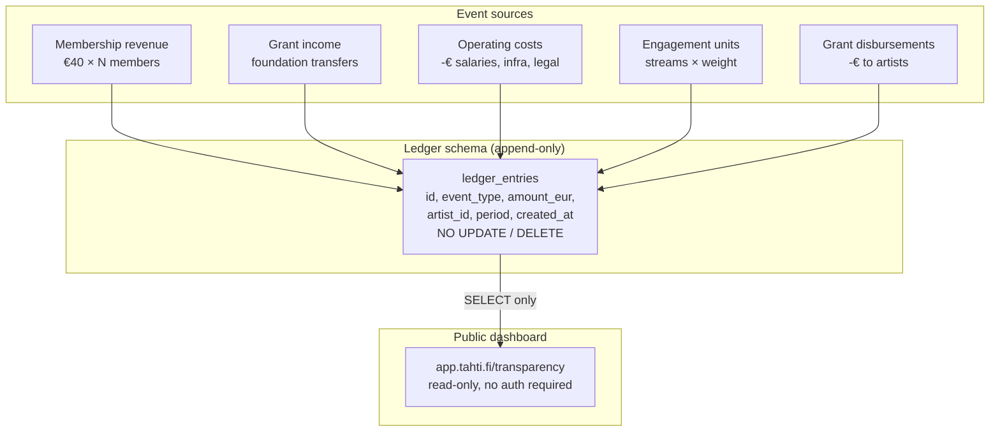
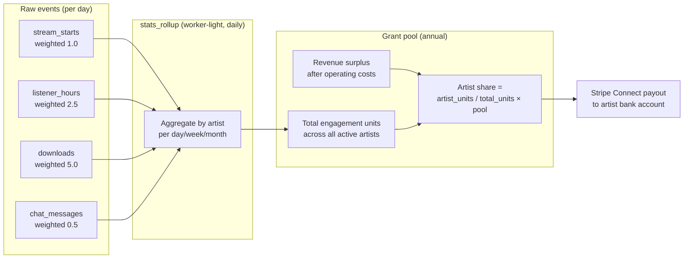
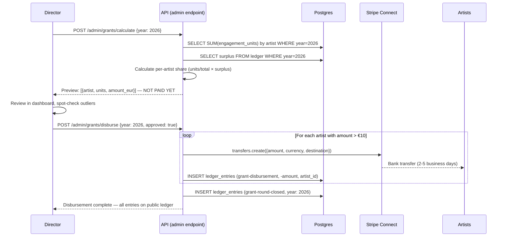
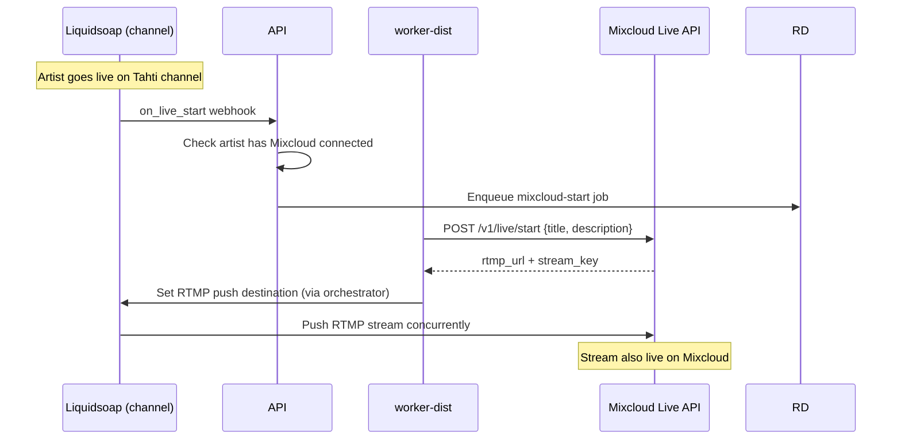

# Phase 6 — Distribution, transparency ledger, grants

**Goal:** an artist can publish a release to major DSPs via Revelator, the transparency ledger is public, and the annual grant disbursement system runs on real data.

**Timeline:** Month 5–9 (milestones M6–M10 from `docs/AGENT.md`)  
**Entry state:** Phase 4 alpha running with active beta artists.  
**New services:** worker-dist (Revelator + Mixcloud), outbound SMTP (Postmark).

---

## Distribution pipeline



## Transparency ledger



## Engagement unit calculation



## Grant disbursement flow



## Multistream out (Mixcloud Live)



## New worker queues (Phase 6)

| Queue | Worker | Trigger | Action |
|-------|--------|---------|--------|
| `revelator-deliver` | worker-dist | Release published | Submit release to Revelator API |
| `revelator-royalty-sync` | worker-dist | Daily cron | Pull royalty reports, write to ledger |
| `mixcloud-upload` | worker-dist | Stream ends (if artist opted in) | Upload recording to Mixcloud |
| `mixcloud-start` | worker-dist | Stream starts | Start Mixcloud Live RTMP push |

## Postmark / SMTP setup

Required before newsletter feature (M13). Must be configured in Phase 6 so the domain is warmed up:

```bash
# Update the smtp_password secret with real Postmark API key
echo -n "<postmark-api-key>" | docker secret rm smtp_password || true
echo -n "<postmark-api-key>" | docker secret create smtp_password -

# Update the stack
make deploy TAG=$(git rev-parse --short HEAD)
```

DKIM and SPF DNS records for `tahti.fi`:
```
TXT  pm._domainkey.tahti.fi   → <postmark-dkim-value>
TXT  tahti.fi                 → "v=spf1 include:spf.mtasv.net ~all"
```

## Exit criteria

| Check | Method | Expected |
|-------|--------|----------|
| Release to Spotify | Submit a real release | Appears on Spotify in 1–3 days |
| Revelator royalty sync | Trigger job manually | Royalties appear in ledger |
| Transparency ledger | Open app.tahti.fi/transparency | Shows real ledger entries |
| Grant calculation | `POST /admin/grants/calculate` | Returns realistic preview |
| Grant disbursement dry-run | Run with `dry_run: true` | No money moved, log shows amounts |
| Mixcloud upload | End a stream with MC connected | Recording on Mixcloud within 30 min |
| Ledger is append-only | Try `DELETE FROM ledger_entries` | DENIED by PG trigger |
