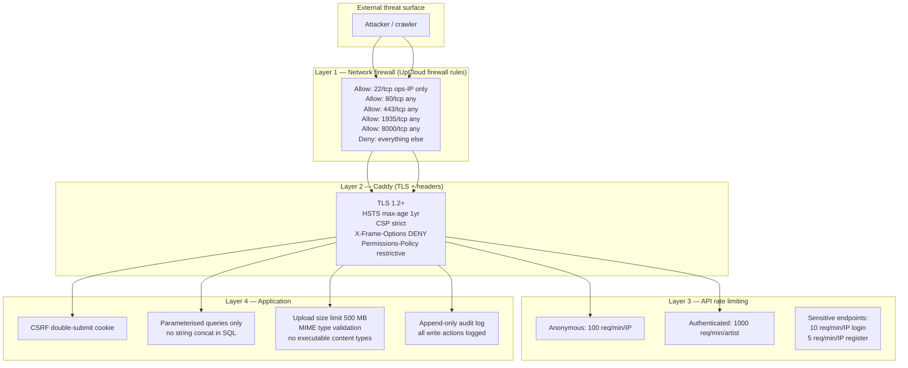
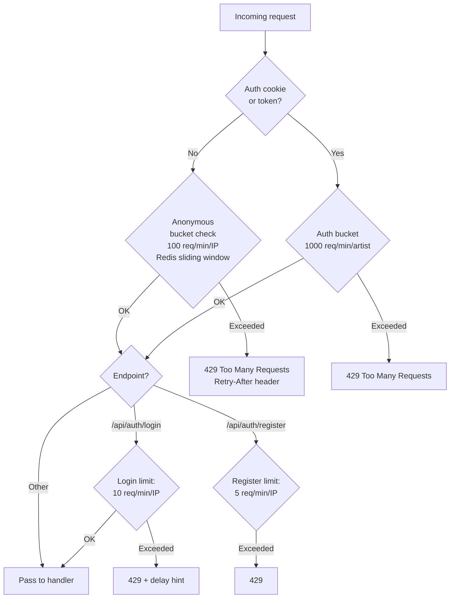
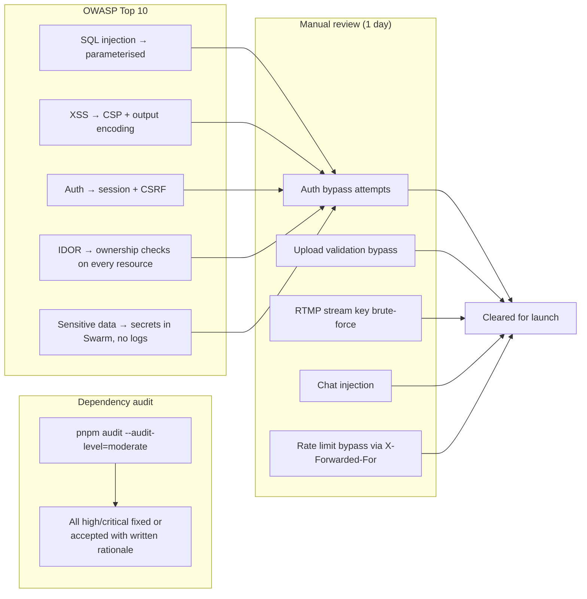
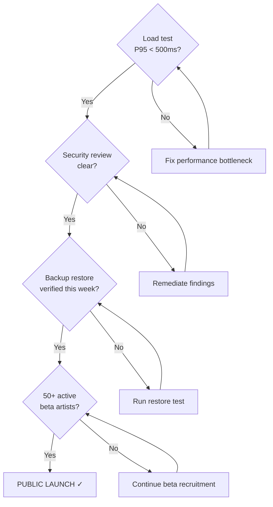

# Phase 7 — Hardening and public launch

**Goal:** the platform meets the security, performance, and reliability bar required to charge €40/year and open public signup. Every check in this document must pass before launch day.

**Timeline:** Month 8–9 (milestone M11 from `docs/AGENT.md`)  
**Entry state:** Phase 6 complete, 50+ active beta artists.

---

## Security architecture



## Rate limiting configuration



## Audit log

All write operations (POST/PUT/PATCH/DELETE) that touch artist, membership, release, broadcast, payout, or ledger tables emit an audit record:

```sql
CREATE TABLE audit_log (
  id          BIGSERIAL PRIMARY KEY,
  event_type  TEXT NOT NULL,
  actor_id    BIGINT,         -- NULL for system/cron
  target_type TEXT NOT NULL,
  target_id   BIGINT NOT NULL,
  old_value   JSONB,
  new_value   JSONB,
  ip_hash     TEXT,           -- SHA256 of IP + rotating salt
  created_at  TIMESTAMPTZ DEFAULT NOW()
);

-- Prevent any modification
REVOKE UPDATE, DELETE ON audit_log FROM tahti_app;
```

## Load test protocol

Run against **staging** (never production) with realistic scenarios:

```bash
# Install k6
curl https://github.com/grafana/k6/releases/download/v0.50.0/k6-v0.50.0-linux-amd64.tar.gz | tar xz
sudo mv k6 /usr/local/bin/

# Scenario: 500 concurrent listeners on one channel
cat > /tmp/k6-listener.js << 'EOF'
import http from 'k6/http';
import { check, sleep } from 'k6';

export const options = {
  vus: 500,
  duration: '10m',
  thresholds: {
    http_req_duration: ['p(95)<500'],
    http_req_failed: ['rate<0.01'],
  },
};

export default function () {
  // Fetch HLS playlist
  const res = http.get('https://staging.stream.tahti.live/hls/test-channel/index.m3u8');
  check(res, { 'playlist 200': (r) => r.status === 200 });

  // Simulate segment fetch every 3s
  sleep(3);
  const seg = http.get('https://staging.stream.tahti.live/hls/test-channel/seg-001.ts');
  check(seg, { 'segment 200': (r) => r.status === 200 });
  sleep(1);
}
EOF

k6 run /tmp/k6-listener.js
```

Pass criteria: P95 latency < 500 ms, error rate < 1%, no OOM or service restarts during test.

## Security review checklist



## Pre-launch ops runbook

Documented responses for the five most likely incidents at launch:

### Incident: Postgres down

```
1. docker stack ps tahti | grep postgres → identify failed task
2. docker service logs tahti_postgres --tail=100 → find root cause
3. If OOM: increase memory limit in stack, redeploy
4. If disk full: df -h → extend volume in UpCloud console
5. If corrupt data: stop services, restore from last backup
   → /srv/tahti/scripts/restore-postgres.sh <backup_date>
6. After recovery: verify row counts match backup verify log
```

### Incident: Live stream not starting

```
1. curl -I https://api.tahti.live/internal/rtmp/on_publish → should be reachable
2. docker service logs tahti_rtmp-ingest --tail=50 → check for auth errors
3. docker service logs tahti_orchestrator --tail=50 → check Liquidsoap spawn
4. docker ps | grep liquidsoap → is container running?
5. docker logs <liquidsoap-container> → check for input/output errors
```

### Incident: MinIO disk full

```
1. docker exec tahti_minio.1.xxx mc du tahti/ → find large buckets
2. Check lifecycle policy: mc ilm ls tahti/audio
3. If lifecycle misconfigured: fix and apply mc ilm add --expiry-days 730 tahti/audio
4. Emergency: delete oldest daily postgres backups (keep 7 days minimum)
```

### Incident: Chat WebSocket errors

```
1. docker service logs tahti_chat --tail=100
2. Check Redis backplane: redis-cli -h redis PING
3. Check Centrifugo admin panel: https://chat.tahti.live/admin
4. If fan-out lag > 1s: check Redis memory usage
5. Scale chat replicas: docker service scale tahti_chat=3
```

### Incident: API returning 5xx

```
1. Check error rate in Grafana: grafana.tahti.live/d/api-latency
2. docker service logs tahti_api --tail=100 | grep ERROR
3. Check DB connections: SELECT count(*) FROM pg_stat_activity
4. If connection pool exhausted: add PgBouncer (Phase 7 add-on)
5. If OOM: docker stats → identify leaking service → restart + file issue
```

## Security headers (add to Caddyfile)

```caddyfile
(secure_headers) {
    header {
        Strict-Transport-Security "max-age=31536000; includeSubDomains; preload"
        X-Content-Type-Options nosniff
        X-Frame-Options DENY
        Referrer-Policy strict-origin-when-cross-origin
        Permissions-Policy "camera=(), microphone=(), geolocation=(), payment=()"
        Content-Security-Policy "default-src 'self'; script-src 'self' 'unsafe-inline' https://cdn.jsdelivr.net https://fonts.googleapis.com; style-src 'self' 'unsafe-inline' https://fonts.googleapis.com; font-src 'self' https://fonts.gstatic.com; img-src 'self' data: https://cdn.tahti.live; connect-src 'self' wss://chat.tahti.live https://api.tahti.live"
        -Server
    }
}

tahti.live, www.tahti.live {
    import secure_headers
    encode zstd gzip
    reverse_proxy website:80
}
```

## Launch day checklist

| Item | Owner | Done? |
|------|-------|-------|
| Load test passes (P95 < 500ms, 0 5xx) | Ops | ☐ |
| Security review signed off | Security reviewer | ☐ |
| `pnpm audit` shows no high/critical | Dev | ☐ |
| Ops runbook reviewed by director | Director | ☐ |
| Backup restore tested within 7 days | Ops | ☐ |
| GDPR privacy policy live at tahti.live/privacy | Director | ☐ |
| Terms of service live at tahti.live/terms | Director + Lawyer | ☐ |
| Postmark DKIM/SPF verified | Ops | ☐ |
| Stripe account KYC complete | Director | ☐ |
| 50+ artists confirmed via beta | Director | ☐ |
| Press release sent to Rumba, Soundi | Director | ☐ |
| DNS TTLs set to 3600 | Ops | ☐ |
| Grafana oncall alert routing tested | Ops | ☐ |
| All secrets rotated from test values | Ops | ☐ |

## Exit criteria (launch gate)


