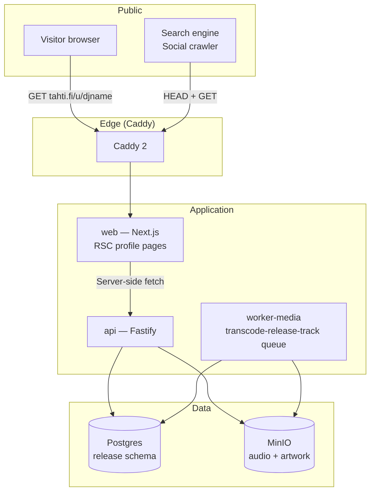
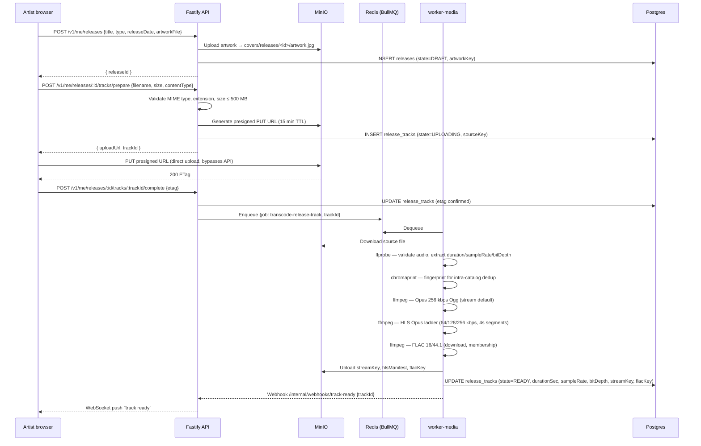
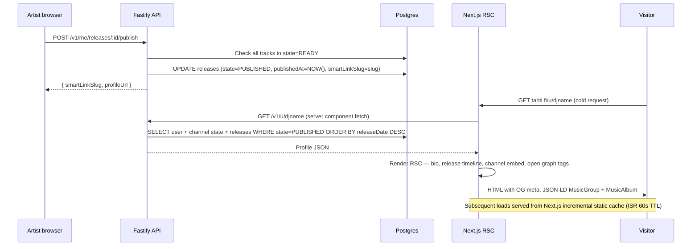

# Phase 8 — Artist profile and releases (M12)

**Goal:** every artist has a permanent public URL at `tahti.fi/u/<handle>` that functions as their home page on the internet — bio, release timeline, channel embed, and social links. Artists can upload tracks, publish releases, and have the platform generate smart links automatically.

**Timeline:** Months 10–12 (post-launch, alongside live beta)  
**Entry state:** Phase 7 complete, public beta open, 50+ active member artists.  
**New services:** none — existing `api`, `web`, and `worker-media` services extended.

---

## Artist profile architecture



## Release upload and transcode pipeline



## Release publish and profile page render



## New worker queue

| Queue | Trigger | Action |
|-------|---------|--------|
| `transcode-release-track` | Track upload completed | ffprobe → chromaprint → Opus/HLS/FLAC derivatives |

No new Docker services. `worker-media` picks up the new queue alongside the existing `transcode-archive` queue.

## New API routes (Phase 8)

```
# Public — anonymous
GET    /v1/u/:handle                  → profile (bio, releases, channel state)
GET    /v1/u/:handle/releases         → release timeline (paginated)
GET    /v1/r/:slug                    → release detail + tracklist + smart link targets
GET    /v1/r/:slug/tracks/:id/stream  → signed streaming URL (Opus 256)
GET    /v1/r/:slug/tracks/:id/flac    → signed FLAC download (membership)
GET    /oembed?url=                   → oEmbed discovery

# Artist-authed
GET    /v1/me/profile
PATCH  /v1/me/profile                 → bio, hero image, social links, press kit toggle
GET    /v1/me/releases
POST   /v1/me/releases
PATCH  /v1/me/releases/:id
POST   /v1/me/releases/:id/tracks/prepare
POST   /v1/me/releases/:id/tracks/:trackId/complete
PATCH  /v1/me/releases/:id/tracks/:trackId → title, ISRC, position, explicit, previewStart
POST   /v1/me/releases/:id/tracks/reorder
POST   /v1/me/releases/:id/publish
DELETE /v1/me/releases/:id            → moves to ARCHIVED; source file retained
GET    /v1/me/releases/:id/tracks/:trackId/download/source → original WAV/FLAC
```

## Open Graph and SEO

Every profile page and release page generates:

```html
<!-- Profile page: tahti.fi/u/djname -->
<meta property="og:type"        content="profile" />
<meta property="og:title"       content="DJ Name — Tahti" />
<meta property="og:description" content="First 160 chars of bio" />
<meta property="og:image"       content="https://cdn.tahti.fi/covers/users/<id>/avatar.jpg" />
<link rel="canonical"           href="https://tahti.fi/u/djname" />

<!-- Release page: tahti.fi/r/album-slug -->
<meta property="og:type"        content="music.album" />
<meta property="og:title"       content="Album Title — DJ Name" />
<meta property="og:image"       content="https://cdn.tahti.fi/covers/releases/<id>/artwork.jpg" />
<meta property="music:release_date" content="YYYY-MM-DD" />
```

JSON-LD on profile:
```json
{
  "@context": "https://schema.org",
  "@type": "MusicGroup",
  "name": "DJ Name",
  "url": "https://tahti.fi/u/djname",
  "description": "...",
  "album": [{ "@type": "MusicAlbum", "name": "...", "datePublished": "..." }]
}
```

Sitemap: `api` exposes `GET /sitemap/profiles.xml` and `GET /sitemap/releases.xml` — Next.js fetches at build time and includes both in the sitemap index.

## Deployment notes

No new services. New migrations only:

```bash
# Run migration on production
docker exec -it $(docker ps -qf name=tahti_api) node dist/migrate.js

# Confirm new tables
docker exec $(docker ps -qf name=tahti_postgres) \
  psql -U tahti -c "\dt release.*"
# Should list: releases, release_tracks
```

## Exit criteria

| Check | Method | Expected |
|-------|--------|----------|
| Profile renders | Open `tahti.fi/u/testartist` | Bio, avatar, release timeline visible |
| OG image correct | Share URL on Telegram | Release artwork shows in card preview |
| Track upload | Upload 24-bit WAV, 5 tracks | All in state=READY within 15 min |
| FLAC download | Member artist downloads own track | Correct FLAC 16/44 file served |
| Anon cannot FLAC | Unauthenticated GET /r/:slug/tracks/:id/flac | 401 |
| Smart link auto | Publish a release | `tahti.fi/r/<slug>` renders without error |
| ISR works | Update bio, wait 60s, reload | Updated bio visible without redeploy |
| JSON-LD valid | Paste profile URL into schema.org validator | No errors |
| Transcode speed | 10-min WAV (44.1 kHz 24-bit) | READY within 3 min |
| Sitemap includes | `GET /sitemap/releases.xml` | Lists all published releases |
