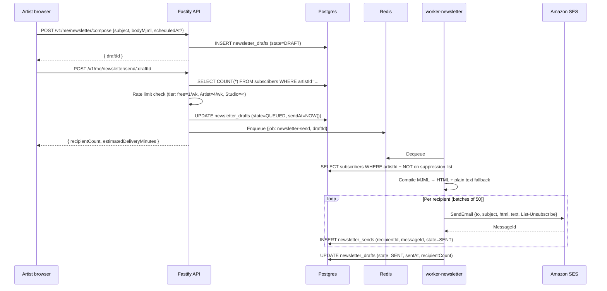
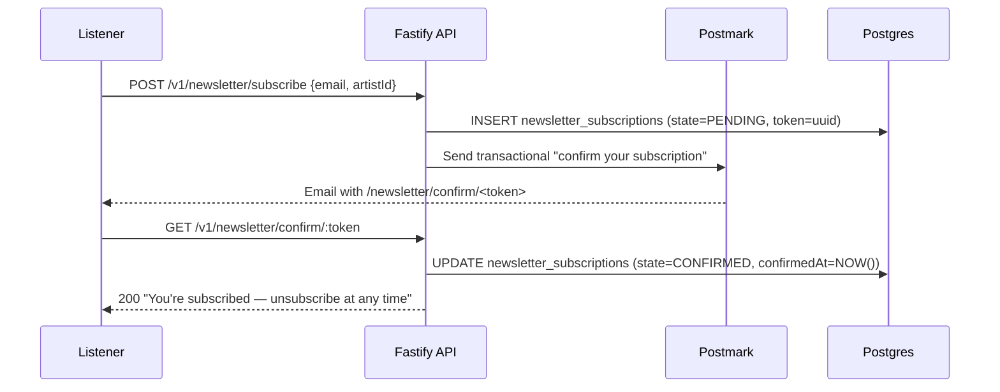
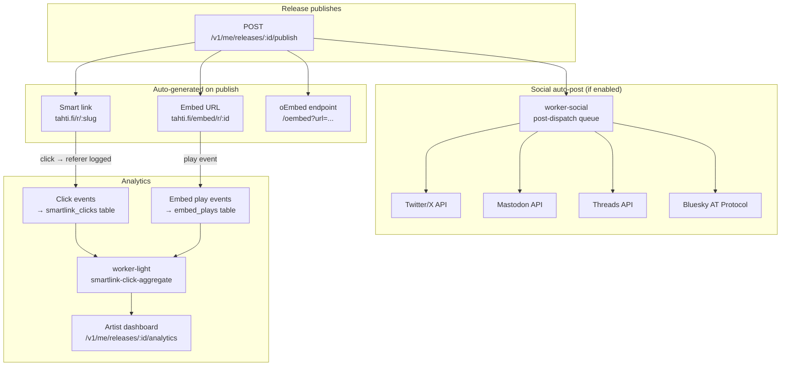
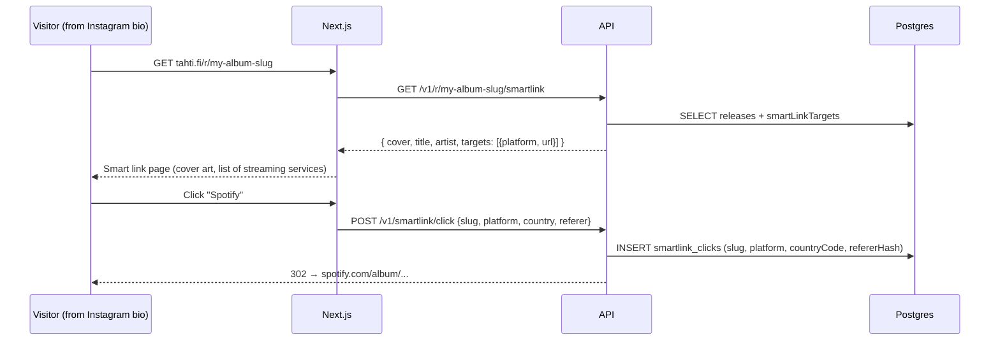
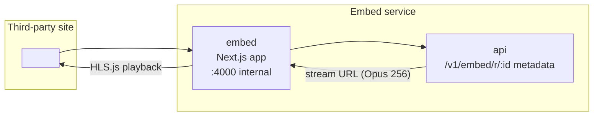
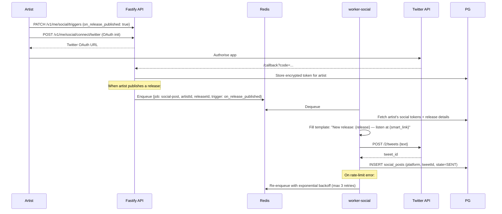

# Phase 9 — Newsletter and promo toolkit (M13–M14)

**Goal:** every artist can send newsletters to listeners who opt in, and every release auto-generates a smart link, embeddable player, and optional social auto-posts. Analytics show plays, smart-link clicks, and embed impressions in one dashboard.

**Timeline:** Months 13–18  
**Entry state:** Phase 8 complete, artist profiles live.  
**New services:** `worker-newsletter` (SES dispatch + bounce handling), `embed` (lightweight iframe player).

---

## Newsletter architecture

```mermaid
graph TB
    subgraph "Listener opt-in surface"
        CP[Channel page\n"Subscribe to updates" button]
        PP[Profile page\n"Get notified" button]
    end

    subgraph "API"
        SUB[POST /v1/newsletter/subscribe]
        CONF[GET /v1/newsletter/confirm/:token]
        UNSUB[GET /v1/newsletter/unsubscribe/:token]
    end

    subgraph "Artist compose"
        Comp[Newsletter composer\nMJML rich-text editor]
        Queue[POST /v1/me/newsletter/send/:draftId]
    end

    subgraph "Worker"
        WN[worker-newsletter\nSES dispatch]
        BH[Bounce handler\nSNS webhook consumer]
    end

    subgraph "External"
        SES[Amazon SES\nbulk send]
        PM[Postmark\ntransactional]
        SNS[AWS SNS\nbounce + complaint]
    end

    subgraph Data
        PG[(Postgres\nnewsletter schema)]
        RD[(Redis BullMQ)]
    end

    CP --> SUB
    PP --> SUB
    SUB --> PM
    PM -- "Verify your email" --> Listener
    Listener --> CONF
    CONF --> PG

    Comp --> Queue
    Queue --> PG
    Queue --> RD
    WN --> RD
    WN --> SES
    SES --> Listeners

    SNS -- Bounce/complaint webhook --> BH
    BH --> PG
    UNSUB --> PG
```

## Newsletter send sequence



## Subscriber double opt-in flow



## Bounce handling

```mermaid
flowchart TD
    SES -- bounce/complaint --> SNS[AWS SNS topic]
    SNS -- POST webhook --> API[/v1/internal/ses-bounce]
    API --> BounceType{type?}
    BounceType -- permanent --> Suppress[INSERT suppression_list\nno more sends]
    BounceType -- transient --> Log[Log only — retry on next newsletter]
    BounceType -- complaint --> Suppress
    Suppress --> PG[(Postgres)]
```

---

## Promo toolkit architecture



## Smart link page render



## Embed player

The `embed` service is a separate minimal Next.js app at `tahti.fi/embed/` with no analytics chrome, no cookies, and a 25 KB total page weight.



**oEmbed:** pasting a release URL into Substack, WordPress, or Notion auto-embeds via the oEmbed discovery endpoint:
```
GET /oembed?url=https://tahti.fi/r/my-album-slug&format=json
→ { "type": "rich", "html": "<iframe ...>", "width": 400, "height": 120 }
```

## Social auto-post flow



## New worker queues

| Queue | Worker | Trigger | Action |
|-------|--------|---------|--------|
| `newsletter-send` | worker-newsletter | Artist sends a draft | Compile MJML → batch send via SES |
| `newsletter-bounce-handler` | worker-newsletter | AWS SNS webhook | Update suppression list |
| `social-post-dispatch` | worker-social (new) | Release published / channel goes live | OAuth post to enabled platforms |
| `smartlink-click-aggregate` | worker-light | Every 15 min | Aggregate click events → analytics rollup |

## New services

**`worker-newsletter`** — new Docker service, same image as `worker-media` but with queue filter `newsletter-*`. Needs SES credentials:

```bash
# Add SES credentials as Swarm secrets
echo -n "<AWS_ACCESS_KEY_ID>" | docker secret create ses_access_key_id -
echo -n "<AWS_SECRET_ACCESS_KEY>" | docker secret create ses_secret_access_key -
echo -n "<AWS_REGION>" | docker secret create ses_region -
```

**`embed`** — new Docker service, lightweight Next.js app:

```yaml
# Addition to docker-stack.yml
embed:
  image: registry.tahti.fi/tahti/embed:${TAG:-latest}
  networks: [internal, edge]
  deploy:
    replicas: 2
    placement: { constraints: [node.labels.role == worker] }
```

Caddy route:
```caddyfile
tahti.fi/embed/* {
    reverse_proxy embed:4000
    header {
        X-Frame-Options ""            # embed must allow framing
        Content-Security-Policy "default-src 'self' data: blob:"
    }
}
```

## New API routes (Phase 9)

```
# Newsletter — public
POST   /v1/newsletter/subscribe       → double opt-in start
GET    /v1/newsletter/confirm/:token  → confirm subscription
GET    /v1/newsletter/unsubscribe/:token → one-click unsubscribe
POST   /v1/internal/ses-bounce        → AWS SNS webhook (signed, internal)

# Newsletter — artist-authed
GET    /v1/me/newsletter/subscribers  → total count, growth chart
POST   /v1/me/newsletter/compose      → save draft
POST   /v1/me/newsletter/send/:draftId → queue for delivery
GET    /v1/me/newsletter/sends        → past sends + open/click rates

# Smart links — public
GET    /v1/r/:slug/smartlink          → landing page data
POST   /v1/smartlink/click            → log click (platform, country, referer)

# Smart links — artist-authed
PATCH  /v1/me/releases/:id/smartlink  → set DSP targets
GET    /v1/me/releases/:id/analytics  → plays + clicks + embed impressions

# Social — artist-authed
POST   /v1/me/social/connect/:platform → OAuth init
GET    /v1/me/social/callback/:platform → OAuth return
DELETE /v1/me/social/connect/:platform → revoke token
PATCH  /v1/me/social/triggers          → enable/disable auto-post triggers
POST   /v1/me/social/post              → manual one-off post

# Embed — public (served by embed service)
GET    /embed/r/:id                    → release embed player
GET    /embed/c/:slug                  → channel embed player
GET    /oembed?url=                    → oEmbed JSON
```

## Exit criteria

| Check | Method | Expected |
|-------|--------|----------|
| Listener opt-in | Enter email on channel page | Confirmation email arrives < 30s |
| Double opt-in | Click confirm link | Subscription confirmed, unsubscribe link in every email |
| Newsletter send | Artist sends to 10 subscribers | All 10 delivered, analytics update |
| Bounce handling | Send to invalid address | Bounced address added to suppression list |
| Rate limit | Free artist sends 2nd newsletter same week | 429 with retry-after |
| Smart link | Publish a release | `tahti.fi/r/<slug>` loads with DSP links |
| Click tracked | Click a DSP link | Click logged in analytics within 1 min |
| Embed renders | Paste embed URL in iframe | Player loads, audio plays, no cookies set |
| oEmbed | Paste release URL in Substack | Auto-embeds without manual iframe |
| Social connect | Connect Twitter account | Token stored, test post sent |
| Auto-post on publish | Publish release with trigger enabled | Tweet appears within 2 min |
| Auto-post retry | Simulate rate-limit from Twitter | Retried 3× with backoff, final state logged |
| Analytics CSV | GET /v1/me/stats/export.csv | Contains release plays + newsletter sends |
