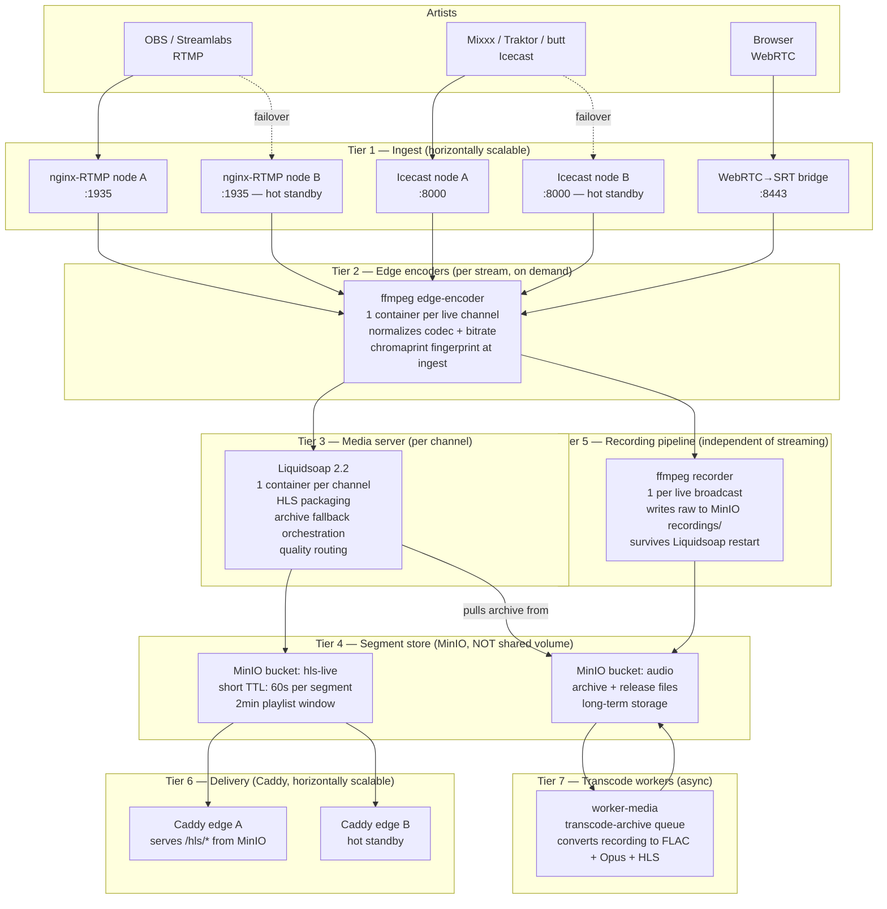
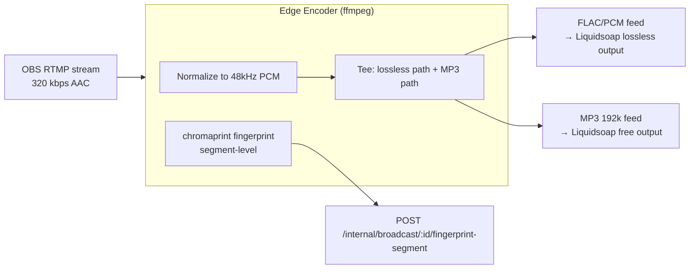
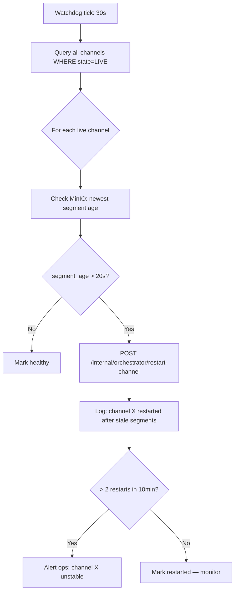
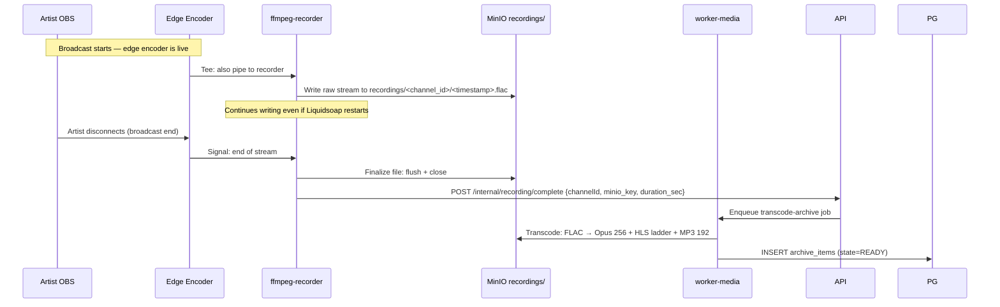
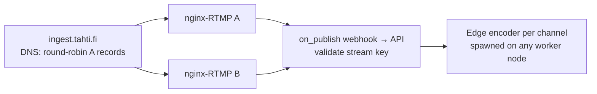
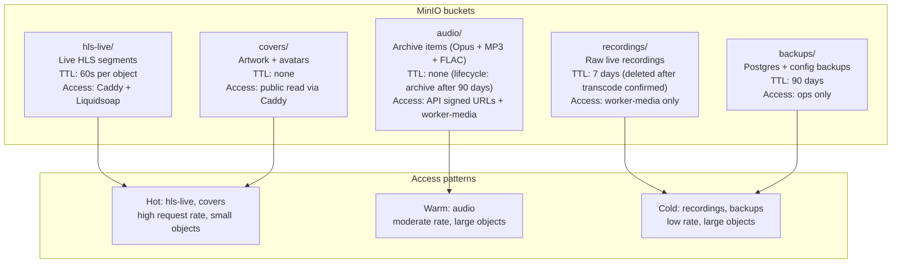

# Streaming architecture — distributed, measurable, scalable

Every container in the streaming path must be:
1. **Independently scalable** — add capacity to one tier without touching others
2. **Individually measured** — CPU, memory, segment write rate, bandwidth per channel
3. **Independently recoverable** — one container crash must not silence other channels

The current monolithic design (one Liquidsoap container per channel writing to a shared Docker volume) fails all three criteria at scale. This document specifies the target distributed architecture.

---

## Tier map



---

## Why segments go to MinIO, not a shared volume

The current `hls_shared` Docker volume is pinned to one Swarm node. This means:
- Caddy must run on the same node as Liquidsoap
- Adding a second Caddy node doesn't help — it can't read the volume
- Adding a second worker node doesn't help — Liquidsoap segments can't be read from there

By writing HLS segments to MinIO:
- Any Caddy node can serve segments (MinIO is network-accessible)
- Liquidsoap containers can run on any worker node
- Caddy nodes can be added or removed without data migration
- Segment TTL is enforced by MinIO lifecycle rules, not cron jobs

**MinIO bucket policy for live segments:**
```json
{
  "Rules": [{
    "ID": "expire-live-hls",
    "Filter": { "Prefix": "hls-live/" },
    "Expiration": { "Days": 1 }
  }]
}
```
Individual segments expire via object headers (`x-amz-expiration`), not batch cron.

---

## Edge encoder — what it does and why

Between raw RTMP/Icecast input and Liquidsoap, an FFmpeg edge encoder container:

1. **Normalizes codec** — RTMP sources send AAC, MP3, or Opus at varying bitrates. The edge encoder outputs a consistent 320 kbps PCM or Opus stream regardless of input.
2. **Produces two feeds** — a high-quality FLAC-compatible feed for paid channels and an MP3 feed for free channels, from a single source input.
3. **Runs chromaprint fingerprint at ingest** — fpcalc sidecar posts segments every ~30s; **AcoustID** title lookup on archive/live (ACRCloud deferred until post-production).
4. **Decouples ingest from Liquidsoap** — if Liquidsoap crashes and restarts mid-stream, the edge encoder continues receiving from the artist without dropping the connection. Liquidsoap reconnects to the edge encoder's output, not the artist's OBS.



On broadcast end, `archive-broadcast` collapses fingerprint boundaries and writes `tracklist` entries. Titles come from **AcoustID** chromaprint lookup. **ACRCloud** ingest identify is off until post-production (`ACRCLOUD_ENABLED=true`, `FINGERPRINT_SEND_AUDIO=1`).

While **LIVE**, listeners see a **Now playing** panel on `/c/:slug` that polls `GET /api/channels/:slug/live-fingerprints` every 30s (same tracklist shape as archive metadata).

**Env:** `ACOUSTID_API_KEY` on **api** + **worker**; ACRCloud secrets deferred (see `ops/RUNBOOK.md`).

---

## Icecast ingest failover (STREAM-007)

`GET /api/me/stream-settings` health-probes each host in `ICECAST_INGEST_HOSTS` via `/status-json.xsl` and returns `fallbackServers` for Mixxx/Traktor.

**Production:** deploy two Icecast replicas behind public hostnames, e.g. `ICECAST_INGEST_HOSTS=https://icecast-a.tahti.live,https://icecast-b.tahti.live`.

**Local stack:** optional second node for probe testing:

```bash
docker compose -f infra/docker-compose.stack.yml --profile icecast-failover up -d icecast-b
# API env (host-visible URLs for dashboard + health probes from api container via published ports):
# ICECAST_INGEST_HOSTS=http://localhost:18100,http://localhost:18101
```

RTMP uses the same pattern with `RTMP_INGEST_HOSTS` and nginx-RTMP `/health`.

**Local stack:** optional second RTMP node:

```bash
docker compose -f infra/docker-compose.stack.yml --profile rtmp-failover up -d rtmp-ingest-b
```

Ingest DNS TTL and verification: **`ops/ingest-dns.md`**.

---

## Per-channel metrics (required from day 1)

Every Liquidsoap container and every edge encoder must expose a Prometheus metrics endpoint. These are the minimum measurements required:

| Metric | Source | Why |
|--------|--------|-----|
| `tahti_channel_segment_write_rate` | Liquidsoap | Detects silent/frozen channels |
| `tahti_channel_listeners_connected` | Caddy + Centrifugo | Listener count per channel |
| `tahti_channel_input_bitrate_kbps` | Edge encoder | Source quality monitoring |
| `tahti_channel_cpu_seconds_total` | Docker stats exporter | Cost attribution per channel |
| `tahti_channel_memory_bytes` | Docker stats exporter | Container sizing |
| `tahti_channel_hls_segment_age_seconds` | MinIO + watchdog | Alert if newest segment > 15s old |
| `tahti_channel_bandwidth_bytes_out` | Caddy | Per-channel egress billing |
| `tahti_recording_bytes_written` | ffmpeg recorder | Recording progress |

Grafana dashboard: one row per channel, showing segment freshness, listener count, and input bitrate. Red if `hls_segment_age_seconds > 15`.

---

## Per-channel health watchdog

A `channel-watchdog` job runs every 30 seconds inside `worker-light`:



The watchdog does **not** bounce artists' OBS connections. The edge encoder holds the RTMP/Icecast connection. Liquidsoap restarts silently and reconnects to the edge encoder's output. Listeners experience at most one missed HLS segment (3s gap).

---

## Recording pipeline (independent of streaming)

Recording must survive Liquidsoap crashes. It runs as a separate container:



If the recording container crashes mid-broadcast, `ffmpeg` can resume from where it left off using the partially-written file (FLAC is a streamable format). The archive item is only created after successful finalization.

---

## Ingest redundancy

Two nginx-RTMP instances + two Icecast instances. DNS round-robin (`ingest.tahti.fi`) distributes new connections. Existing connections stay on their assigned ingest node until disconnect.



If one ingest node fails, new connections use **health-ranked `fallbackServers`** from stream settings immediately; DNS TTL on RTMP A records (target **5–30s**) limits stale resolver cache. See `ops/ingest-dns.md`.

---

## Storage architecture



MinIO tiering: hot buckets on NVMe, cold buckets on spinning disk (Y2 storage expansion).

---

## Container sizing guide

At Y1 beta (200 artists, max 20 live simultaneously):

| Container | Min | Max | Trigger to add more |
|-----------|-----|-----|---------------------|
| Edge encoder (per channel) | 0.5 CPU / 256 MB | 1 CPU / 512 MB | Always 1 per live channel |
| Liquidsoap (per channel) | 0.25 CPU / 128 MB | 0.5 CPU / 256 MB | Always 1 per active channel |
| ffmpeg-recorder (per broadcast) | 0.5 CPU / 256 MB | 1 CPU / 512 MB | Always 1 per live broadcast |
| worker-media | 2 CPU / 2 GB | 4 CPU / 4 GB | Queue depth > 10 jobs |
| Caddy | 0.5 CPU / 256 MB | 2 CPU / 1 GB | P95 latency > 200ms |
| nginx-RTMP | 0.5 CPU / 256 MB | 1 CPU / 512 MB | Input bitrate > 600 Mbps total |

At 20 simultaneous live channels:
- 20 edge encoders: ~10 CPU, ~5 GB RAM
- 20 Liquidsoap: ~5 CPU, ~2.5 GB RAM
- 20 recorders: ~10 CPU, ~5 GB RAM
- Total streaming: ~25 CPU / ~12.5 GB RAM

This requires 2 worker nodes of 4 vCPU / 8 GB minimum for comfortable headroom. See `docs/hosting-budget.md`.

---

## Known issues → backlog

See `docs/project-roadmap.md` section **Streaming backlog** for tracked items.

| ID | Issue | Severity |
|----|-------|----------|
| STREAM-001 | ~~HLS segments on shared Docker volume~~ — `hls-minio-sync` cron | done |
| STREAM-002 | Per-channel ffmpeg edge encoder + dual-bitrate HLS (`stream-mp3-192` / `stream-flac`) | done |
| STREAM-003 | Health-ranked fallbacks + prod replicas; DNS TTL 5–30s (`ops/ingest-dns.md`) | done |
| STREAM-004 | ffmpeg recorder sidecar (STREAM-004) | done |
| STREAM-005 | `channel-watchdog` worker cron + orchestrator restart | done |
| STREAM-006 | Per-channel egress from Caddy access logs + dashboard chart | done |
| STREAM-007 | Icecast `/status-json.xsl` + prod **`icecast-b`** + Caddy failover | done |
| STREAM-008 | fpcalc sidecar, live tracklist, **ACRCloud** + AcoustID fallback | done |
| STREAM-009 | Archive fallback local cache volume + cron | done |
| STREAM-010 | Telnet `graceful_shutdown` + `fade.out` on `radio_out`; `docker stop -t 20` backstop | done |
| ARTIST-002 | Hot RTMP/Icecast credential rotation while live (24h grace) | done |
