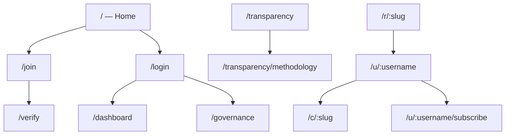

# User flows & screen map

Screenshots live in [e2e-screenshots/](e2e-screenshots/). Capture locally via `./scripts/e2e-screenshots.sh` (not run in CI).

For **how to distribute Swarm nodes by bottleneck** (API, chat, transcode, ingest, egress), see [scaling-node-distribution.md](scaling-node-distribution.md).

## Personas

| Persona | Who | Guide | Technical journey |
|---------|-----|-------|-------------------|
| **Listener** | Anyone tuning in; account optional | [for-viewers.md](guides/for-viewers.md) | [journey-listener.md](technical/journey-listener.md) |
| **Member** | Tahti ry cooperative member (€40/year) | [for-members.md](guides/for-members.md) | [journey-member.md](technical/journey-member.md) |
| **Artist** | Member with channel, releases, fan tiers | [for-artists.md](guides/for-artists.md) | [journey-artist.md](technical/journey-artist.md) |

**Streamer** is the live-broadcast slice of the artist path: [for-streamers.md](guides/for-streamers.md).

## Site map



## Automated journey e2e

| Script | Personas |
|--------|----------|
| `tests/e2e/user-journeys.sh` | Listener, artist, streamer, member, fan supporter (API + optional web) |
| `tests/e2e/journeys/listener.sh` | Public browse only (sourced by main script) |
| `tests/e2e/journeys/artist.sh` | Studio + ingest (sourced by main script) |
| `tests/e2e/journeys/member.sh` | Governance + fan sub (sourced by main script) |
| `tests/e2e/user-journeys.mjs` | Same personas in Playwright (needs `APP_URL` + seeded fixtures) |
| `tests/e2e/journeys/dashboard-player.sh` | Dashboard studio APIs + channel/embed player data (in `user-journeys.sh`) |
| `tests/e2e/dashboard-player.mjs` | Playwright: dashboard navigation + archive/live players |
| `apps/api/src/routes/journeys/persona-journeys.test.ts` | Listener / artist / member API paths (Vitest) |

```bash
# CI-style (API only)
SEED_JOURNEY_FIXTURES=1 DATABASE_URL=postgres://... API_URL=http://localhost:3001 pnpm test:e2e:journeys

# Local Playwright
API_URL=http://localhost:3011 APP_URL=http://localhost:3010 pnpm test:e2e:journeys:web

# Dashboard + player only
pnpm test:e2e:dashboard-player
pnpm test:e2e:dashboard-player:web
```

Seed fixtures: `cd apps/api && DATABASE_URL=... pnpm exec tsx scripts/seed-e2e-screenshots.ts` or `make stack-up --seed`.

## Flows → screens

### Listener (no account)

| Step | Route | Screenshot |
|------|-------|------------|
| Land | `/` | [01-home.png](e2e-screenshots/01-home.png) |
| Channel | `/c/screenshot-demo` | [08-channel.png](e2e-screenshots/08-channel.png) |
| Profile | `/u/screenshot-demo` | [09-profile.png](e2e-screenshots/09-profile.png) |
| Fan tiers | `/u/screenshot-demo/subscribe` | [10-subscribe.png](e2e-screenshots/10-subscribe.png) |
| Smart link | `/r/northern-lights-ep` | [11-smart-link.png](e2e-screenshots/11-smart-link.png) |
| Transparency | `/transparency` | [06-transparency.png](e2e-screenshots/06-transparency.png) |

### Member (cooperative)

| Step | Route | Screenshot |
|------|-------|------------|
| Register | `/join` | [02-join.png](e2e-screenshots/02-join.png) |
| Verify | `/verify?token=…` | [05-verify-token.png](e2e-screenshots/05-verify-token.png) |
| Governance | `/governance` | [13-governance.png](e2e-screenshots/13-governance.png) |

### Artist (studio + optional live)

| Step | Route | Screenshot |
|------|-------|------------|
| Login | `/login` | [03-login.png](e2e-screenshots/03-login.png) |
| Dashboard | `/dashboard` | [12-dashboard.png](e2e-screenshots/12-dashboard.png) |
| Live channel | `/c/screenshot-demo` | [08-channel.png](e2e-screenshots/08-channel.png) |
