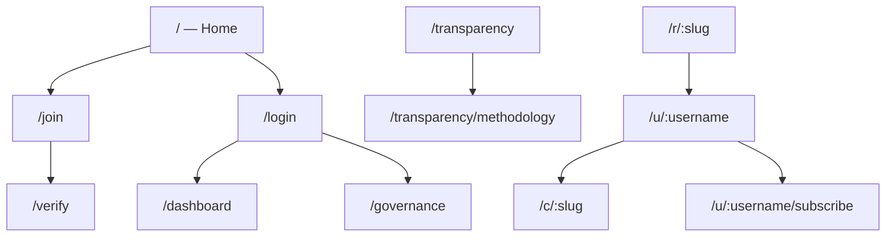

# User flows & screen map

Screenshots live in [e2e-screenshots/](e2e-screenshots/). Capture locally via `./scripts/e2e-screenshots.sh` (not run in CI).

For **how to distribute Swarm nodes by bottleneck** (API, chat, transcode, ingest, egress), see [scaling-node-distribution.md](scaling-node-distribution.md).

## Site map

## Automated journey e2e

| Script | Covers |
|--------|--------|
| `tests/e2e/user-journeys.sh` | Viewer, artist, streamer, fan paths (API + optional web curl) |
| `tests/e2e/user-journeys.mjs` | Same journeys in Playwright (needs `APP_URL` + seeded fixtures) |

Seed fixtures: `cd apps/api && DATABASE_URL=... pnpm exec tsx scripts/seed-e2e-screenshots.ts` or `make stack-seed`.

## Flows → screens

### New member (fan)

| Step | Route | Screenshot |
|------|-------|------------|
| Land | `/` | [01-home.png](e2e-screenshots/01-home.png) |
| Register | `/join` | [02-join.png](e2e-screenshots/02-join.png) |
| Verify email | `/verify?token=…` | [05-verify-token.png](e2e-screenshots/05-verify-token.png) |
| Governance | `/governance` | [13-governance.png](e2e-screenshots/13-governance.png) |

### Artist onboarding & studio

| Step | Route | Screenshot |
|------|-------|------------|
| Login | `/login` | [03-login.png](e2e-screenshots/03-login.png) |
| Dashboard | `/dashboard` | [12-dashboard.png](e2e-screenshots/12-dashboard.png) |
| Live channel | `/c/screenshot-demo` | [08-channel.png](e2e-screenshots/08-channel.png) |

### Public discovery & support

| Step | Route | Screenshot |
|------|-------|------------|
| Profile | `/u/screenshot-demo` | [09-profile.png](e2e-screenshots/09-profile.png) |
| Fan tiers | `/u/screenshot-demo/subscribe` | [10-subscribe.png](e2e-screenshots/10-subscribe.png) |
| Smart link | `/r/northern-lights-ep` | [11-smart-link.png](e2e-screenshots/11-smart-link.png) |

### Transparency / grants

| Step | Route | Screenshot |
|------|-------|------------|
| Dashboard | `/transparency` | [06-transparency.png](e2e-screenshots/06-transparency.png) |
| Methodology | `/transparency/methodology` | [07-transparency-methodology.png](e2e-screenshots/07-transparency-methodology.png) |
