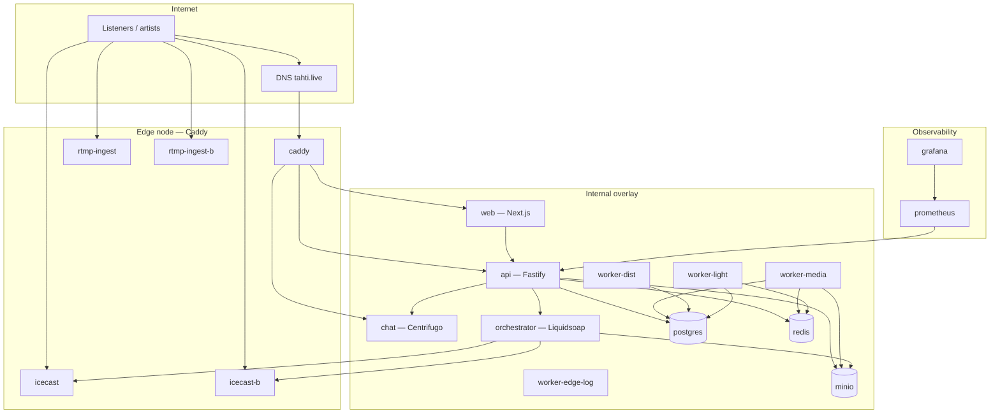
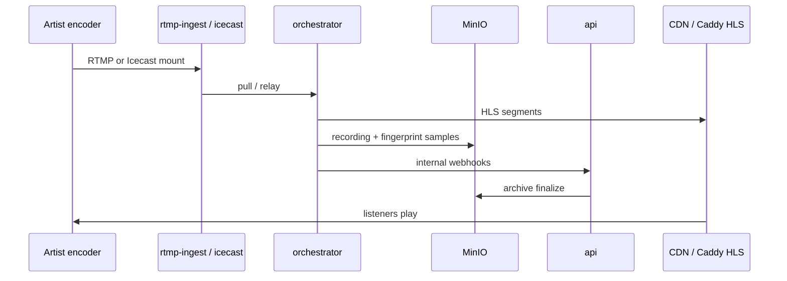
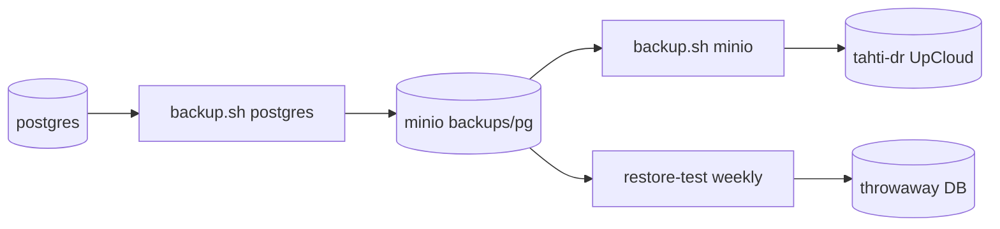

# Tahti platform architecture

High-level topology for operators and developers. Service names match Docker Swarm
stack **`tahti`** in [`infra/docker-stack.yml`](../infra/docker-stack.yml).

## Production topology (Swarm)

## Live broadcast data flow

## Backup & DR flow

## Networks

| Overlay | Services | Exposure |
|---------|----------|----------|
| `edge` | caddy, rtmp-ingest*, icecast* | Public via host ports / DNS |
| `internal` | api, web, workers, postgres, redis, minio, orchestrator, chat | Private overlay only |
| `ingest` | ingest replicas | Between edge and orchestrator |

## Stateful volumes

| Volume | Holds |
|--------|--------|
| `postgres_data` | All application data |
| `minio_data` | Audio, covers, backup objects |
| `redis_data` | Sessions, rate limits, Tor exit cache |
| `hls_shared` / `recordings_shared` | Live pipeline scratch (orchestrator) |

## External dependencies

| Service | Purpose | Config |
|---------|---------|--------|
| Stripe | Membership, fan-subs, distribution fees | Secrets + webhooks |
| Mixcloud | Archive distribution OAuth | `MIXCLOUD_CLIENT_ID` + secret |
| Revelator | DSP submission stub/live | `revelator_api_key` secret |
| SMTP / Postmark / SES | Auth mail + newsletters | [`EMAIL.md`](EMAIL.md) |
| UpCloud | DR object storage | `tahti-dr` mc alias |

## Environments

| Env | Compose / stack | Ports / URL |
|-----|-----------------|-------------|
| Local dev | `docker compose` + `pnpm dev` | localhost |
| Lab stack | `scripts/stack-up.sh` | 3010 / 3011 |
| Production | Swarm `tahti` | `*.tahti.live` |

## Related

- [`RUNBOOK.md`](RUNBOOK.md) — operational procedures
- [`docs/technical/streaming-architecture.md`](../docs/technical/streaming-architecture.md) — ingest failover, fingerprints
- [`docs/technical/scaling-node-distribution.md`](../docs/technical/scaling-node-distribution.md) — horizontal scale notes
